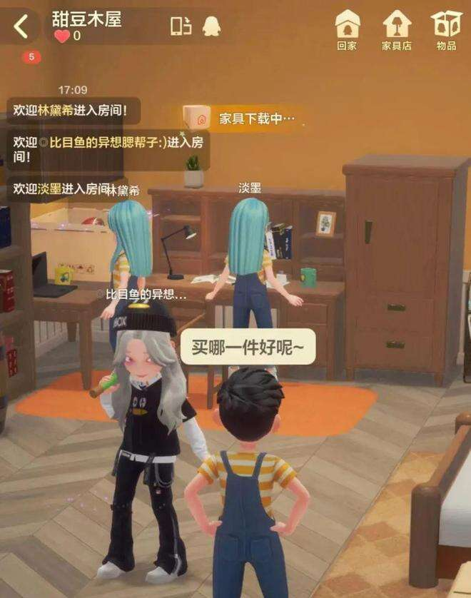

# 腾讯停售“幻核”，元宇宙业务另有发展？

上线刚满一年，目前国内最大的数字藏品平台之一、腾讯幻核便官宣停止数字藏品发行。

近日，腾讯幻核发布公告，称基于公司聚焦核心战略的考量，将做出业务调整。即日起幻核将停止数字藏品发行，所有通过其平台（包括腾讯新闻数字藏品馆）购买过数字藏品的用户可自行选择继续持有或发起退款申请。

按照幻核公告，如用户选择继续持有，包括此前通过活动免费领取的数字藏品将仍可正常访问和使用。因为所有的数字藏品数据均已上链，用户对其所有权也不会因幻核的调整而受到影响。

幻核是国内数字藏品平台中最大的平台之一，也是腾讯内部孵化的NFT发行平台，2021年8月2日正式上线APP，据《链新》不完全统计，幻核自成立以来销售额超过8000万元，其中2022年4月的月度销售额近2000万元。幻核团队曾对外表示不会开放用户间的数字藏品转移，坚决抵制虚拟货币相关的违法违规行为。

目前，腾讯旗下的数字藏品平台只剩QQ音乐的TME数字藏品，

**腾讯元宇宙业务另有发展？**

说起数字藏品，就不得不提到区块链，数字藏品之所以能迅速火爆，也是因为数字藏品一直提到了区块链存证技术。

作为区块链的一个应用，NFT、数字藏品一直被认为是元宇宙的资产。国内大部分数字藏品平台也是从发售数字藏品起家，逐渐升级元宇宙生态开发建设。虽然关停了数字藏品的业务，但在元宇宙方面，腾讯似乎一直在试水。

在Web3、元宇宙的热潮下，曾经国内虚拟形象的鼻祖，也不想错过这次发展浪潮，因此“超级QQ秀”诞生了，超级QQ秀是QQ秀的升级版，是QQ秀形象从2D向3D的探索和尝试。

QQ秀应该是最早的数字虚拟人，那应该是不少80、90后的回忆。在当时，为了能在QQ的聊天界面展示出自己最炫酷美丽的一面，不知有多少人充了红钻会员。

如今QQ秀也升级成为了3D版数字虚拟人，只需要在QQ的小组件中就可以进入。内置的QQ小窝还会不定期开放派对，进入后可以聊天、看电影、玩游戏等等。

元宇宙和游戏的区别就在于，游戏里用户拥有的身份和社交关系等等都只是暂时的，且游戏有开始和结束；元宇宙则相当于是我们现实社会的复刻，在里面的不同地点会实时发生各种不同的事。

尽管还不能称之为严格意义上的元宇宙，但显然，超级QQ 秀已经带有元宇宙的影子了。

除了QQ小窝之外，QQ音乐内测版加入了“Music Zone”功能，类似超级 QQ 秀中的“QQ 小窝”，用户可化身虚拟人与其他用户进行社交。用户可以获得一个独立的“家”，并且可以装修自己的“家”，还能把虚拟播放界面和歌单挂在墙上，自己和其他用户都可以进行点播。

不止是国内，腾讯在国外也有布局。此前，腾讯投资了一家名为Hadean的英国元宇宙初创公司，该公司为英国军队制作模拟软件。英国初创公司Hadean成立于2015年，该公司的定位为元宇宙是的软件制作，用于大型多人视频游戏、虚拟音乐会和数字会议等。虽然2022年才过去半年多，但腾讯已多次出手，总共投资了四家英国公司。

从腾讯的布局来看，幻核业务的关停并不会影响腾讯布局元宇宙，未来腾讯也有可能在自己的元宇宙生态中进行NFT版权品的发售。
