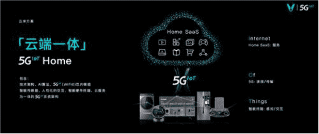
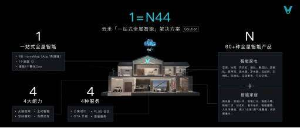
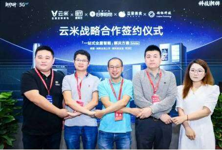

# 抢先起跑家电元宇宙赛道，云米科技解锁全屋互联新模式 

随着国民经济的增长，消费者对生活品质的追求，从需求侧推动了智能家居市场的迭代发展。被誉为是下个数字时代浪潮的“元宇宙”，可以说是近年来最火爆的概念了，一个个平行于现实世界运行的人造空间即将蜂拥而来。云米科技抓住先机，将这一概念发展到家庭电器领域，解锁了全屋智能互联的全新模式，收获认可无数。发展家电元宇宙的赛道充满重重挑战，云米科技缘何成功入局，抢先起跑？

**革新技术，玩转智能**

5G是新兴技术发展的产物，在这基础上也带动了更多产品的诞生。云米科技创始人陈小平认为，5G绝对不仅仅是速度的提升和低延时这两个变化，它意味着终端、连接和智能这三个要素都将产生一个颠覆性的变革。与人高效交互，让智能变得真正“有用、好用”，探索家电元宇宙构建，这便是云米科技家电产品在5G+AI+loT技术加持下的新诠释。

**高端套系，互联互通**

云米科技2022春季战略新品发布会上，CEO陈小平强调云米科技潮牌的定位将更为高端化，并发布了全新升级「⼀站式全屋智能」解决方案“1=N44”，推出30万元起售、亿元级别墅专享的高端全屋智能套系，全面加码布局高端全屋智能市场，实现家电元宇宙全域互联互通，带来更为舒适的全屋智能场景体验。

**异业联动，产业融合**

为促进产业融合，完善一站式全屋智能解决方案，云米科技与爱奇艺、豆果、好享购物、领标科技达成战略合作，促使行业之间相互渗透，利用自身的行业优势，共同拓展多元智能家居应用场景。此外，云米科技还同中国电信、天猫、京东等多渠道平台签署了战略合作协议，提升了购物效率，优化了购物体验。异业联动加速了云米一站式全屋智能在智能家居市场的前进步伐，完善家电元宇宙指日可待。

未来智能家电市场将不断加速发展，市场需求持续扩大，家庭电器元宇宙的发展也会产生越来越重要的影响。云米科技深入多个层次，通过蓄力打造全屋智能互联网家电，将虚拟场景引入现实，多年以来不断推陈出新，发展势头持续向好，获得成功实属必然。
