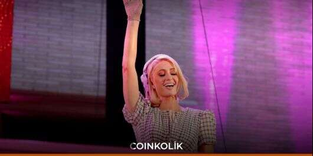
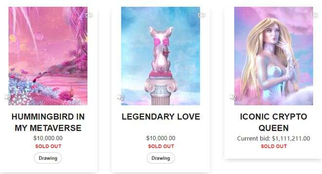
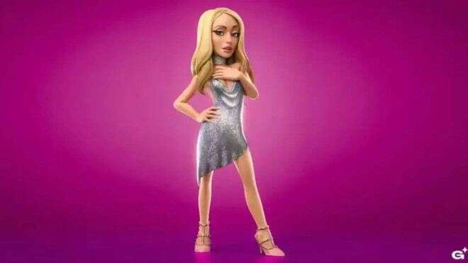
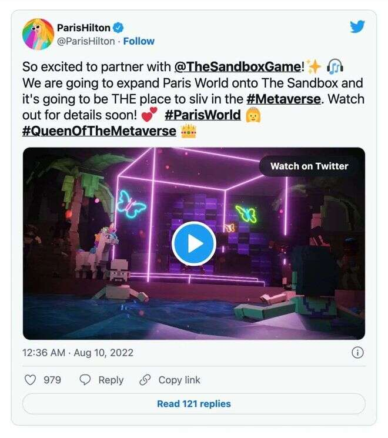
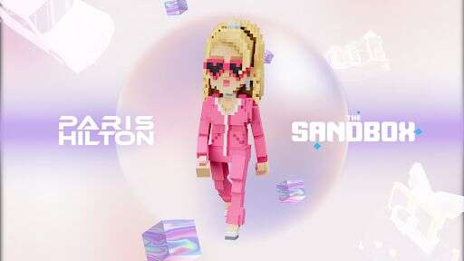
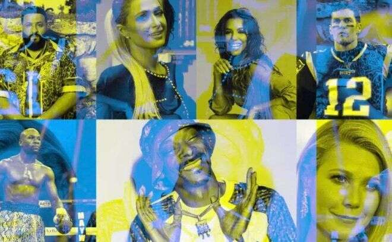

# 希尔顿入驻元宇宙，网红接轨次世代成功

元宇宙兴起的这一年间，总能听到明星与元宇宙接触，但不论是国外的侃爷还是国内的周董，面对元宇宙都只是浅尝辄止式的游走于边缘。明星效应的每一次叠加，都让元宇宙声量又大了一分，元宇宙的火热必然要体现在时代KOL上，而最终在初代网红帕丽丝·希尔顿身上得到了第一份答案。

1981年出生的希尔顿，十九岁时被签进模特公司，次年就被评为“纽约女生潮流指标”，模特公司的老板则是过气网红唐纳德·川普，网红背景十足。

去年 4 月，希尔顿又与设计师 Blake Kathryn 合作推出了 NFT，其中一幅以粉红云为背景的希尔顿动画自画像最终以 1,111以太币的价格售出。

此外希尔顿还专门建立了自己的 NFT 网站，她认为NFT是创造者经济的未来，通过使用区块链技术帮助创作者增加作品的价值，并与粉丝实时分享。

去年10月希尔顿则首次真正进入了元宇宙，在 Decentraland 的元宇宙音乐节中，希尔顿的虚拟化身亮相 DJ 台，称自己为元宇宙女王。

随后希尔顿与The Sandbox达成合作，粉丝可直接登陆希尔顿的虚拟世界土地，虚拟社区为希尔顿的粉丝提供一个以全新方式与她建立联系的机会。

如希尔顿一样，很多明星都在元宇宙中进行着各种布局：明星更高的声量能对粉丝的决策产生影响，从而为各个元宇宙平台引流。

但就像明星代言产品会翻车一样，目前的NFT和元宇宙空间，明星同样不能100%保证真的具有投资潜力，但元宇宙市场巨大的经济价值已出现端倪。
