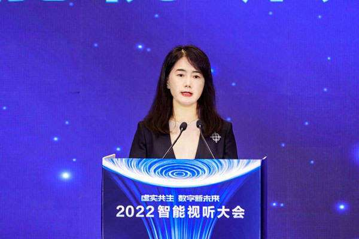

# 海信陈彩霞：虚拟现实技术是接通元宇宙和现实世界的桥梁 

近日，2022智能视听大会在山东省青岛市盛大开幕，本届大会以“虚实共生 数字新未来”为主题，打造开放共享的产业交流联动平台，通过引领智能视听产业迭代升级，为数字中国建设持续注入活力。海信集团高级副总裁、党委副书记陈彩霞在主旨演讲中表示，虚拟现实产业在数字孪生工业、智慧城市、文创和教育场景的应用上想象空间巨大。

陈彩霞表示，目前我国已拥有超过全球70%的5G基站、80%的5G用户，5G大带宽、低时延、广链接的特性，以超高清视频、AR、VR人工智能等技术融合，催生出丰富创新应用和各种场景，元宇宙热度居高不下，虚拟数字人出道，虚拟与现实链接场景百花齐放，智能视听产业发生前所未有的改变。技术的进步创造未来一万种可能，数字化未来是由硬件加软件，场景加沉浸式体验编织而成新世界。

陈彩霞认为，虚拟现实技术是接通元宇宙和现实世界的桥梁。虚拟现实产业在数字孪生工业、智慧城市、文创和教育场景的应用上想象空间巨大。虚拟现实产业的发展过程，是一个必然从虚的技术走向实的产品和服务，并不断推动经济社会运行效率和个体体验突破性提升的过程。

陈彩霞介绍，近年来海信坚定大显示战略，在电视智能终端、新型显示、商用显示和专用显示等领域全面布局，可以预见未来这些产品形态将会被不断突破，视听将突破屏幕在空间维度上大放异彩。

2022智能视听大会由中央网信办、人民日报社、山东省人民政府指导，青岛市人民政府、山东省委网信办、人民网主办，青岛高新区管委、人民视听公司承办。
