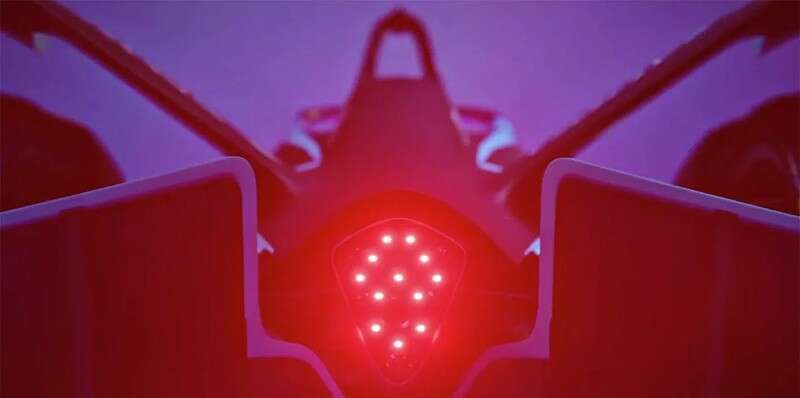
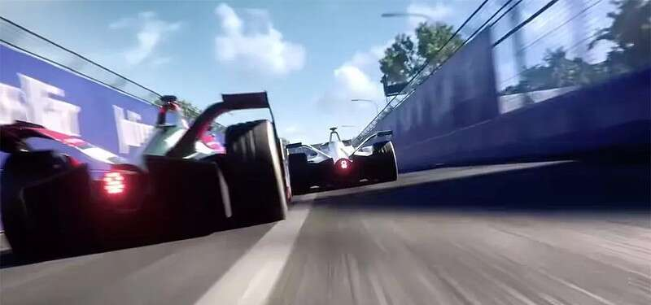
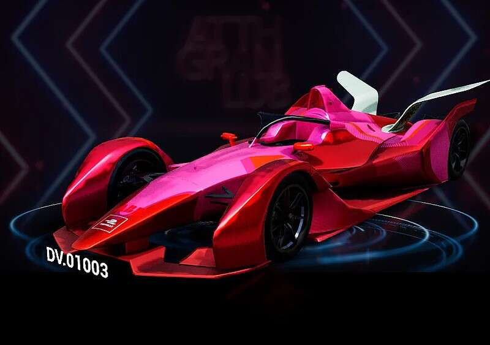
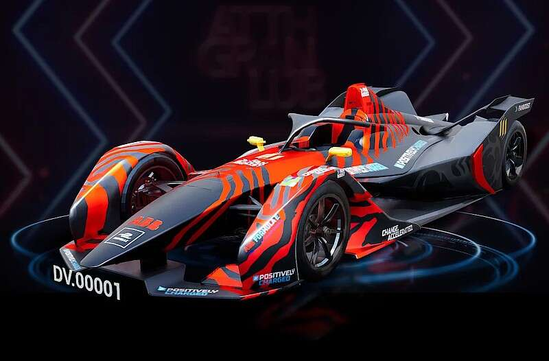

# 上演虚拟世界的速度与激情 “FE赛车”+“元宇宙”超凡赛事来袭

看过方程式世界锦标赛的朋友一定知道，风驰电掣与名将谁与争锋的壮阔场面让人难忘。而在元宇宙世界里，也有一件大事正在发生。

没错，它就是来自漫联星球与国际汽联电动方程式世界锦标赛（FIA Formula E Championship，简称FE）的授权方北京空天云飞公司共同推出的[元宇宙-FE赛车]专题，并正式在DV101星球启动第一届“元宇宙”赛车锦标赛！

通过引入一万辆不同等级的FE赛车与超过百万的丰厚奖金的赛事，为近年来炙手可热的元宇宙概念带来全新的可能，而大众也将得以在酷炫的虚拟世界中体验风驰电掣的速度与激情，获得全新的元宇宙虚拟社交体验!

**当“元宇宙”遇上“FE赛车“: 超震撼的沉浸式赛事体验**

近年火热的“元宇宙（Metaverse）”是利用科技手段进行链接与创造的，与现实世界映射与交互的虚拟世界，具备新型社会体系的数字生活空间。根据著名国际咨询公司 Analysis Group （ 简称AG ）发布的元宇宙行业白皮书，未来元宇宙相关产业的市场规模将达到80 万亿美元。而作为国内最具有发展前景的元宇宙项目平台之一，北京漫联星球数字科技有限公司围绕中国传统神话IP打造“DV101星球”，内测阶段即获得数千名内测玩家的积极反馈，数十万人参与到直播讨论。

近日，漫联星球携手空天云飞公司共同推出 [元宇宙-FE赛车] 专题，在DV101星球上搭建“元宇宙”赛车场和赛车俱乐部社区，并启动第一届“元宇宙”赛车锦标赛，打破时空限制，为FE电动方程式赛车爱好者打造震撼的沉浸式赛事体验，也突破性地将超仿真虚拟数字赛车带入元宇宙，为酷炫的元宇宙世界带来全新的无限可能。

**拥有一辆最快、最轻、最强大的“FE赛车”：可以驾驶它参加比赛的数字赛车（数字藏品）**

本次“DV101星球”[元宇宙-FE赛车] 的设计原型来自FE电动方程式的FE官方GEN2赛车，因其外形独特、性能强大并具有卓越的强度和抗压性，成为可持续的高性能赛车的全新标杆。FE电动方程式首席执行官杰米·雷格尔（Jamie Reigle）表示：“在设计赛车时，我们着手证明高性能、效率和可持续性可以毫不妥协地共存。FE赛车是迄今为止最快、最轻、最强大、最高效的赛车。”

而在 [元宇宙-FE赛车] 的世界中，DV101技术团队及原创设计团队摆脱了传统车企在量产车型时的设计束缚，将其赋予更具有未来感的设计风格，打造10000辆专属于DV101星球元宇宙的数字款3D赛车，并采用版权品的铸造方式：每一款都拥有自己的独特DV编号和图案花纹（涂装），通过区块链进行加密储存，在超凡脱俗的视觉效果与感官体验之外更极具收藏价值。

在“DV101星球”[元宇宙-FE赛车] 专题中，共有专业级，豪华级，马路级等3个不同等级的超仿真虚拟数字3D赛车，用户可以驾驶专业级，豪华级，马路级等3个不同等级的赛车在元宇宙中畅游。车辆功能将与等级相挂钩，具备不同的速度系统，电池系统、等级编号和外形设计，同时后期更享有不同的虚拟赛车手、头盔、赛服等的选择权利以及品牌赞助收益的分红权益。

不同等级的虚拟数字赛车均配备专属打造的“DV编号”悬浮式车头LOGO，彰显独特的元宇宙数字赛车手身份。

[元宇宙-FE赛车-专业级] 仅1000辆，编号为0001到1000，采用独特的花纹和尾翼设计以及全轮驱动的动力系统，加速仅需0.1 秒，带来无与伦比的飞驰快感。

[元宇宙-FE赛车-豪华级] 仅3200辆，编号为1001到4200，有着极低的前盖与高耸的后翼板造型，一体式车身流畅性设计，带来充满未来感的视觉体验。

[元宇宙-FE赛车-马路级] 仅5800辆，采用4201-10000的“DV编号”，经典的流畅性车型和花纹保留了FE电动方程式赛车标志性的设计元素。

**“元宇宙-FE赛车” 百万奖金超凡赛事：虚实结合的赛车世界**

除了是极具收藏价值和升值空间的数字藏品，DV101星球还将举办 [元宇宙-FE赛车] “元宇宙”赛车锦标赛，一万辆不同等级的FE赛车将真正加入到激动人心的“元宇宙”赛车锦标赛，精彩竞逐百万奖金。

作为世界上首个纯电方程式锦标赛，国际汽联电动方程式世界锦标赛（FIA Formula E Championship）是全球增速最快的体育娱乐赛事，以其抢眼的环保理念和符合未来汽车发展趋势的模式，吸引着全球高收入、高学历并具有社会责任感的高净值Z世代群体；同时FE也是未来电动车最先锋的科技实验平台，与元宇宙的科技与创新概念完美契合。

在DV101星球，玩家将可以携带自己独一无二的超仿真虚拟数字FE赛车进入“FE赛车世界”，作为赛车手获得完整而逼真的FE电动方程式赛事体验。DV101星球的“FE赛车世界”占地约40万平方米，将最大限度还原真实赛道，P房（Pit House）、培训中心、品牌中心、活动中心等，在未来还将有全球汽车品牌一起加盟车队，共同打造先锋而酷炫的元宇宙虚拟赛车生态。

更激动人心的是，第一届“元宇宙”赛车锦标赛更根据不同排名设置不同等级的奖金，奖金总额高达百万级别，让FE数字赛车持有者得以在元宇宙中实现最大胆的超跑赛车梦想！

无可厚非，元宇宙-FE赛车的出现，引领了元宇宙强大的生态体系。通过DV101星球举办 [元宇宙-FE赛车] “元宇宙”赛车锦标赛，一万辆不同等级的FE赛车将加入到激动人心的“元宇宙”赛车锦标赛，这种在虚拟场上的竞技大场面也受到了行业内外的关注，未来我们也希望再次看到DV101星球第二届更多精彩的元宇宙赛事内容。

