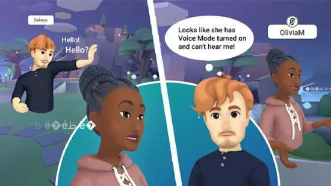

# Meta元宇宙平台Horizon Worlds已登陆法国、西班牙

Meta 的元宇宙平台 Horizon Worlds 现已在法国和西班牙推出，并将很快在其他国家/地区上线。

据了解，Horizon Worlds 是 Meta 于 2021 年推出的元宇宙平台，目前可在 Oculus Rift （S） 和 Meta Quest 2 VR 头显上使用。Quest 1 支持于 2022 年 1 月结束。到目前为止，只有美国和加拿大年满 18 岁的用户才能访问。

此前6月，Horizon Worlds 于登陆英国，这是 Meta 首次将 Horizon Worlds 带到欧洲。7月份登陆爱尔兰和冰岛。

虽然年龄限制依然存在，但 Horizon Worlds 大门已经为欧洲的社交 VR 爱好者开放。在公司的 Oculus 博客上，Meta 宣布 Horizon Worlds 将在未来几周内向欧洲越来越多的用户推出。

据悉，Horizon 平台包括 Horizon Worlds 和 Horizon Venues、会议应用程序 Horizon Workrooms 和 Horizon Home，是 Meta 元宇宙计划的核心部分。为了扩大用户数量，该集团正计划对 Horizon Worlds 进行重大扩展，并希望将该平台带到智能手机和游戏机上。

在接下来的五年中，Meta 希望在欧洲创造 10000 个工作岗位，以帮助建立自己的元宇宙。为了从零开始培养必要的专家，Meta 还在法国开设了 Metaverse Academy，为支持技术人员和开发人员提供沉浸式技术课程。
