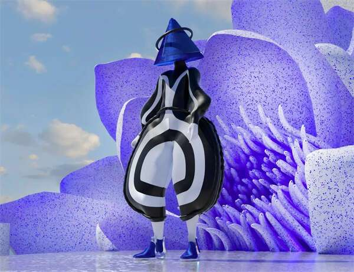
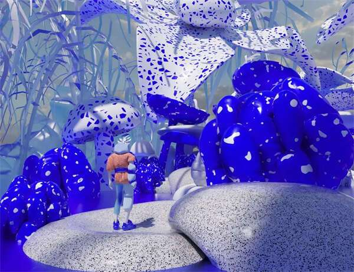
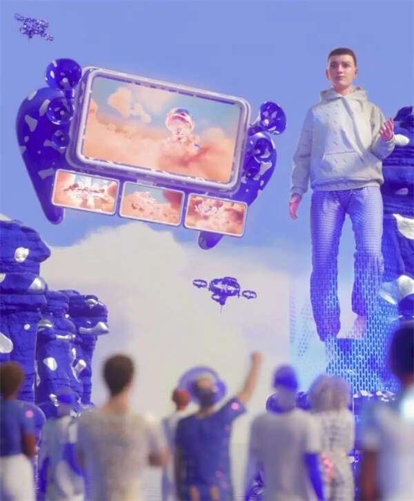
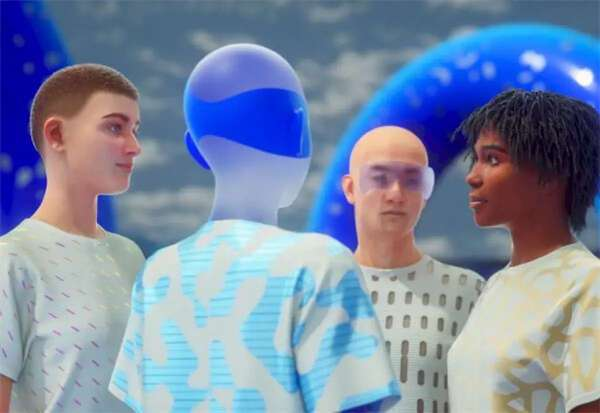

# Journee在虚拟世界中连接品牌 创造逼真的3D元宇宙环境

元宇宙概念大火，如今很多在线展会、行业峰会、发布会、招企业活动等都选择在元宇宙中创建自己的虚拟在线活动场地，Journee便是这样一个平台。Journee 是领先的软件公司，在虚拟世界中连接品牌及其受众，提供先进的风格化解决方案，以革命性的方式将虚拟空间中的人们联系起来。Journee与品牌、企业及其他领域合作，以实现引人注目和面向未来的虚拟世界。

Journee的定制交互式流技术为人们创造了逼真的 3D 环境，让他们聚集、获得灵感和交流想法。Journee 使这成为可能，并且任何人都可以在任何地方使用元宇宙，而无需安装任何额外的软件或硬件。

独特的世界：Journee根据每个要求定制环境，以创造所需的虚拟体验——美丽的建筑、风景、行星等等。

现场会议：鼓舞人心的演讲者、产品发布、音乐会或辩论——Journee可以将任何内容放在Journee的自定义元宇宙中并实时流式传输。

逼真的 3D 产品：Journee的虚拟空间以光线追踪渲染质量向他们的 Metaverse 访问者展示壮观的 3D 产品可视化。

空间网络体验：Journee的 Metaverse 访问者体验了 3D 现实与网络交互功能的无缝集成，例如用于转换的 CTA 和用于参与的弹出窗口。

自定义头像：Journee为每个虚拟世界创造与世界本身一样富有想象力的个体。

虚拟连接：通过文本、语音或视频聊天，在开放的虚拟空间中与新老朋友互动，通过虚拟名片和社交媒体保持联系。

富有表现力的表情符号：通过Journee的表情符号功能，通过舞蹈和动作让化身栩栩如生。

环境相互作用：用烟花庆祝成就和特殊时刻，或者在海滩酒吧喝一杯，JOURNEE 使虚拟世界中的各种交互成为可能。

Journee将云流、沉浸式设计和 UX 工具集进行独特组合，在互联网上创造了高质量的沉浸式体验，同时让每个人都可以通过浏览器访问它；网络的所有功能，例如游戏内购买、社交媒体嵌入、实时聊天和混合媒体，都可以在逼真的 3D 环境中使用；通过Journee自己的虛拟世界自定义内容管理系统，Journee能够实时采用新媒体内容、世界氛围，甚至在几秒钟内宾客名单系统。

Journee 的技术包括最高质量的视觉实时渲染、交互式和网络功能，以及允许访问者通过任何浏览器和任何设备进入虚拟世界体验的能力。艺术家和企业已经开始在 Journee 平台上的虚拟 3D 环境中与他们的粉丝和用户互动。

Journee创造的每个世界都是独一无二的，并且在设计时考虑了品牌形象。Journee的设计团队会在概念阶段与企业协商，了解企业的需求和目标。通过这样做，Journee能够创建一个对品牌而言是独一无二的元宇宙。

从鞋子到汽车，Journee可以在元宇宙中复制它。无论是产品发布还是时装秀，Journee 虚拟世界中的 3D 产品都精确到最小的细节。

Journee的客户通常会将视觉内容添加到他们的虚拟世界中，无论是主题演讲者、讨论小组，甚至是音乐会。无论格式如何，Journee 都可以预先录制或直播其视觉内容。Journee的 3D 高清在线流媒体技术以 60fps 的最高质量提供。

从技术和创意的角度来看，Journee的团队拥有业内一些一流的设计师。无论化身是现实的、艺术的还是单纯的有趣。Journee将首先了解企业愿景和品牌，以便Journee可以设计最适合企业的虚拟世界形象。

为了创造逼真的人文虚拟世界体验，Journee决定从游戏机制中加入空间识别功能。这使得当用户接近 Journee 虚拟世界中的化身和对象时，可以更清楚地听到和看到事物——就像在现实生活中一样。
