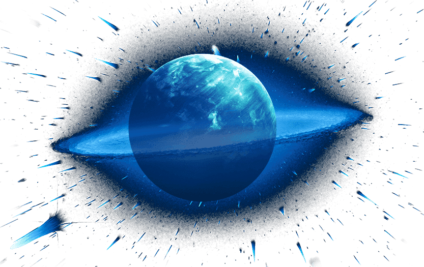
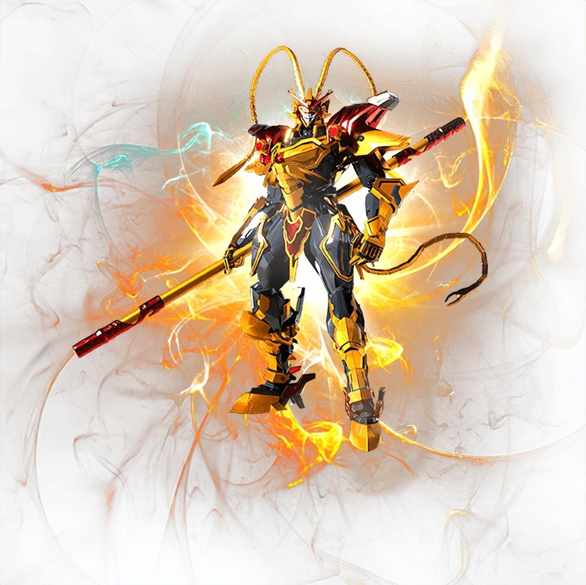
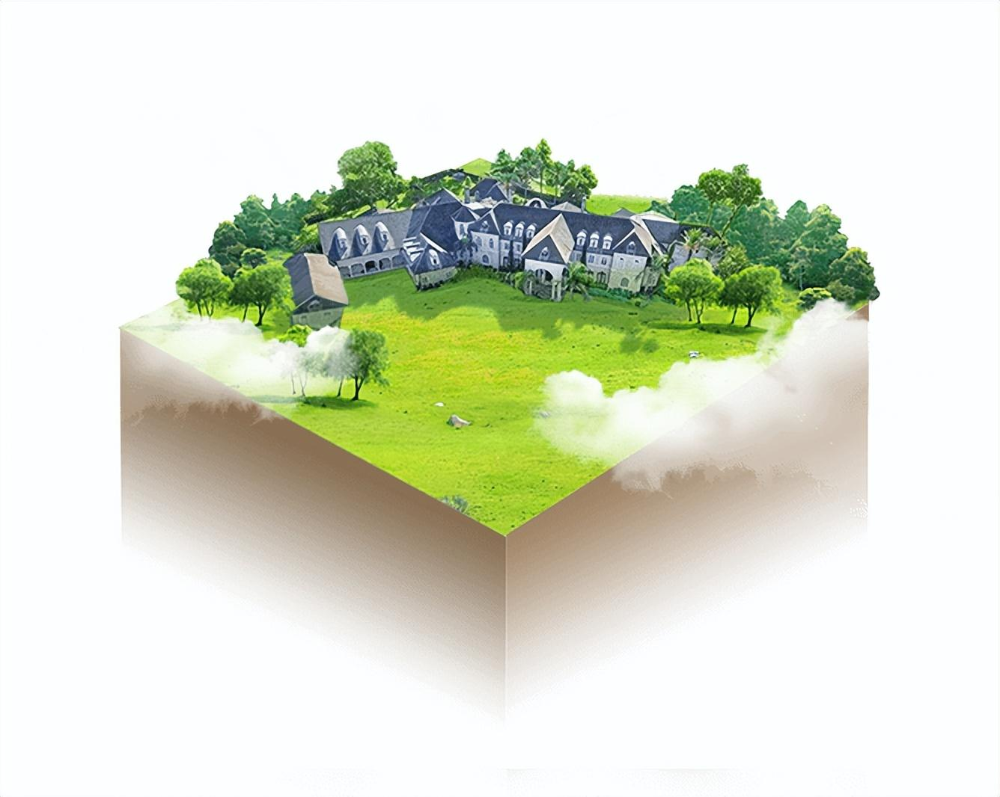
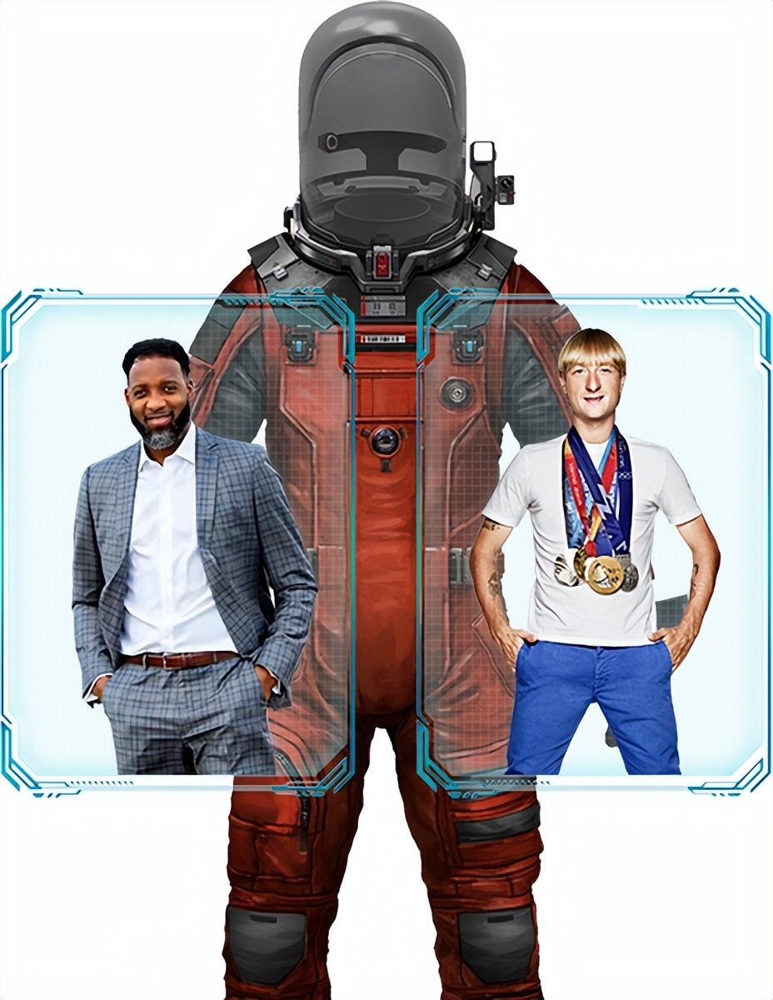

# 元宇宙虚拟世界Dreamverse 手冢治虫、EVA、流浪地球、漫联盟都在入驻

元宇宙概念充满了无尽想象，由元宇宙概念应运而生的虚拟世界平台层出不穷，其中Dreamverse很特别。Dreamverse和许多世界IP达成合作，手冢治虫、《EVA》、《流浪地球》、NBA球星麦迪、漫联盟……很多熟悉的IP人物都能在这个虚拟平台触碰交流。Dreamverse是一个高保真、精细还原众多明星、电影、动漫、游戏等顶级IP世界和现实世界的虚拟世界。

Dreamverse致力于打造高保真、精致、视觉冲击力强、沉浸式体验的元宇宙。用户可以在虚拟世界中进行销售、构建、分享、参与和互动，让用户获得与现实相同的存在感和体验感。所有参与者都将沉浸其中，共同创造一个新世界。‎土地，建筑，阿凡达，蛋等等，更多激动人心的玩梦世界方式‎。

和阿童木一起拯救世界， 和NBA球星麦迪一起打篮球，和普鲁申科一起滑冰感受冰上魅力，在《EVA》的经典场景中体验人类补完计划，甚至体验《流浪地球》的生死逃亡…这一切是不是像极了《头号玩家》里的虚拟世界？今天，这些遥不可及的场景在DreamVerse元宇宙里都可以实现。

DreamVerse已经签署了包括《阿童木》在内的数十部手冢治虫的经典作品和动漫人物；签署了影响一代人的经典动漫《EVA》和开启中国科幻电影先河的影视作品《流浪地球》；NBA球星麦迪和“冰王子”普鲁申科已经入驻DreamVerse元宇宙，并认购了专属土地来打造自己的家园。

漫联盟也已经与DreamVerse 正式达成合作协议，将于近期在DreamVerse中开通“西游元宇宙”为主题的数字藏品、游戏、娱乐、社交等一系列应用场景，致力于构建元宇宙的崭新业态，为用户增加元宇宙体验场景。

DreamVerse将对漫联盟全面开放元宇宙生态，包含动漫、影视、娱乐、游戏、顶级IP..... 双方携手，将现实世界通过VR设备，在元宇宙世界中高度逼真、精细化的呈现，为用户带来新奇的元宇宙世界体验。同时，用户可以基于漫联盟元宇宙的NFR，创造自己的梦想世界。

未来，DreamVerse将集合众多明星及影视、动漫、游戏等顶级IP，打造一个将IP和现实世界高逼真、精细化还原，拥有强视觉冲击和强沉浸式体验的元宇宙，用户可以在元宇宙中进行建造、分享、参与、体验并与其他人进行互动，在创造自己独有NFT的同时体验社交娱乐。

DreamVerse的愿景是汇聚全世界最精彩的VR内容，成为用户进入Web3.0的新入口。当用户带上VR设备进入到DreamVerse元宇宙中时，就仿佛走进了Tiktok、Steam，在这里，每块Land上面都有丰富精彩的VR视频内容、强体验感的VR游戏，每个用户都能身临其境的感受、体验元宇宙的魅力。
