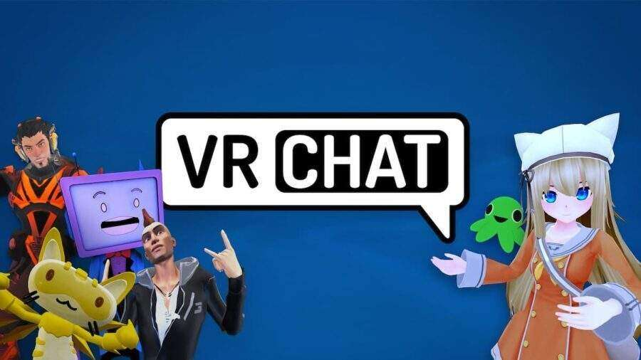
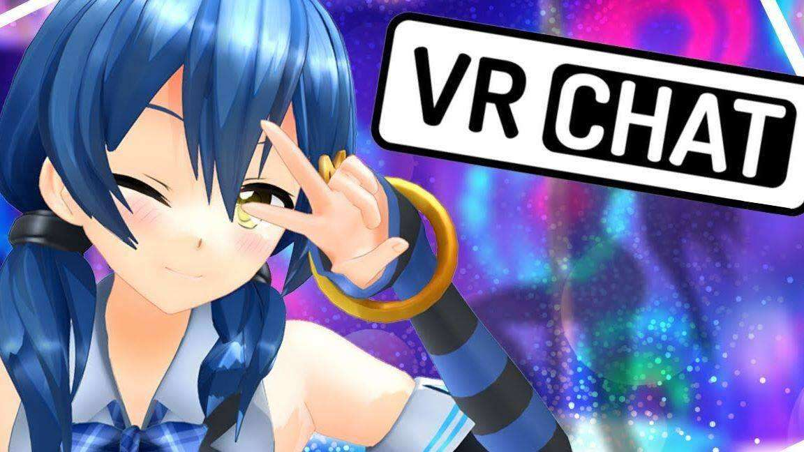
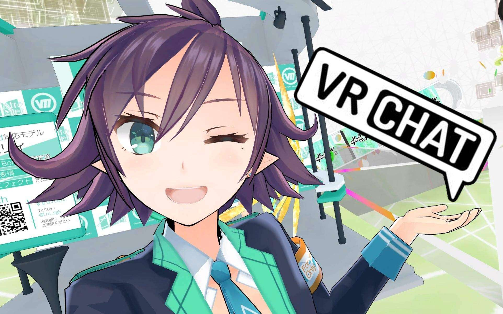
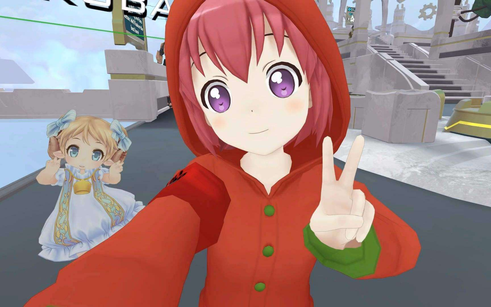

# 最接近“元宇宙”的存在？VRCha世界上最热门的虚拟现实游戏之一

元宇宙是什么？简单的理解就是一个数字与现实世界平行的世界，即虚拟现实。随着元宇宙概念的持续火爆，各类虚拟现实社交平台扎堆出现，而在众多玩家眼里，VRChat才是玩家眼中最接近“元宇宙”的存在。

VRChat是一款由格雷厄姆·盖勒（Graham Gaylor）和杰西·荷德瑞（Jesse Joudrey）开发的免费大型多人线上虚拟现实游戏。其允许玩家以3D角色模块与其他玩家交流，同时也支持Oculus Rift、HTC Vive和Windows Mixed Reality虚拟现实耳机。

VRChat的游戏玩法与《第二人生》和哈宝相似。玩家可以自行创建服务器，在其中玩家们可以通过虚构角色彼此交流。与游戏一起发行的软件开发工具包则使玩家可以创造来自各个知名ACG系列的重要人物，并将其作为他们的角色。玩家的模型可以支持“声音对嘴、眼动追踪、眨眼和动作”。游戏还包括一些小游戏，例如夺旗、战斗光盘等。

在VRChat可以与世界各地的人们互动，通过尝试新头像来体验身份。许多用户报告说 VRChat 有助于克服社交焦虑，建立长久的友谊，表达自己，建立世界并邀请人们加入其中。

全身化身：具有唇形同步、眼球追踪/眨眼和完整运动范围的化身

表达自己：用手势、表情和表情符号表达自己

3-D 空间化音频：VRChat的 3-D 空间化音频可帮助玩家听到对玩家而言很重要的对话

社交活动：与朋友聊天、协作、绘画、雕刻等。

头像创作：使用VRChat的 Unity SDK 创建自己的头像和世界。

探索世界：探索由其他社区成员创建的数百个世界。

每周活动：参与官方和社区活动。

建立友谊：你永远不知道你遇到的下一个化身是否会成为你下一个最好的朋友。

虽然这游戏叫做VRChat，但VR设备并不是必要的。但是因为游戏内缺乏打字接口，所以麦克风和说话的能力还是必要的。另外，使用键盘鼠标来游玩时，一些功能像是脸部表情或者自带物品等无法启动。而键盘鼠标的玩家也只能在有限的角度和高度来拾物或者做身体动作。

VRChat是领先的虚拟世界平台之一，拥有最大的活跃用户和创作者在线社区之一。VRChat的社区已经创建了数百万条内容，并在给定的会话中花费了很多时间。无数的友谊、团体和活动已经形成，并且每天都在增长。VRChat已经在 Steam（Vive、Index、混合现实）和 Oculus Home（Rift 和 Quest）上推出，并计划在未来推出更多平台。VRChat 不需要使用 VR，但VRChat的许多桌面用户在使用该平台后会快速升级。

使用 Unity 游戏引擎和VRChat的 SDK，人们可以创建并上传他们的作品，以便与他们的朋友和全世界分享。除了构建内容外，用户还使用 Twitch 和 Youtube 等服务进行表演、玩游戏、聊天、交朋友、角色扮演、举办活动和流媒体。此外，VRChat拥有 Discord 上最大的社区之一。

作为一款在线人数可以稳定在2W+、巅峰可以达到近9W人的虚拟社交软件，VRChat的成功自然离不开创造者的先见之明：早在被称为VR元年的2014年1月，VRChat就已经以VR头套设备Oculus Rift DK1原型机应用的身份发布。两个月后，当时的Facebook以30亿美元收购了Oculus，VRChat三位创始人才知道自己创造了一个有现象级潜力的软件。

虽然VRChat在技术方面并没有特别突出的优势，没有高精度人物模型、也没有开发特别有趣的虚拟游戏，但VRChat最大的资本是玩家，准确的说是玩家社区带来的无限内容创造能力。在Unity技术的支持下，VRChat允许玩家自己创造游戏里的场景世界、人物形象、头像等等，也允许玩家使用各种mod插件来丰富和调整游戏本就不太丰富和完善的各种功能。相对于其它VR软件，VRChat更加自由和开放。

《VRChat》的玩家可以套上任何自己喜欢的虚拟形象，去一个由玩家自己创造的千奇百怪的世界，在各种mod插件的辅助下与另一名玩家交流互动。男扮女装去跳个二次元集体宅舞不是什么大新闻，虚拟漫展、音乐会想办就办，各种奇葩课程、艺术展会、虚拟游戏就看组织者的脑洞有多离谱。虽然《VRChat》本身只是款聊天软件，但在玩家的手中已经变成了一个名副其实的虚拟乐园。
