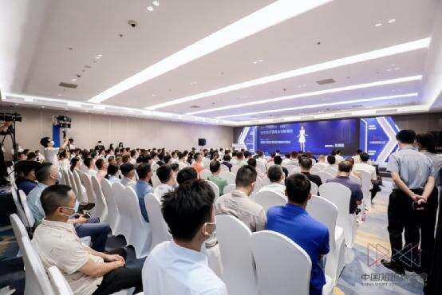
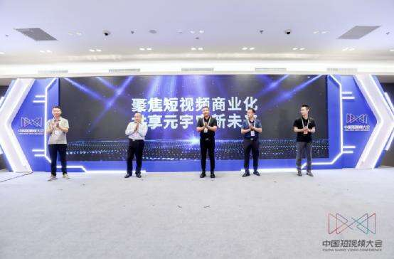

# 短视频大会：百鸣未来升维变革，开启元宇宙新征程

近日，由百鸣集团承办的第三届中国短视频大会主题论坛以“短视频内容商业化新路径”为题，围绕版权、短视频内容商业化以及元宇宙+短视频等热点话题展开深度对话，汇聚政产学研专家代表，共同探索短视频内容商业化的创新路径，为行业发展积极建言献策。

论坛上，百鸣未来（北京）数字科技有限公司（下称百鸣未来）联合行业发起中国元宇宙商业化倡议，并与禾只数字版权商城进行战略签约，是本届论坛的亮点。小猪数藏和虚拟主持人“朱晓薇”的惊艳亮相，也获得了业内外人士的广泛好评。

**携手行业，做大做强元宇宙**

短视频是文化与技术深度融合的产物，元宇宙的加入会加速其进化。在这一趋势下，国家先后出台《关于推进实施国家文化数字化战略的意见》和《关于推动出版深度融合发展的实施意见》，对文化数字化进行总体部署。这意味着，全面贯彻实施文化数字化战略，将进一步推动短视频发展转向治理现代化、内容高质化、数据确权化、交易合规化和业态智慧化。

为共同推动短视频商业化、深化各方合作，以元宇宙赋能经济高质量发展，百鸣未来总经理陈仙朋联合四位行业代表：北京林夕影业总裁曹齐，淘梦科技、数字星空高级副总裁刘广杰，北京紫禁城影业市场部主任安轶强，国美集团品牌营销vp朱伟东共同发起倡议。

联合倡议书提出，将多措并举创新短视频内容生态，达成线上线下一体化，在线在场相结合的数字文化新体验；携手建设行业示范高地，加强行业间的交流，优化数智赋能机制，推动短视频元宇宙正向发展；注重以虚促实，以虚强实，大力发展短视频、元宇宙对实体经济赋能作用；加快脚步探索行业建设标准规范，共创短视元宇宙新业态。

**守正创新，持续引领行业发展**

论坛现场，百鸣未来与禾只数字版权商城进行战略签约，为今后的创新合作奠定了更加坚实的基础和更加有活力的共探氛围，打造了极具代表性的数字资产生态示范案例。百鸣未来总经理陈仙朋与禾只科技有限公司总经理张元林对此次合作充满期待和信心，并对未来给予了祝福及展望。

伴随市场以及监管体制的日益完善，此次合作将助力小猪数藏平台搭建文化资源数据和数字文化内容的确权、交易体系。小猪数藏聚焦影视综短视频数字资产业务，而这条赛道竞赛者极少，并未有巨头出现，小猪数藏凭借自身业务独特性和体系优越性快速跑通商业回路，成为赛道领跑者。同时，小猪数藏严格遵守市场规则，坚持合法、合规发行藏品，力图和行业一起构建健康、创新、活跃的文化数字资产交易市场格局。

本次论坛不仅呈现了一场思想交锋盛宴，更标志百鸣未来发展新纪元的到来。百鸣未来借势影视版权，深耕元宇宙业务，旗下三大板块小猪数藏、小猪虚拟人、小猪数娱锚定影视综泛文娱领域，构建成多元化、数字化的小猪元宇宙。未来，百鸣未来将深挖数字藏品、虚拟人成长势能，成就元宇宙领军品牌，并为行业良性发展不断贡献力量，为全民开启Web3.0时代注入企业力量。
