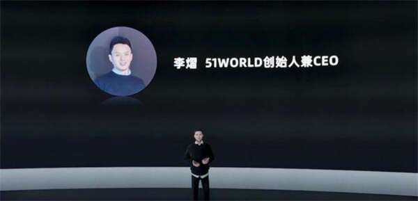
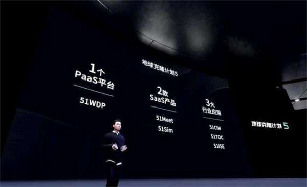
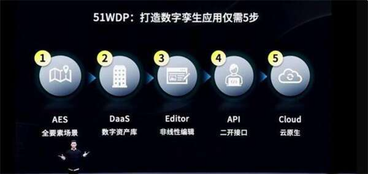
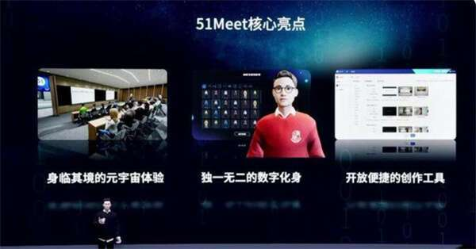
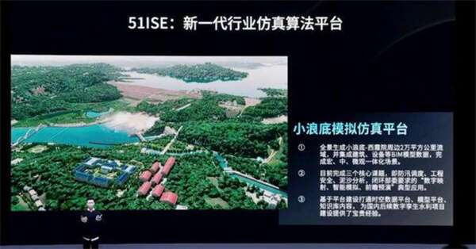
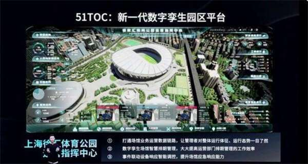

# 51WORLD创始人李熠：Web3.0时代，每一家企业都应有元宇宙空间

近日，数字孪生平台公司51WORLD举办了元宇宙发布会，正式带来了其数字孪生产品地球克隆计划5。51WORLD的创始人兼CEO李熠通过自己的虚拟数字人举办了这一场发布会。

在此次发布会上，51WORLD带来了1个PaaS平台51WDP，2款SaaS产品51Meet、51Sim，3大行业应用51CIM、51TOC、51ISE。

“我们希望在2030年打造一个完整、真实的虚拟世界，我们将为100万位企业和用户提供数字孪生的服务。”李熠说道。他认为我们正在走入Web3.0时代，内容正在以图文和视频以及实时3D互动的模式呈现。并且，未来的创作会变得更加多元性。

**一、1个PasS平台：5步打造数字孪生应用**

此次会议上，51WORLD推出一个PasS平台51WDP，该平台可以用无代码的方式进行编译，并且可以应用在PC端，VR/AR端、手机端。“平均每一到两个月，我们就会对该产品进行一部分更新。”李熠说。

51WDP可以将数字孪生应用变得非常简单。据介绍，简单来说，打造一个数字孪生的应用一共只需要5步，包括AES全要素场景、数字资产库、非线性编辑、二开接口、云原生。

“从本月开始，我们将逐渐发布100个城市的数字孪生地图。”李熠说道。他还介绍到将给企业提供不同的云服务。

“过去高不可攀的数字孪生创作，如今已经触手可及”。他还举例到，扬州电信通过WDP软件3人5天的时间就开发出所需要的产品，整个产品的开发效率提升了近10倍。

**二、2大SaaS产品：如何在元宇宙上举办展会？51Meet拥有三大核心优势**

据李熠介绍，51Meet仅用了6个月的时间就成为了公司的主力产品。

“我们认为Web3.0时代，每一个公司都需要元宇宙空间，这就像Web1.0时代的网页和Web2.0时代的APP。”

他还介绍到51Meet的开发创意来源是来自于公司内部的年会。

未来，51Meet将从一个核心场景开始，逐步将其拓展至多个场景。51Meet将会提供身临其境的元宇宙体验、独一无二的数字化身、开放便捷的工具。51Meet将会为客户上带来数字营销推广、商务效率提升等好处。

如今，51Meet已经承办了多场展会，如北京CBD全球会客厅、希捷中国企业元宇宙展厅、产业元宇宙新书发布会等场景。

相比六个月快速孵化的51Meet，51Sim产品则打磨了将近5年的时间。

51Sim可以在自动驾驶领域拥有诸多应用场景。如今，51Sim已经和毫末智行、地平线在底层技术上展开合作，提供仿真闭环、算法迭代等服务。

“我们希望通过行业的深度整合、国产开源可控、数据驱动闭环等方式帮助中国自动驾驶量产落地。”李熠说道。

**三、3大行业应用场景：从小场景到大城市，数字孪生如何影响现实？**

“L4阶段最重要的突破就是在数字应用方面，需要从数据应用到仿真应用。”李熠介绍到现阶段51WORLD数字孪生的应用正处于L4+W4的阶段，由此，他们推出了三大产品：51ISE、51TOC、51CIM。

通过51ISE，51WORLD可以全景生成小浪底模拟仿真平台，并通过实时监测大坝上游水位变化等措施，完成防汛调度、工程安全、泥沙分析等核心目标。

“我们的数字孪生园区已经经历了四年的发展历史”。随后，李熠向我们介绍到上海徐家汇体育公园展馆数字孪生的场景。据他介绍，该公园通过51TOC实时监测场馆内的人流变化，并且在危险来临时及时疏散相关人员。

“一个产业园已经非常接近一个小型城市，这也是中国的产业特色。”目前，51TOC还在零碳园区、产业园区等领域落地，如崖州湾科技城数字孪生平台。

51CIM支持W4的仿真平台和城市级的L4的数字孪生精度，这都为整个城市级的数字孪生带来了新的应用。“城市级的l4上可以构建无数的应用，从工作到社交，拥有无限的应用场景。”

“我相信十年内数字孪生的应用，数字孪生的意义就和过去二三十年内土地资源的意义相同。”李熠说道。

最后，他还提到目前51WORLD希望打造一个开放的生态，提供Open API接口开放平台、Open DaaS数字资产开放平台。

**结语：数字孪生从小场景走向大城市**

2021年8月，世界经济论坛与中国信息通信研究院联合征集数字孪生城市案例，据本项目案例统计，千万人民币级投资项目占一半以上，百万人民币以上级别投资项目达到89%，项目平均投资达到2800万元人民币。

数字孪生与流量词“元宇宙”之间联动，让数字孪生市场更加活跃。但目前数字孪生在城市建设仍然面临诸多挑战。海量数据也增加了数字安全与隐私保护风险，并且目前该行业对于复合型人才资源、行业知识资源有所欠缺，创新的商业模式以及行业标准化等仍亟待深化等。
