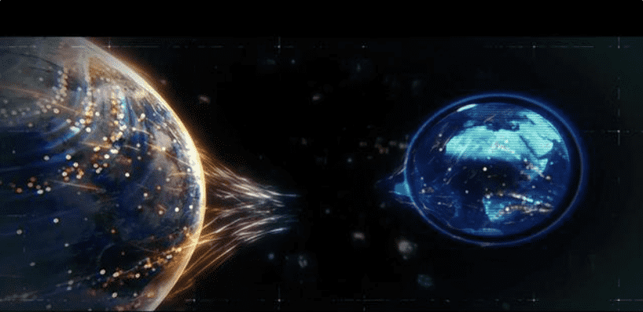

# 进入Web3.0的元宇宙新纪元，科技巨头争先“跑马圈地”

现今，国内外知名大厂纷纷入局，“元宇宙”这把大火越烧越旺。

元宇宙不仅被众多科技巨头及多国政府视为“下一个互联网时代”，一些知名机构和消费者也对元宇宙的应用提供了积极的反馈信号。加州伯克利大学在沙盒游戏“Minecraft”元宇宙中复刻了整个校园，虚拟毕业生们在里面合影留念；抖音平台虚拟人柳夜熙在“元宇宙”等概念的加持下爆火；全球众多时尚达人晒出了自己的虚拟穿搭，雅诗兰黛、HUGO BOSS等品牌携手举办了元宇宙时装周。

元宇宙浪潮的背后，一方面是互联网行业（Web2.0）陷入增长瓶颈，另一方面是互联网被巨头垄断，信息孤岛、高度中心化、隐私侵权等问题日益严重。互联网的生态参与者们不得不开始追求生产关系的重新构建，聚焦“下一代互联网”，此时，元宇宙便孕育而生，其意在构建一个更加平等的生态。

“下一代互联网”也被称为Web3.0。Web3.0是去中心化技术重构生产关系的“后端”，而元宇宙可视作是直接和用户互动的“前端”。

元宇宙是一个互联、体验式的3D虚拟世界，位于任何地方的人都可以在其中进行实时社交和娱乐，并形成一个跨越数字和物理世界的、恒久的、由用户自己拥有的互联网经济体系。而Web3.0互联网则基于区块链技术，采用去中心化的理念，其未来与元宇宙等技术融合发展。

**区块链——Web3.0元宇宙的核心**

区块链具有去中心化、开放性、独立性、安全性等特点，能为Web3.0 元宇宙提供价值传递的解决方案。

比特币实现了去中心化的资产记录和流转，而智能合约的出现则实现了交易的自主执行，进而规避黑箱操作，解决了某些场景的信任问题，DeFi 可以提高金融基础设施的效率、 透明度、可访问性和复合性，NFT 的诞生，实现了虚拟物品的资产化，大大提高了资产的流通性。元宇宙是现实世界的映射，它具备新型社会体系，需要与之契合的完整的经济规则。

区块链技术提供了去中心化的清结算平台，智能合约、DeFi、 NFT 则可以为元宇宙的资产权益和流转提供保障。毫无疑问，区块链技术是未来互联网的“基础设施”，是构建元宇宙经济体系的关键。

**Web3.0发展势头猛，但仍处于早期阶段**

自2021年起，Web3.0因元宇宙概念的火热而备受关注，获得了大量的融资。据CB insights数据显示，2021年全球区块链初创企业融资规模创下新高，共完成 1247 笔交易，总金额达到 252 亿美元，同比增长713%，2022年更加突飞猛进，一季度融资规模已经达到 92 亿美元，再次创下历史新高。

强大的资金流意味着强大的人才流。同时，Web3.0的使用者也在快速增长，因此供给端和需求端同时为Web3.0提供了增长动力。

Web3.0走向大众化市场的关键还是在于丰富的应用，但目前仍未出现“划时代”级别的单个重量级应用，距离完整生态还有很长的路要走。

因此，未来一段时间内，Web2.0和Web3.0会以共存的状态存在。一方面，DeFi、NFT、GameFi等Web3.0应用稳步向前，持续更新迭代；另一方面，Web2.0巨头自我革命，从数字藏品、虚拟数字人、防伪溯源等切入，向Web3.0靠拢，蚂蚁金服采用区块链溯源、UTONMOS采用和数链进军元宇宙链游、抖音虚拟人等都是其中的典范。

不过，在如今的市场上，元宇宙、区块链领域的人才稀缺，对于很多企业和创业者来说，想要向区块链领域转型、创业，举步维艰。
