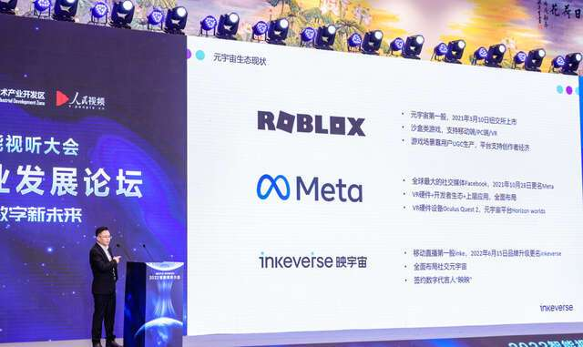
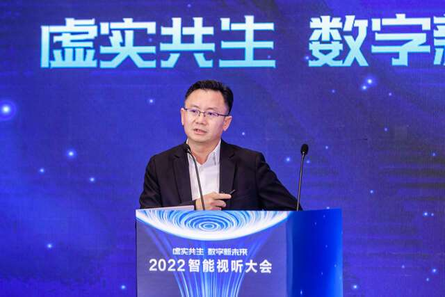
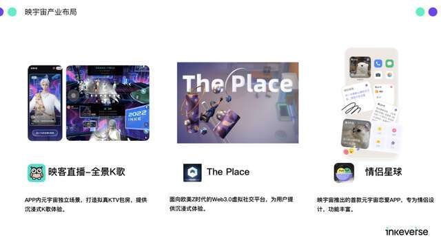
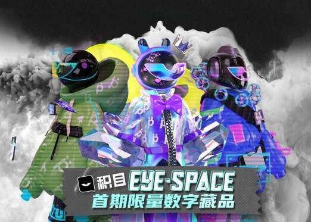
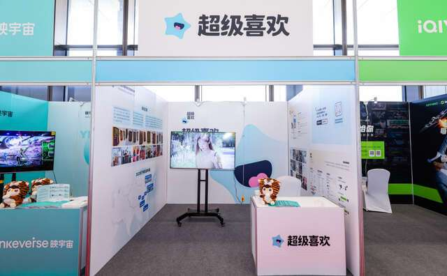

# 2022智能视听大会：映宇宙集团总编辑夏晓晖：元宇宙开启数字化新时代

近日，以“虚实共生 数字新未来”为主题的2022智能视听大会在山东省青岛市开幕。业内专家、头部企业、相关媒体代表齐聚一堂，共话元宇宙的技术迭代、场景应用和未来趋势。映宇宙集团高级副总裁、总编辑夏晓晖出席大会，并发表题为《现在即未来——元宇宙开启数字化新时代》的演讲。

夏晓晖表示，目前，全球各个国家和地区都在加速元宇宙产业相关布局，包括VR、AR等各类可穿戴设备市场规模倍增，互联网大厂也陆续入局。未来，随着颠覆性技术的升级，元宇宙必将重塑我们的生活，引领数字化新时代。

“虽然对元宇宙概念并无统一认知，但映宇宙也总结出四点共识：一是沉浸体验。元宇宙会给用户提供更实时、更同步、更沉浸式的体验，更多从移动端2D到3D，以及从手机设备到AR/VR可穿戴设备；二是内容共建。元宇宙里的内容生态由平台和用户共建，除PGC、UGC，未来也会出现AIGC；三是资产自有。元宇宙平台里的内容、数据、资产应属于用户本身，不应因平台某一天关掉，用户数据也丢失了；四是社会体系。元宇宙里需要有一套完备的生活体系，用户可能在那有份可观的收入，甚至能取代在真实物理世界里的工作。”

夏晓晖称，早在2019年，映宇宙集团就提出过跟元宇宙非常类似的概念——全场景，希望能把社交和娱乐场景融合，线上和线下、现实和虚拟打通。所以当元宇宙走进大众视野后，有种“英雄所见略同”的感觉。“我们相信，元宇宙是真正面向下一代互联网、下一代人群的。集团由映客更名为映宇宙，就是希望用元宇宙新技术，突破现实次元壁，搭建更丰富、更多维的场景，构成社交元宇宙平台矩阵。”

谈及映宇宙具体业务布局，夏晓晖则从数字人、元宇宙社交产品、数字藏品三方面展开阐述。在今年6月15日的品牌发布会上，映宇宙便签约映映为数字代言人。“数字人，是元宇宙产业构成的重要窗口。映映作为企业代言人，可以在不同场景里陪伴用户。同时，它也在映宇宙所有社交星球中，象征用户权益的‘通行证’。”

产品方面，集团已落地全景K歌、情侣星球、The Place等多个产品应用。为Z世代、情侣、海外等不同圈层的用户，提供沉浸式的元宇宙社交体验。

另外在数字藏品上，映宇宙集团也积极探索。旗下兴趣社交产品积目APP，近期打造了数字潮流社交空间Eye-Space，并推出“GMUHuman系列数字藏品”，希望通过数字藏品链接Z世代文化和潮流生活，构建年轻人的社交元宇宙。

最后，夏晓晖表示，映宇宙集团希望未来和各领域平台、各合作伙伴一起，共同推动技术进步，探索元宇宙应用落地产业，提供更有温度、更有价值、更有意义的科技服务，助力中国数字化建设。

大会期间，“超级喜欢”作为映宇宙集团旗下恋爱新品牌，也一同参与了展会。相关负责人与互联网行业专家展开深度对话，共话智能视听行业的前沿观察与未来趋势。

据了解，作为行业年度盛会，智能视听大会已连续举办三届，今年第四次落地青岛。自2019年创办以来，智能视听大会围绕智能化、产业化、国际化、场景化，打造产业创新平台，已成为智能视听领域内极具影响力的会展IP。

本届大会由中央网信办、人民日报社、山东省人民政府指导，青岛市人民政府、山东省委网信办、人民网主办，青岛高新区管委、人民视听公司承办。
