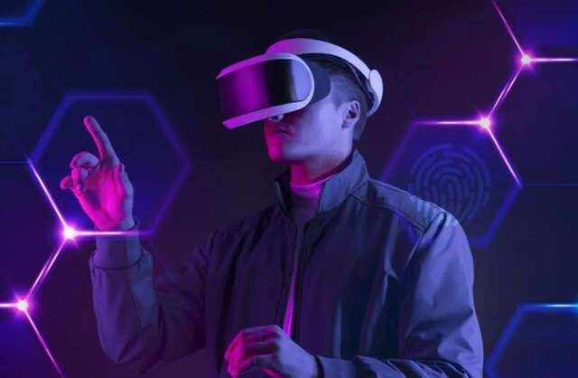
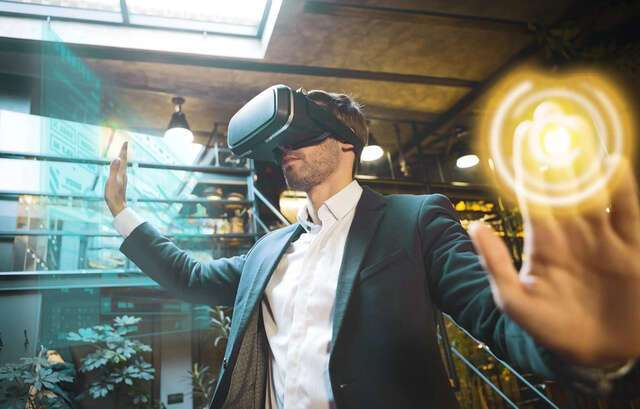
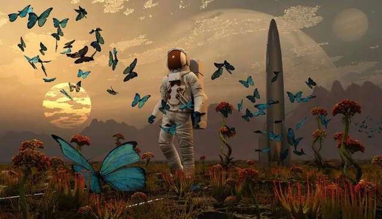

# VR的尽头是元宇宙，元宇宙的尽头是MR，穿透式混合现实

随着元宇宙概念的兴起，支撑元宇宙世界的头戴式显示设备也逐渐开始受到关注，头显示设备主要有VR和AR两种，其中VR是最畅销的，但以目前虚拟现实（VR）的技术水平来看，VR还不足以打造一个完美的元宇宙世界，我们现在体验到的只是VR游戏而已，于是一种更加先进的显示技术孕育而生。

**穿透式混合现实技术（MR）**

MR技术是一种未来技术，从工作原理上来看MR相当于AR和VR技术的结合体，它可以把虚拟和现实完美结合，真正打造元宇宙世界，MR能够让你在现实中看到非常真实的虚拟画面，因此MR不光能够打游戏，商务会议、远程聊天都很适合，甚至还可以应用在医疗、航天领域。

其实MR的工作原理并没有那么复杂，只需要摄像头（拍摄现实场景）、深度传感器（感知周围环境）、中央处理器（处理图像数据）、屏幕（显示画面）这些硬件，但相比较于VR和AR，MR对硬件参数要求很高，因为同时要处理眼睛所看到的现实场景和虚拟画面，画质、精确度、算力缺一不可。

目前这些零部件都非常贵，因此组装成这样一台穿透式混合现实头显，无疑成本非常高，这也是限制MR发展的主要原因之一！

MR的种种优点都非常适合元宇宙世界，而且体验感要比VR好很多，因此包括苹果、Meta等国际公司都在布局MR，并且认为穿透式混合现实技术就是未来的发展方向，最适合元宇宙世界的硬件设备。

要知道想要打造真正的元宇宙，就需要给大家呈现了一个真实、完美、清晰的世界，归根结底还是我们眼睛看到的、接收到的，目前VR技术虽然进步神速，但从这点来看不是很适合元宇宙世界，例如目前手机屏幕像素密度大约为550像素/英寸，VR头显大约为2000像素/英寸，MR大约为3500像素/英寸。

因此MR需要一块特别优秀的显示面板，同时还需要做成眼镜片的厚度和大小，那么价格一定非常贵，起码从目前来看这种市场上这种显示屏还没有（只存在于实验室中），只有真正量产推向市场，MR才能说真正开始普及。

屏幕像素密度越大分辨率就越高，就意味着需要性能强大的处理器支持，Mete就计划推出一款MR设备，预计售价在1000美元左右。

**元宇宙的尽头是MR**

之所以说元宇宙的尽头是MR，因为穿透式混合现实技术真正大成，能够把现实和虚拟融合在一起，在我们眼中你根本分不清哪些是现实场景，哪些又是虚拟场景，当你戴上MR头显后，你就会进入一个全新的世界，这才是我们所说的元宇宙。
