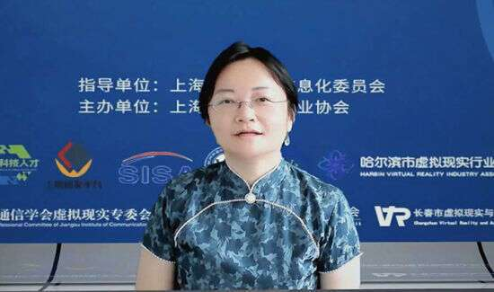

# 九场系列“元宇宙降本增效烧脑会”助力产业创新应用

为期一个月的2022元宇宙科技降本增效系列烧脑会(以下简称“烧脑会”)落下帷幕，作为2022上海信息消费节的重要活动之一，在由随幻科技打造的虚拟直播间里，上海市多媒体行业协会率先发起连续主办了9场面向教育培训、工业制造、能源能耗、文娱旅游、展示陈列、消费零售、政府服务、应急安防等场景在线对接会，对元宇宙创新技术在各领域的应用现状、优劣势分析、对创新技术的需求以及未来产业趋势等进行了一系列地探讨，收看人次累计近万人。

上海市经济和信息化委员会软件和信息服务业处刘文在闭幕式上对活动进行了充分肯定，并希望元宇宙科技能够在所有人的共同努力下早日实现产业化。

上海市多媒体行业协会秘书长明豪侠明豪侠秘书长对各主管部门及产业相关机构和企业的支持表示感谢，并表示将继续为本行业多组织赋能行业发展推动增效提质的活动。

左为上海市经信委软件和信息服务业处刘文，右为上海市多媒体行业协会明豪侠秘书长

9场对接会中，上海市多媒体行业协会扩展现实专业委员会(VAIA)分别邀请了由其编制的《2021元宇宙科技将本增效白皮书》案例入选单位作为乙方代表，如720云、易智时代、超级芯、蓝硕文化、联想上研院、睿悦信息、中谷芯、安比来、帛钥智能、境腾信息、曼恒数字、蛙色VR、一定会旺、GOOVIS、瑞欧威尔、影创科技等，对其在各个垂直领域的精选案例进行剖析，并对该领域应用的痛点、难点、周期、趋势进行阐述。同时，活动也邀请到上述相关典型用户代表，如百联、长宁疾控、迪爱斯、国网浙江、汉高投资、teamLab、上海电气、上海电子职院、上海科技馆、仪电集团自仪院等根据不同主题每期展开讨论。

活动在元宇宙产业应用方面获得了与会嘉宾及观众的一致好评。作为发起人，上海市多媒体行业协会副秘书长/扩展现实专业委员会主任端木海婴表示：通过9场讨论发现，各垂直领域对以XR为代表的创新技术态度已经一致从尝鲜变为实践，从研究部、创新部的探索已经过渡到技术部、工程部、业务部的应用；从仅为了酷炫好看而采用扩展现实技术变为强调ROI、注重实际效用；从仅有个别零星案例变为希望能规模化采用。我们也看到不同行业对应用创新技术的需求、周期和流程完全不同，这对扩展现实及其他创新技术的融合型人才布局、产业化发展道路提出了挑战。同时我们也看到当前商业环境下，垂直领域用户更希望能获得轻量化、标准化、易用型的工具，从而实现生产工作的快速优化，小步快跑逐渐迭代。

上海市多媒体行业协会端木海婴副秘书长

在这次活动的基础上，上海市多媒体行业协会将继续面向行业征集《2022元宇宙科技降本增效赋能白皮书》，本次征集的案例重点聚集两类：一是工具类案例(轻量化、标准化、易用性)帮助垂直领域客户立杆见影产生实效；二是标杆类案例(大场景、生态化、示范性)以灯塔效应打造创新技术应用生态。争取为创新技术佐证效能，为科技企业寻找商机提供一定的参考。

本次活动不仅获得了中国三大学会、上海研发平台的支持，还获得长三角地区以及北京、哈尔滨等全国十余家XR方向行业组织的支持。
