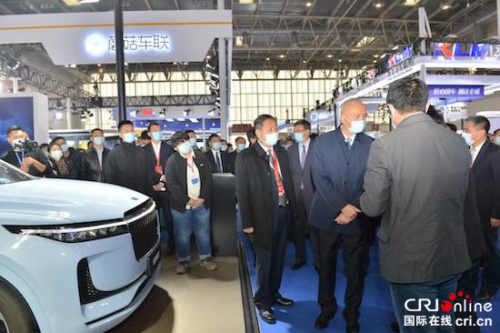
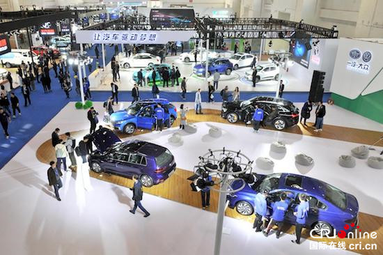
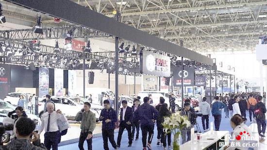
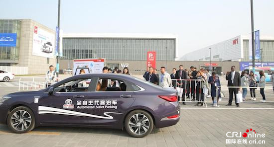

# 2022世界智能网联汽车大会展览会将于9月16日开幕 首次融入元宇宙

近日，由北京市人民政府、工业和信息化部、公安部、交通运输部、中国科学技术协会共同主办的世界智能网联汽车大会在京召开新闻发布会。会议宣布，2022世界智能网联汽车大会将于9月16日-19日在北京中国国际展览中心（顺义馆）举办，并同期举办中国国际新能源和智能网联汽车展览会、2022全国智能驾驶测试赛总决赛。

**展会名企云集 引领行业风向标**

大会同期举办的中国国际新能源和智能网联汽车展览会，是今年在北京举办的首个大型国际专业车展。今年展会主要邀请新能源和智能网联汽车产业上下游重点企业参展，日前，招展工作已接近尾声，奔驰、宝马、上汽集团、东风集团、北汽新能源、广汽埃安、百度、美团、大唐高鸿、蘑菇车联等企业已确认参展，它们将携最新款车型、前沿智能驾驶技术、先进车联网技术、自动驾驶解决方案、智能网联创新应用场景和产品等亮相展览会，引领当今全球新能源汽车、智能网联汽车产业发展方向。

**引入元宇宙 创新展览新模式**

今年展会将以更具科技感的创新手段展示智能网联汽车产业新技术、新产品、新模式和新业态。

展会将采用线上线下相结合、室内室外相呼应、静态展示和动态体验并举三种模式进行展示。线下展会规模约4万平方米，同时，搭建“云端智联”线上展览平台，设立云展览、云直播两大板块，实现24小时全天候内容输出。

2022世界智能网联汽车大会展览会将于9月16日开幕 首次融入元宇宙_fororder_image004

展会首次引入“元宇宙”，设立“智能网联汽车遇上元宇宙”展示专区，设立“智联未来科技秀场元宇宙发布厅”；首次设立“智能车时空穿梭”科普画廊、智能网联汽车科技创新成果征集展示区等特别展示，以更加酷炫、更具科技感的创新手段展示智能网联汽车产业新技术、新产品、新模式和新业态。

**自动驾驶演示 特色秀场再升级**

自动驾驶演示体验、未来智慧出行体验等动态体验活动，一直是世界智能网联汽车大会展览会的重要特色。今年与专业机构合作，将自动驾驶演示活动全面升级，在室外搭建微缩城市及各类场景，将智能配送、共享出行、公共交通、环卫作业、港口码头、干线物流、智能矿山、无人零售、智慧农业等典型应用场景连贯起来进行体验。并且充分利用室外场地的优势，打造空间宽松通畅、呈现手段多元、视觉元素直接生动的体验式室外展场。

**缤纷配套活动 “政企会客厅”受关注**

为突出展会的专业化、国际化和市场化，今年展会设置了多项创新配套活动，比如：2022全国智能驾驶测试赛总决赛、科技直播访谈间、自动驾驶接驳体验、网红打卡、寻“心”集赞、政企会客厅等。其中为产业链供应链配对、为政企对接服务的“政企会客厅”活动备受关注，企业报名踊跃。

**中德合作展示 国际顶尖技术亮点多**

2022年正值中德建交50周年，50年来中德两国在汽车产业方面的合作共赢成为中外经济技术合作的创新典范。配合中德合作国际论坛等系列活动，今年展会将特别设立“中德50年·新能源智能汽车产业合作展示专区”，邀请德国企业展示国际顶尖智能网联汽车技术。北京中德产业园拟携重点德企项目集中亮相，展示中德合作成果。
