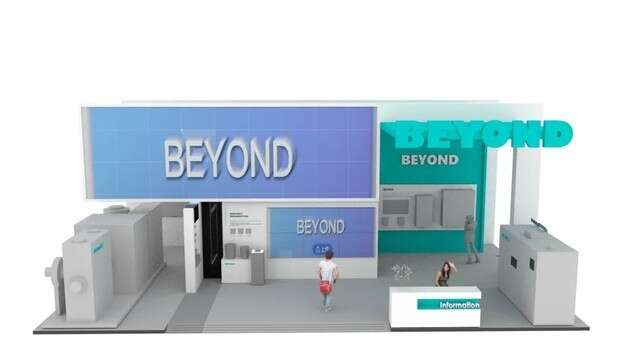
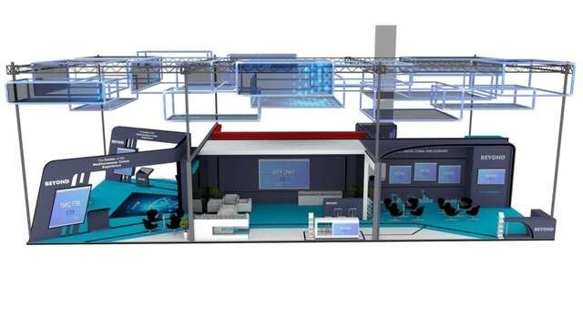
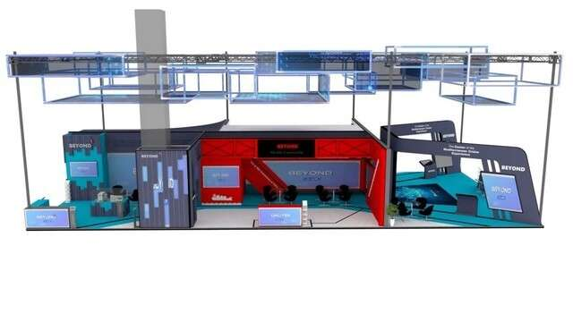
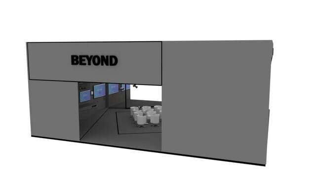

# BEYOND 元宇宙揭秘，打开互动社交新方式！

此前BEYOND已正式公布，第二届BEYOND国际科技创新博览会（BEYOND Expo 2022）将于9月21日-27日在BEYOND元宇宙里举办，持续7天。BEYOND元宇宙致力于打造一个虚实交融的新世界，开启视觉化的全新体验！BEYOND 元宇宙展区将围绕三大子品牌：生命科学、可持续发展、消费科技，吸引500+海内外科技企业参展，海外企业预期所占比例达到 40%，同时围绕投融资、消费科技、可持续发展、生命科学、Web3 设立五大行业峰会。

此外BEYOND组委还将在在元宇宙世界里搭建路演大厅、投融资对接厅以及全球媒体中心，设立超过120场元宇宙对接交流活动，让创业者可以与投资机构、产业上下游企业一对一高效沟通，促进全球科技生态与资本的交流合作。同时链接国内外媒体资源，邀请海内外百家媒体参与，为全球观众带来国际化视野的专业报道。

BEYOND元宇宙不论身处何地都能通过智能终端轻松参与，线上参展打破了虚拟和现实世界的界限，超越传统线上会议，同时带给大家更真实，更高效的线上社交体验。今天为大家揭晓——BEYOND元宇宙展区以及亮点玩法，BEYOND元宇宙也为展商及嘉宾提供更多新的机遇。

置身BEYOND元宇宙中，参加BEYOND线上活动的嘉宾、观众之间，可以进行交换名片、面对面聊天等社交活动；可以通过给其他嘉宾、观众发送私信，点击瞬间移动到他身边；参会者可以体验沉浸式逛展，点击地图图标就可以到达想要去的地方，穿梭于展厅及多种论坛现场，以超现实的方式感受前沿产品和科技创新理念，增强展商和参会者的互动。

BEYOND展区为参展企业提供线上展品展示、品牌宣传、对外交流、洽谈合作的解决方案及服务。展商可以在BEYOND元宇宙博览会的展区打造属于自己的虚拟展位，通过上传文件、图片、视频等功能在虚拟展位中充分展示公司科技产品和前沿技术，更值得一提的是为了展商节省参展成本，BEYOND特别开发外链功能，展商可直接设置链接到公司已有网站或虚拟产品展示。通过体验更真实、更高效的线上交互体验，有效实现产品推广，借助BEYOND媒体资源，提升品牌影响力和塑造企业形象。

