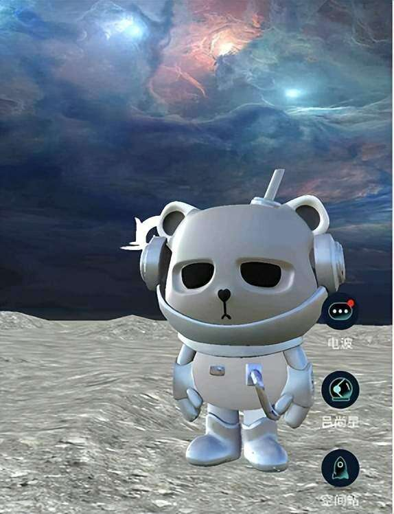
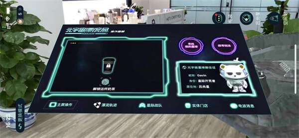
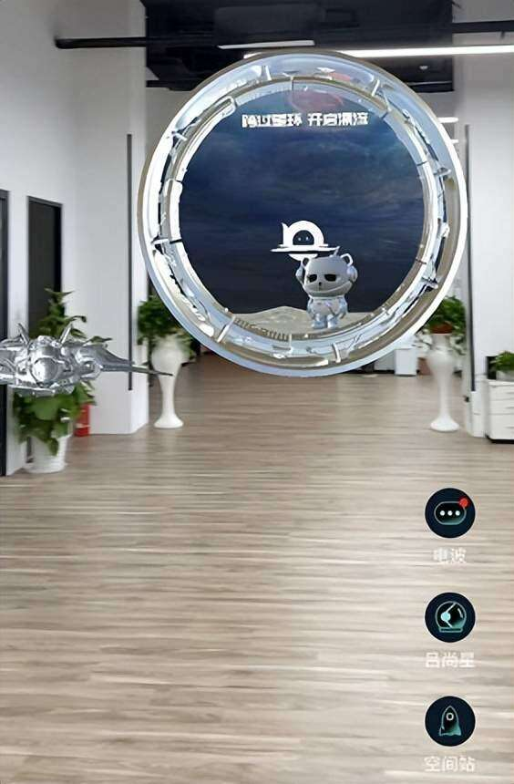

# 虚拟对象与现实世界场景无缝融合让元宇宙漂流局的未来无限延展

随着数字技术和社会理念的发展，人类向内心寻求满足，把更多的消费用于满足自己内心的多样、快乐和愉悦，社会的创造力和丰富度将被激发，这是一个单向式的过程，人类，一定向这个方向进发。

元宇宙漂流局页面

元宇宙漂流局在AR社交赛道的潜力无限，平台内玩家突破时间与空间限制创作个性化AR内容。在虚实结合的世界中，人们通过AR表达自我，因志同道合而互相吸引，赋能社交关系产生新的改变。

“元宇宙漂流局”是一款独特的沉浸式AR情景交互社交平台，以AR赋能“地点+”的交互方式为玩家带来耳目一新的AR情景交互功能与体验。元宇宙漂流局的AR情景为玩家提供一种身临其境的体验，它将虚拟对象与现实世界无缝融合。

元宇宙漂流局页面
元宇宙漂流局应用LBS移动定位和场景识别系统，将虚拟图像与真实场景相结合，让整个现实世界都成为可交互的虚拟空间。玩家可通过移动设备与真实场景无缝融合，增强游戏般体验中的临场感与真实感。

元宇宙漂流局在玩家中具有较强的吸引力，不仅在于其应用AR技术，将真实环境与虚拟图像进行有机互动，更在于其注重玩家需求，打破人与人之间的隔阂感。

“元宇宙漂流局”具备沉浸感、真实体验和虚实互联等特征，极大地扩展了“隔着屏幕互动”的社交平台。数字技术全面融入年轻人社会交往和日常社交生活的新趋势，搭建新型消费场景、构筑全民畅享的数字生活提供新的应用途径。

在未来，元宇宙漂流局会朝着AR场景更加注重用户体验与技术更新的方向发展。AR场景及其社交价值领域相关议题将会得到更多学者关注。AR场景叠加带来的高互动性、体验感和话题性将会更加受欢迎。
