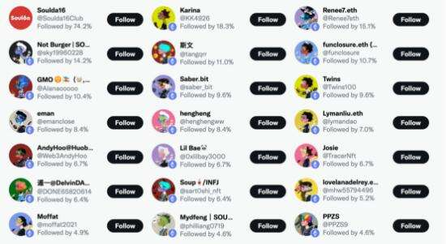
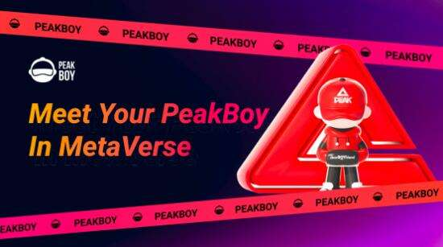

# Tony Parker携手匹克打造PeakBoy元宇宙生态

2021年Flow链上NBA Top Shot的成功发行，以及数字艺术家Beeple的作品《Everydays：The First 5000 Days》拍出天价，让越来越多的投资机构、加密用户的目光，由DeFi赛道集中到了NFT领域。2021年这一年，也被大部分的加密圈用户认为是NFT元年。

NFT，即非同质化代币。随着NFT领域的不断发展壮大，这些基础概念已耳熟能详，无论对于本身就处于web3的原住民，还是圈外想要入圈的向往者。从CryptoPunks到加密猫，从无聊猿到哥布林，明星带头换头像、财富效应叠加将PFP类NFT的发展带到了一个全新的高度。

如今各大社交软件上，如推特、Ins、FB上的头像，基本都被换成了NFT头像，彰显着持有者的自身的个性与态度。而NFT的发展，也逐渐成为一种身份、圈子的入场券，在这里能够更容易找到和自身兴趣相投的同伴。

NFT的发展让各行各业的用户参与了进来，体育圈尤其如此。先有NBA Top Shot 和NBA达成合作，售卖球员精彩瞬间盲盒，后有球星如库里、欧文、伊戈达拉等自己购买NFT，并且还成为一些项目签约的代言人。甚至很多球员已经和项目进行合作，发行自己的NFT，如奥尼尔、罗德曼、魔术师约翰逊、韦德等。

托尼帕克，法国小跑车，与石佛邓肯和妖刀吉诺比利组成NBA圣安东尼奥马刺队的黄金铁三角，帮助球队4次捧起NBA总冠军的奖杯，07年还拿到了NBA总决赛的FMVP(历史上首位总决赛外籍FMVP)。对于篮球爱好者来说，托尼帕克的这些高光时刻彷佛就放生在昨天，让人记忆犹新。

退役后的帕克依旧活跃在体育圈，现在是ASVEL Basket球队的板。而帕克和匹克的合作，早在2013年就已经开始了，作为匹克的全球形象代言人。这一次匹克和托尼帕克再度联手，推出了PeakBoy系列NFT。

在NBA征战了18年的帕克，挑战巅峰、追求卓越是早已刻在骨子里的信条。而做运动鞋起家的匹克也将无限可能当作Slogan烙印在品牌文化中。这一次双方合作在匹克运动品牌背景下，还把街头、潮流、涂鸦、Y2K、赛博复古等文化元素，融合到PeakBoy系列NFT中，旨在将匹克精神通过不同形态的PeakBoy传递到世界的每个角落，让不同纬度不同国界的用户感受到精神的洗礼、文化的传承。

PeakBoy是发行在以太链上的10000个形态各异的NFT。这些NFT也将成为PeakBoy态系统的基础，解锁PeakBoy元航俱乐部的所有权益。

NFT的持久发展是所有项目都面临的问题，如何维持热度和持续赋能创造新的价值，是持有者长期持有的关键。根据官方公布的路线图，PeakBoy生态大致上分为3个时期。第一时期NFT上线，在托尼帕克宣布要进军元宇宙发行NFT后，不到10天项目官推突破1万人，市场反响良好，个人IP价值带来了很大的关注度。

构建生态需要需要不断地为NFT创造新的价值，PeakBoy作为元航俱乐部的准入门槛，在第二时期俱乐部会员将会获得新的NFT空投，用来升级当前手中的PeakBoy，成为可玩性更强的虚拟化身。

进入到第三时期后，俱乐部的成员将会获得PeakBoy的元宇宙土地和相应代币PBT空投，同时获得只有会员才能进入的Gamefi游戏资格。通过PBT，代币持有者可对DAO上的治理提案进行投票，并进行PeakBoy生态上的独家 功能，如游戏P2E、活动参与、购买土地等服务。

NFT的发展走过了图狗乱战的时代，以无聊猿为代表的NFT生态建设持续发展，是未来NFT的趋势。游戏的可玩性扩展了NFT的社交属性，不仅仅只是一个头像、一个身份，而是能创造更多价值和可能的钥匙，而游戏的天然粘性也会让社区更有活力。

PeakBoy通过PFP作为切入点，匹克和托尼帕克IP的加持让项目一上线就收到关注，后续持有NFT解锁更多的玩法以及空投激励，促使更多用户关注到项目并且长期持有，一方面有助于新老用户持续流动维持项目热度，另一方面对长期持有者利好，获得长期的价值捕获收益。
