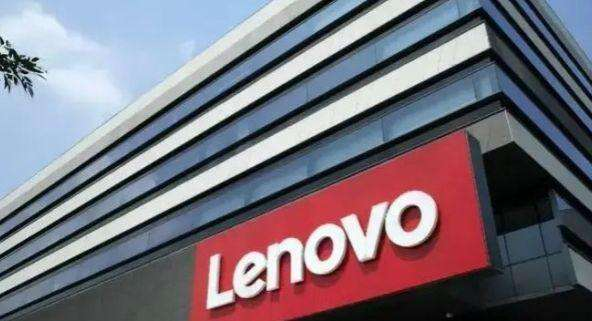
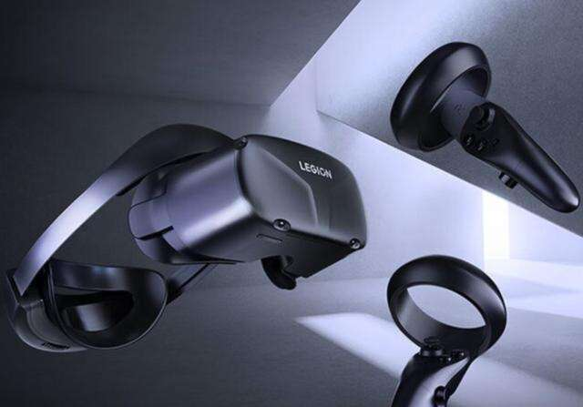

# 联想进军元宇宙，发布拯救者 VR700 VR 一体机

VR设备现在也算是代表着元宇宙的一部分，所以成为了大家争相要占据的高地，所以不少的品牌都在发布自己的VR头显设备，其中就有联想，近日联想发布了拯救者 VR700 VR 一体机。

联想拯救者 VR700 VR 一体机采用旗舰级 VR 平台高通骁龙 XR2，配备 8G RAM 和 256G ROM。 VR700 配备分辨率高达 3664*1920 的快速响应 LCD 屏幕，有 72/90Hz 高刷新率支持。

这款VR采用了完整的6DoF设计，实现了毫米级定位精度、 毫秒级初始化速度和毫秒级延迟速度精确识别身体动作。

还采用帽戴式设计，且精心优化了前后重量，长时间佩戴也不会有明显的拖拽感。

据了解，高通 XR2 平台是目前主流VR头显采用的重要计算核心。新一代骁龙 XR2 平台的 CPU 与 GPU 性能提升、4 倍视频宽带提升、6 倍的分辨率提升以及 11 倍的 AI 性能提升。

此外还包括了先进的 XR 软件服务层、机器学习、骁龙 XR 软件开发包。

联想拯救者VR700配备分辨率高达3664*1920的快速响应LCD屏幕，有72/90HZ高刷新率支持。

联想现在之所以会去做VR，主要是因为联想的营收大头是个人电脑业务，而该业务的市场前景并不看好，要继续打造第二增长曲线的联想只能另想办法，比如做VR。

其实早在2015年，联想上海研究院开始AR眼镜的研发；2017年联想创投参与了AR智能眼镜光学模组供应商耐德佳的融资，后者成功进入联想供应链，协同研发AR/VR产品。所以联想发布VR产品也不足为奇。

