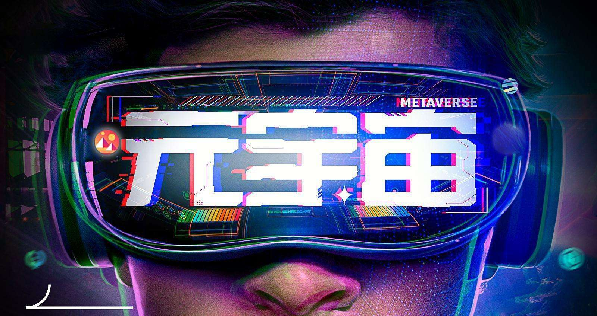

# 北京城市副中心将打造元宇宙主题乐 《指环王》IP被收购

《北京城市副中心元宇宙创新发展行动计划(2022-2024年)》近日印发，力争通过3年的努力，将城市副中心打造成为以文旅内容为特色的元宇宙应用示范区：元宇宙技术创新应用能力明显提升，培育、引进100家以上元宇宙生态链企业，落地建成30项以上“元宇宙+”典型应用场景项目。

《行动计划》聚焦“元宇宙+文旅”、“元宇宙+商业”、“元宇宙+城市服务”三个特色方向的融合应用创新。副中心将聚焦培育元宇宙细分产业链，打造数字设计、数字人、混合现实、数字艺术四大产业链条。

未来三年，副中心将依托文化旅游区、张家湾设计小镇、台湖演艺小镇等重点区域，加强文化IP资源创造性转化和创新性开发，打造元宇宙主题乐园，建设“元宇宙+文旅”场景。开展全域高精度三维城市建模，适度超前布局数字原生智能基础设施，推动智慧办公在城市副中心应用，建设“元宇宙+城市”场景。
