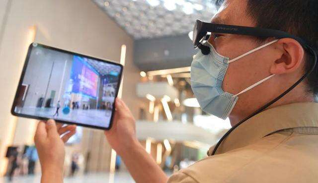
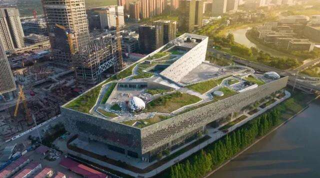
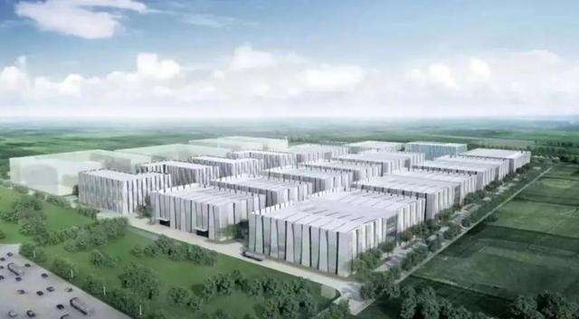

# 打造“元宇宙”特色产业园区！世界人工智能大会浦东分会场

9月1日~3日，2022世界人工智能大会（WAIC2022）举行。今年，世界人工智能大会浦东分会场落址张江科学会堂。3天时间内，WAIC2022浦东分会场将围绕人工智能、元宇宙等主题，带来一系列精彩活动。

据了解，陆家嘴·御桥科创园与浦东软件园在“存量+增量”的强强联合下，将共同打造“元宇宙”特色产业园区，承接人工智能创新生态发展的战略任务。

浦东分会场近30场论坛将轮番上演在上海，元宇宙已被明确为四大“新赛道”之一。从去年谋篇布局，到今年6月推出特色产业园区，再到7月发布行动方案，上海成为元宇宙领域全国在行动层面率先起跑的城市。

在世界人工智能大会五周年来临之际，WAIC2022将继续秉持“智联世界”理念。小布了解到，WAIC2022浦东分会场举行期间，近30场论坛将轮番上演，围绕人工智能、元宇宙、数字光影、芯片、机器人等产业前沿展开讨论。

浦东分会场场馆内，张江科学会堂将打造元宇宙超级应用场景，一场元宇宙展览也即将上线，基于上海长三角科技产业基础，探索元宇宙前沿技术突破，把握数字转型机遇，聚焦“元宇宙+”多产业深度融合，展现元宇宙相关新技术、新产品、新开发，赋能元宇宙相关产业发展新生态，为业界搭建元宇宙产业展示交流、资源对接、项目孵化的服务平台。

据悉，WAIC2022开幕式当天下午，全体会议（产业发展）将在张江科学会堂举行，这是世界人工智能大会首次在产业集群中举办人工智能产业盛会。8月31日-9月3日，音乐剧《再见，ECHO；你好，未来》将在张江科学会堂二楼多功能厅1东侧连演4场，这部原创音乐剧融入了元宇宙与超写实数字人技术，将采用现实与科幻、虚拟相结合的方式，为观众带来不一样的视听体验。

**“双城”联动 打造世界级元宇宙创新社区**

在今年6月举行的2022上海全球投资促进大会上，元宇宙新赛道行动方案正式发布，同时元宇宙主题园区张江数链（元宇宙）特色产业园区（以下简称“张江数链”）成为上海市第三批市级特色园区。

“张江数链”是上海发力元宇宙新赛道的重要载体之一，将以元宇宙为核心，“算、端、创、用”协同推进，重点布局下一代算力平台、未来智能交互终端、新兴数字创作工具、多元数字内容产品，逐步形成完整的产业生态。目前，“张江数链”拥有总计200万平方米的产业空间，同时拥有运行多年赋能全产业链的重要功能性平台。

上海浦东软件园股份有限公司总经理俞博文表示，张江数链，首在链接张江，重在链接浦东，辐射上海乃至长三角。链接张江科学城，链接的就是以上海浦东软件园、人工智能岛、金融数据港、机器人谷、集成电路设计园为代表的“技术场”。链接浦东，链接的是陆家嘴金融城、金桥智能制造、外高桥、浦江、临港等“应用场”，双轮驱动，系统集成，高原造峰，把原本各自割裂的产业、技术，通过数链，进行大兵团作战，不断壮大浦东乃至上海的元宇宙产业集群规模。

作为浦东“产城融合”发展的重要区域，占地面积1.85平方公里，开发体量178万平方米的陆家嘴·御桥科创园已与浦东软件园在“存量+增量”的强强联合下，共同打造“元宇宙”特色产业园区。

上海陆家嘴（集团）有限公司总经理蔡嵘透露，项目共三期，从明年起陆续建成交付。其中三期定位于全面实现“元宇宙”与建筑相结合的低碳智能型园区，实现链上企业的能级提升，并根据链上企业衍生的新需求、新模式，提供新空间，“在浦东数字经济赋能实体经济的联动牵引下，为链上企业提供广阔的合作渠道，助力‘元宇宙’赋能研发、工业、商业、文娱等一系列实体产业，提供新赛道上的新机遇。”
