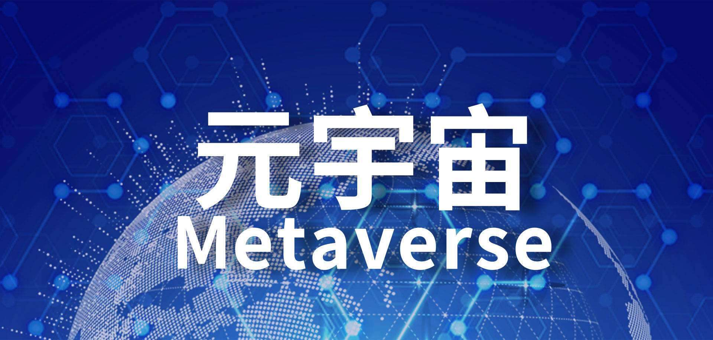

# 开封：做好数字化转型顶层设计，打造好开封大宋元宇宙项目

近日，开封市数字化转型顶层设计方案调研座谈会举行。开封市委常委、常务副市长陈维忠出席会议。

陈维忠指出，当前，开封市“数字政府”建设走在全省前列，呈现很多亮点。今后，要在做好数字化转型顶层设计上下功夫，全面推进中原“数据湖”、“东数西算”枢纽节点项目建设，深入挖掘宋文化资源，打造好开封大宋元宇宙项目。

陈维忠强调，开封在数字化转型方面有场景、有空间，要运用好开封智慧，努力在全省数字化转型战略中当标杆做示范。

座谈会上，开封移动、中移系统集成公司、河南移动信息集成运营中心、咪咕公司元宇宙体娱中心相关负责人分别介绍了开封市数字化转型顶层设计项目、开封市数字化转型顶层设计方案、元宇宙技术方案等情况。市政务服务和大数据管理局、市发改委、开封文投集团负责同志围绕开封市数字化转型顶层设计方案进行了发言。
