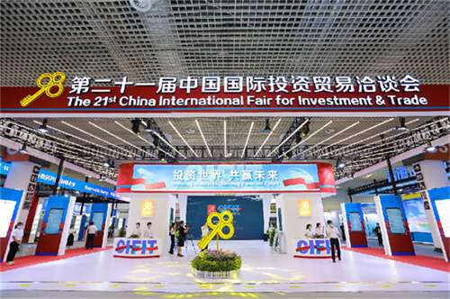

# 办40多场论坛，造元宇宙展馆！第二十二届投洽会将于9月8日至11日在厦举办

投洽会作为促进双向投资的平台，已发展成为全球最具影响力的国际投资盛会之一，吸引全球各地的机构前来招商推介。

第二十二届中国国际投资贸易洽谈会（简称 " 投洽会 "）将于 9 月 8 日至 11 日在厦门举办。目前，本届投洽会已有韩国、日本、比利时、奥地利、西班牙、缅甸、泰国、菲律宾等 48 个国家和地区参展，" 一带一路 " 沿线国家和地区、金砖国家、RCEP 成员国等诸多国家和地区积极参与大会各项活动。

受商务部邀请，韩国产业通商资源部明确韩国将首次以主宾国身份参加本届投洽会。韩国产业通商资源部及下属大韩贸易投资振兴公社将牵头设立 420 平方米以上的韩国国家馆，并举办国别投资环境说明会、一对一企业洽谈等系列活动。

全国各省市区成员单位、各地开发区积极参展，重庆市作为主宾省（市）将设置 720 平方米展馆，哈尔滨市作为明星市将设置 400 平方米展馆。黑龙江省将设置 500 平方米展馆，内蒙古自治区将设置 415 平方米展馆。香港特别行政区拟设置 400 平方米展馆，集中展示回归 25 周年发展成就。

本届投洽会将深耕双向投资促进，举办 40 多场系列论坛研讨活动，服务高质量共建 " 一带一路 "、多双边经贸合作及两岸经贸交流，汇聚起贯彻全球发展倡议的强大合力，为服务构建全面开放新格局和建设开放型世界经济发挥积极作用。

此外，今年投洽会将发挥厦门作为金砖国家新工业革命伙伴关系创新基地的优势，融入金砖元素，举办规模 1.5 万平方米的金砖国家新工业革命展，围绕数字金砖、绿色金砖、生物医疗等内容，展示金砖国家工业合作领域最新成果，举办金砖国家新工业革命伙伴关系有关论坛、赛事等活动。

值得一提的是，今年的投洽会将打造元宇宙馆。这将是一个全方位高精度呈现的元宇宙会展空间，将中心展区及 C 馆展商内容进行数字化展示，实现一个社交大厅（中心展区）及三个子展馆（中国馆、境外馆、中国投资热点城市馆），在元宇宙展馆中设置名片墙、展商名录、宣传大屏等设施，在云宇宙空间中，用户可控制数字人自由漫步、随心游览，线上参会也能身临其境。
