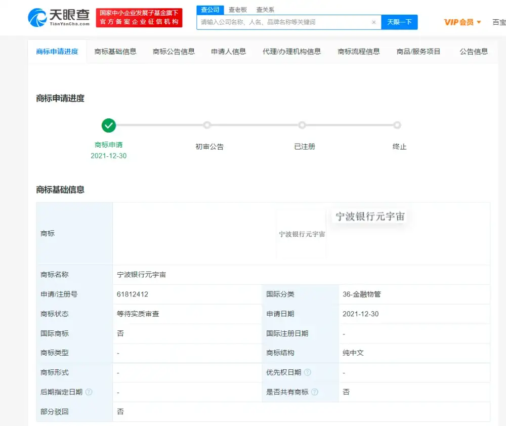

# 上海发力布局元宇宙，元宇宙概念股有哪些？

天眼查App显示，近日，上市银行宁波银行申请注册多个元宇宙相关商标，包括“宁波银行元宇宙”“汇通元宇宙”“永赢元宇宙”，国际分类为金融物管、通讯服务、科学仪器等，目前商标状态为商标申请中、等待实质审查。

就国内银行而言，目前已有浙商银行、江苏银行、百信银行、微众银行等抢先布局“元宇宙”。

据了解，2022年1月11日，中国移动通信联合会元宇宙产业委员会公布首批成员接纳名单，浙商银行位列其中。

江苏银行2021年年底也基于对互联网金融发展和数字化金融底层逻辑的研判，结合自身优势，开始积极布局金融元宇宙，为客户提供更加优质的金融服务体验。

2021年年底，百信银行首位虚拟数字员工AIYA(艾雅)正式出任“AI虚拟品牌官”，为用户带来更友好、更智能、更安全的数字金融服务。
