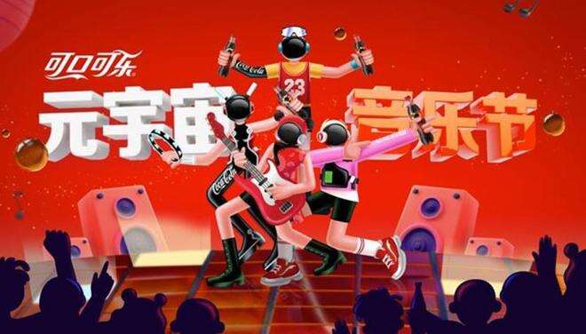

# 可口可乐中国推出元宇宙音乐节

据marketing报道，可口可乐中国推出了元宇宙音乐节活动。

该活动由OpenX（WPP全球可口可乐定制团队）旗下奥美上海策划和开发，在中国大陆、台湾、澳门和香港地区推出，以每个可乐瓶为连接点，通过分享参与创造神奇的共享记忆。

了解当地 Z 世代消费者特别喜欢惊喜带来的快感，可口可乐与上海奥美联手打造了限量版可口可乐“夏日聚会”瓶，基于标签可为消费者转变数百个有趣的可口可乐音乐会场景，以支持消费者与朋友享受夏日乐趣。

活动还通过包括社交发生器在内的两款互动手机游戏在线延伸，以进一步促进联系，其中，可口可乐通过嵌入微信的游戏将“夏日聚会”的瓶子概念带入了数字世界。通过手机，用户可生成一张带有夏季活动创意的社交海报，并由此标记朋友在线下见面，一起分享可口可乐元宇宙。

不仅如此，可口可乐还推出了“元宇宙音乐节”，音乐节启用了虚拟化身，3D游戏和“分享挑战”机制。

进入游戏时，用户被邀请自定义虚拟化身，并从四种场景中选择其一进行音乐PK，游戏玩法简单，用户只需轻敲手指就能游玩，游戏期间，更有特别抽奖环节抽送奖券奖励，当用户通过社交分享伙伴加入挑战时，他们的虚拟形象将同时出现在挑战舞台——毫无疑问，这是一种促进元宇宙社交的方式。

目前，可口可乐活动在社交媒体上得到了广泛传播，奥美制作的幽默短视频在微博和抖音平台更产生了超过1.4亿人次的观看。
