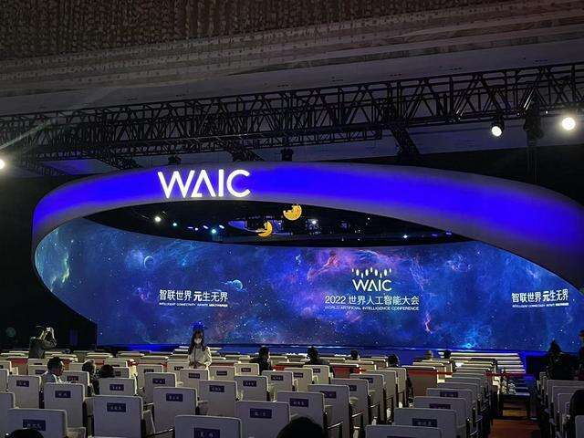

# 推开元宇宙大门！WAIC2022开幕式三大亮点

近日，2022第五届世界人工智能大会正式拉开帷幕。

走进开幕式大厅的大门，最引人注目的是一排热情和参与者打招呼的数字人。虽然往届WAIC上，不少知名的虚拟偶像都曾有闪亮表现。但如今年一众数字人虚拟偶像一同担任迎宾尚属首次。他们有的借助语音交互和图像识别擅长察言观色、热爱表达沟通，有的解决工作难题时勤勤恳恳、一丝不苟，还有的性格活泼、爱好文艺。在会议大厅门口，这些个性鲜明的虚拟人用他们特有的方式欢迎参会嘉宾。

作为整个大会的活动制高点，开幕式重磅邀约全球顶级学者，畅聊人工智能与元宇宙无界融合的尖端话题。

2022IEEE主席兼首席执行官刘国瑞、GSMALtd.首席执行官兼董事洪曜庄、IJCAI2021-2023 理事长Christian Bessiere、2019 Apache软件基金会董事会主席Craig L Russell等全球顶尖组织齐聚共贺，呈现大会“智联世界”宗旨。菲尔兹奖得主、清华大学丘成桐数学科学中心主任丘成桐，2021年图灵奖得主Jack Dongarra，马尔奖得主、英国皇家工程院院士Philip Torr等世界顶级学者分享最新AI与元宇宙互相促进的前沿理念。百度创始人、董事长兼首席执行官李彦宏，华为轮值董事长胡厚崑，Unity CEO John Riccitiello，高通公司总裁兼CEO安蒙，Meta大中华区CEO梁幼莓等产业明星将代表各自领军企业，全力展现元宇宙新赛道的热烈魅力。

其中，两场高峰对话最为令人期待。著名华人学者丘成桐将与见证五届WAIC一路走来的前微软执行副总裁、美国国家工程院外籍院士沈向洋一起，围绕人工智能发展的“元”动力，从数学、人才、社会发展三个角度进行深入探讨。

另一场对话中，首次来到WAIC的中国天眼FAST首席科学家李菂，中国载人航天工程总设计师周建平将和大会“老朋友”清华大学苏世民书院教授、院长薛澜，人工智能科学家、商汤科技CEO徐立展开一场无界对话，共同“仰望星空”，展望以AI科技与探索精神激励的面向更广袤新宇宙的新征程。
