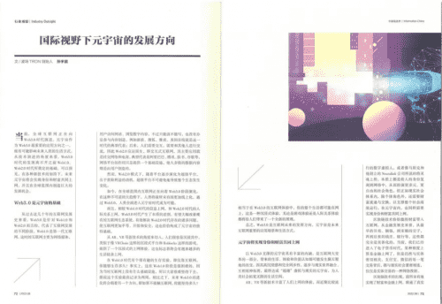

# 国家级权威期刊《中国信息界》发表孙宇晨元宇宙观点文章

近日，国家级信息化权威期刊《中国信息界》发表了波场TRON创始人孙宇晨署名文章《国际视野下元宇宙的发展方向》。孙宇晨在这篇文章中指出，在各种新技术的加持下，未来元宇宙将会实现身份和财富共同上网，并且在全球范围内创造巨大的发展机会。

《中国信息界》是国家发展和改革委员会主管、中国信息协会主办的学术性期刊，在国内外公开发行。该杂志以权威、高端、深度、系统为特色，获得了专家学者以及各界读者的一致好评，不少人将其称作为“为国家和地方信息化领导者、组织者、管理者、研究者提供决策参考的白皮书”。

在这篇题为《国际视野下元宇宙的发展方向》的文章中，孙宇晨预测分析了元宇宙未来，他认为，元宇宙是人类未来发展的方向之一，其主要有两个关键点：一是身份上网，比如通过虚拟人进入互联网中；二是财富上网，通过区块链把整个社会积累带到互联网上去。孙宇晨同时认为，未来元宇宙将会为很多发展中国家、小微国家提供一个不一样的机会。

近些年，元宇宙作为一个新概念受到各路互联网巨头的热捧，大众对元宇宙的关注也持续升温。作为元宇宙早期布局者，孙宇晨不仅多次公开表示看好元宇宙，也带领着波场TRON频频发力该领域，目前，波场TRON已取得了不少骄人成绩。

值得一提的是，这并不是《中国信息界》首次收录孙宇晨署名文章，早在2020年12月，孙宇晨的出圈观点文章《区块链助力下一代金融基础设施》也发表于该杂志。
