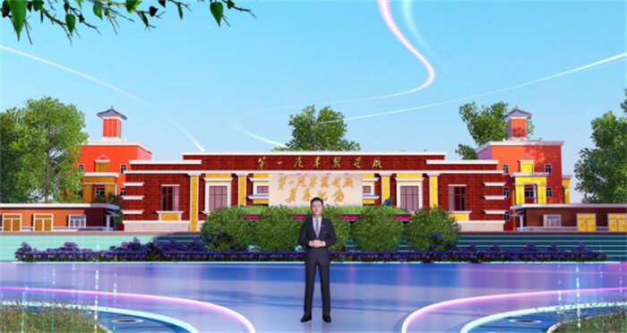
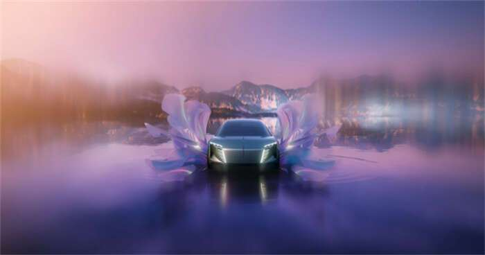
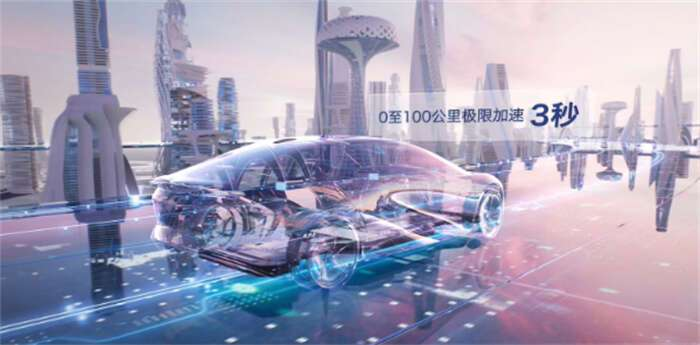
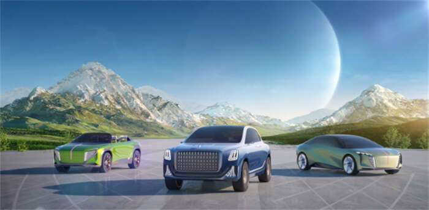

# 红旗品牌元宇宙盛典暨新能源设计美学发布会举行

近日，红旗品牌通过云端召开红旗品牌元宇宙盛典暨新能源设计美学发布会。中国一汽党委书记、董事长徐留平以虚拟形象+虚拟声音的形式，发布了代表中国一汽红旗品牌技术革新突破的“新能源战略”、“超级电动智能平台”和“多款新能源概念产品”。

面对新能源汽车产业蓬勃发展的机遇与挑战，红旗品牌通过布局新能源发展的最新战略、最新设计美学和最新的产品与技术，积极抢跑新能源汽车行业赛道。

“红旗”作为中国汽车品牌的引领者，对于正在到来的元宇宙时代，积极前瞻布局，秉持“以用户为中心”的理念，通过全新的技术手段、丰富的社区玩法、多维度的链接形式，打造了一个物质与精神的家园，一个实体与虚拟的家园，一个创新创造与休闲娱乐的家园，一个激荡奋勇与安祥宁静的家园，满足所有消费者的情感、社交与出行需求，这就是“红旗元宇宙”。

中国一汽党委书记、董事长徐留平在红旗元宇宙中以虚拟形象发布内容

红旗新能源设计美学，表达着红旗人的“宇宙观”，诠释着“中国式新高尚精致主义”的精神，演绎着“尚·致·意”的深刻内涵，代表着红旗品牌对新能源设计美学的极致追求。

其中，“旗贯山河、紫气东来”的旗标，它传承了中轴线设计；由红色和蓝色，结合成为“尊贵、勇敢、未来”的紫色，光芒四射。

“神采飞扬、展翅翱翔”的分体式大灯，清澈深邃、轻灵动感。

“澎湃活力、生生不息”的格栅，精妙运用参数化、点阵式设计，演绎出条条江河奔涌入海的气势。

红旗品牌新能源设计美学发布

“旗风招展、E随形动”的腰身，昂首挺胸、俯冲向前，诗画般的曲面设计，彰显速度与力量。

“极致安全，追逐梦想”的轮标，外廓如刚强的盾牌，寓意极致安全、坚如甲胄，凸显对生命的无限关爱；内形似托举的双手，象征着承载希望、追逐梦想，展现出对和平和谐、幸福美满的孜孜以求。

“如梦似幻、E元宇宙”的座舱，将科技与艺术融合，打造虚实结合、数智孪生。

尾部经典的汉字“红旗”，焕新材质与色彩，突显中国书法的独特至美艺术；首尾呼应的尾灯设计，精彩呈现“经纬连阡陌，横纵耀山河”的风姿。

在红旗品牌迭代发布的《创新·2030中国一汽阩旗技术发展战略R.Flag1785》中，提出以电动化、智能网联化、造型新锐化、驾乘体验化、安全健康化、节能降耗化、精致精湛化、研究前瞻化为技术方向，布局未来技术创新发展路径。

超级电动智能整车平台架构FMEs

在“阩旗技术”发展战略的设计与指引下，红旗创建了超级电动智能整车平台架构FMEs，它汇聚了R.Flag阩旗技术发展战略8大技术领域群，115项关键核心技术，充分运用了红旗布局全球的研发资源，凝结了数万人创新创造的智慧，同时预期将拥有专利达1万多件，打造成为“绿色智能、安全健康、尊享体验、可变可进化”的超级电动智能平台架构，将满足红旗品牌旗下绝大多数车型的开发制造和使用需求，是新红旗通向绿色智能化未来的关键技术支撑。

SUV EV和新红旗E-LS。作为红旗绿色智能创领之作，将助力红旗品牌开拓更多全新细分市场，彰显红旗品牌面向绿色智能化奋进的决心。

第一款是新红旗 Sedan EV，是红旗品牌基于全新FMEs平台架构开发的第一辆B级新能源轿车，拥有1000+公里超长续航，并可实现同时充、换电，0至100公里极限加速3秒，能实现全天候多场景的高级自动驾驶，同时配备天然环保、智能多元交互及无限进化OTA的“E元宇宙”座舱。

第二款是新红旗SUV EV，同样诞生于FMEs平台架构的一款B级新能源SUV。在依托于FMEs平台架构的高效安全电驱系统和高级智能网联系统的同时，新车独创智能主动空气悬架、智能四驱技术、后轮转向等关键核心技术，实现随心而动的驾驶和越野体验。

红旗品牌新能源概念车

第三款是新红旗E-LS，它是一款在新红旗L平台上全新开发的新能源旗舰SUV，将领先的新能源智能技术、极致工匠制造工艺、新能源设计美学和至尊驾乘体验融于一体。

站在打造“中国第一、世界著名汽车品牌”的冲锋时刻，不论是现实与理想紧密交织的“元宇宙”，还是灵感迸发的新能源设计美学，亦或是卓越创新的技术与产品，都是红旗品牌对于“共建共创、共有共享”“美妙出行、美丽体验、美好生活”的憧憬与承诺。

来源：新华网
