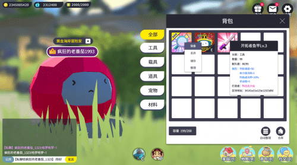
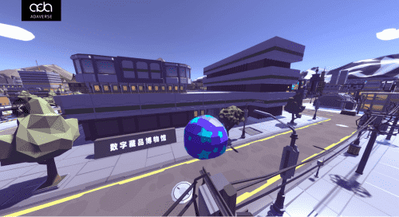

# ADA数字乐园开启内测 首次实现数藏与元宇宙间互通流转

近日，ADA元宇宙开发的“数字乐园”平台正式迎来内测。这也是国内首个数字藏品与元宇宙场景实现数字资料互通流转的虚拟世界。

据悉，ADA元宇宙旗下数字藏品平台宇宙鸭，是集锻造、交易、流量、宣发为一体的国内领先的数字藏品综合服务平台。而此次发布内测的ADA数字乐园是基于公司自主IP项目TinyStoneClub(小石头)为蓝本的虚拟场景世界。数字乐园的上线也标志着过往在ADA旗下宇宙鸭平台发布的数字藏品、文化要素、身份权益等内容,将逐步实现与“新世界”的融合创新,进一步形成以创作、生产、娱乐、社交为一体的数字化潮流社区。

数字乐园是ADA元宇宙在web3.0下，探索元宇宙发展的重要布局之一。相关负责人表示：“在双平台驱动下，将实现数字藏品和场景道具间的实时流转互通，同时基于拥有者在区块链上的数字资产不可篡改、不可分割的特性,让每一位用户能够感受数字虚拟世界中探索、创造、收集、社交、娱乐以及置换的乐趣。”

据透露,目前测试版本的ADA数字乐园为基础版。随着平台的进一步完善升级,未来一方面会将更多数字资料开放给用户，获得更好的沉浸式体验;另一方面,ADA元宇宙也将围绕数字乐园,搭建起IP、品牌、机构以及玩家共创共治的创作者体系，实现规模经济和虚拟世界的价值融合，打造数据创造应用，应用连接现实，现实反哺平台的循环生态。
