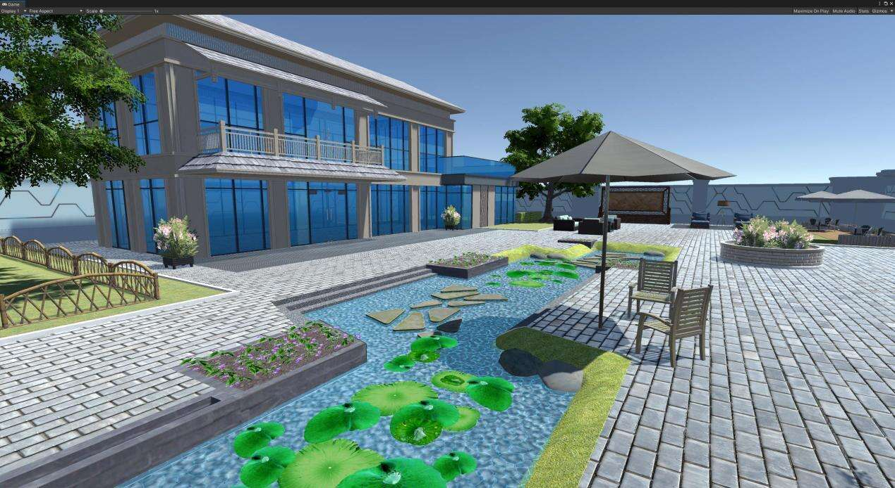

# 数藏中国联合RealWorld元宇宙蝴蝶兰庄园开启公测

数藏中国宣布数藏中国联合Real world元宇宙联合推出的元宇宙别墅——蝴蝶兰庄园正式开启公测,首批白名单用户为蝴蝶兰庄园数字藏品持仓用户。300名幸运用户将陆续收到数藏中国和RealWorld联合赠送PICO新款VR眼镜,并可通过眼镜体验蝴蝶兰庄园别墅。

**数藏进入应用的2.0时代**

发端于2021年的数字藏品,在一年多时间里经历了“起步——发展——高潮——冷寂”的发展历程。其中最受诟病的原因是“缺少应用场景”。而数字藏品与元宇宙的结合,为数字藏品的应用开辟了崭新天地。

RealWorld元宇宙公告

此次数藏中国与Real World联合发布的蝴蝶兰庄园,让用户在元宇宙世界中拥有了属于自己的“领地”,用户购买和喜欢的数字藏品,都可以放入自己的“庄园”进行展示。这标志着传统数字藏品的书画、勋章、IP偶像等作品,都拥有了陈列展览以及元宇宙世界中的社交等使用价值。

RealWorld元宇宙中的蝴蝶兰庄园

数藏中国CEO王鹏飞表示,在元宇宙中,数字藏品不仅可以展览展示,还可以作为新场景的入口。比如在蝴蝶兰庄园展示的王羲之的书法藏品,可以再度开发,通过“藏品入口”进入新的场景,讲述王羲之的书法特性。甚至可以通过王羲之虚拟人带你进入王羲之练习书法的场景,讲述书法创作经验。元宇宙世界打破了时间、空间等现实物理界限,使得数字藏品的应用范畴具有极大的想象空间。数字藏品从此进入了2.0应用时代,元宇宙世界与现实世界的交互也更加深入。

蝴蝶兰庄园院落场景

**推动现实与元宇宙世界的交互与联动**

Real World实现了元宇宙中人与人、人与物的广泛交互,为用户创造一个数字人的栖息之地。蝴蝶兰庄园也由此从一款数字藏品升级为“私属的精神世界栖息地和自主社交空间”。

在Real World元宇宙世界,现实中的每个人都可以凭借数字人身份在其中实现互动。Real World元宇宙还纳入了区块链的底层技术,将数字资产、数字时尚、数字化服务等新形态内容植入其中,使用户拥有不一样的社交和娱乐体验。例如蝴蝶兰庄园主人可以自主设置进门权限,带领客人欣赏自己的藏品,与客人一起超越时空界限,进入不同虚拟空间等。

Real World元宇宙CEO宋磊表示,RealWorld的开服与蝴蝶兰庄园的交付,拉开了数字时代全新的帷幕。数字资产和数字世界的融通在全球范围也是极具创新和标志性意义的。作为3D互联网的元宇宙,平行世界将需要无数的资产和服务,海量的数字人与空间来构建起一个比现实世界更丰富和多元的新世界,蝴蝶兰只是为用户衣食住用行和打造数字资产真实应用的起点,首批2000名业主是元宇宙世界的创世公民,一个属于未来的新纪元已经到来,精彩世界无限可期。
