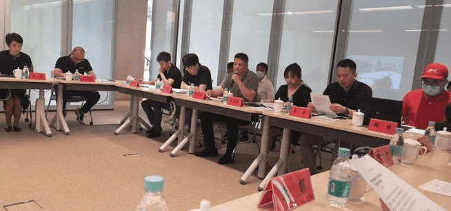
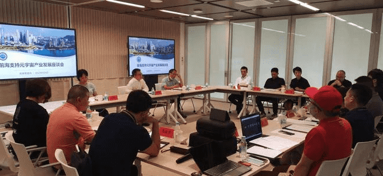

# 湾区元宇宙联盟与前海管理局共商元宇宙创新发展

“新技术革命爆发了吗？”

“元宇宙是新技术革命的爆发点吗？”

在前海管理局召开的“前海支持元宇宙产业发展座谈会”上，围绕前海管理局副局长王锦侠抛出的问题，与会人员进行了热烈的讨论。

“虚拟与现实融合发展已是主流趋势”，湾区元宇宙联盟主席、深圳市信息服务业区块链协会会长郑定向认为，“前海是特区中的特区，是总书记一手缔造的改革开放典范，应当立于时代潮头，创新元宇宙的发展。” “除技术创新外，前海在发展元宇宙中更应关注元宇宙的社交系统、经济体系以及内容编辑，在制度创新、模式创新上取得突破。”郑定向说。

元宇宙创新发展需要一定的载体，“有必要建设元宇宙产业发展的孵化器、加速器。”深圳清华大学研究院数字化治理研究中心主任王焕然表示。

华为高晓晨的关注重点在元宇宙的基础设施建设，建议在前海建立公共服务区块链。商汤科技李宇飞则建议政府应把技术场景、技术要求提供出来，由相关方提供技术能力，尝试和验证场景价值。

数据流通、交互是元宇宙的核心，深圳数宝数据交易服务有限公司总经理龙玺提出可以使用区块链技术为数据进行确权，记录数据资产包的流转、分发，以实现数据的安全流通、共享。

腾讯、清博智能、比邻星球、禹创、威观互联等参会单位也表达了自己的看法。

王锦侠副局长总结了大家的意见，梳理了前海支持元宇宙创新发展的思路。他强调，要力争把前海建设成为元宇宙新技术革命的突破口、切入点及聚集区，确保元宇宙创新实验在前海取得成功！
