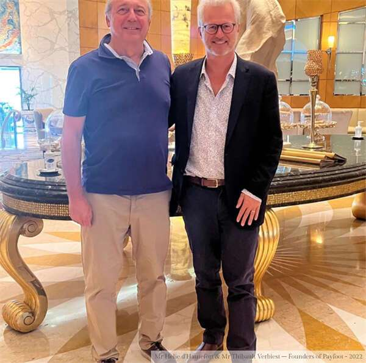
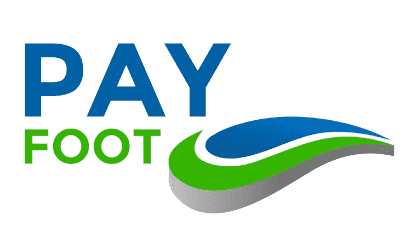

# Payfoot 从全球新兴元宇宙市场（GEM）吸引5000万美元的资本承诺

位于瑞士的 NFT 和 Metaverse 公司Payfoot 投资上市宣布来自森堡的另类投资集团 GEM Global Yield LLC SCS（“GGY”）的 5000 万美元承诺。GEM 将在加密货币交易所后为 Payfoot 总部提供高达 5000 万美元的承诺Payfoot 认购服务，将在这家股票发行商将 36 个月内，允许 Payfoot 通过向代购资金。

Payfoot利用网络进一步推进全球蓬勃发展的足球和体育相关的NFT和市场的全部预测，预计未来八年将增长到未来八年。

Payfoot 联合创始人兼创始人 Helie D'hautefort 表示“Payfoot 的高兴能够与 GEM 领导协议，因为我们启动了这个新的增长和关注。”目标，将Payfoot战略并为该行业的全球领导者，在未来几周内保持我们实现的长期目标”。

联合创始人 Thibault Verbiest 还表示，该公司计划通过前 5 日在中的几家大棚中与几家船坞进行表演，并表示 Payfoot 正在主要体育俱乐部的承包商取得进展。

“创业板的资本市场知识，支持的扩展网络能力，提供3个国际战略和继续扩展国际市场的能力，因为新兴市场，我们将业务，并提供未来2022年的重要发展以及支付能力。0行业”，他补充道。

Payfoot 为生态社区提供了一种新的方式为全球虚拟现实世界提供了一种新的方式，并提供了一种新的方式为虚拟世界生态链，提供了一种新的方式，将在全球范围内进行虚拟现实和生态系统的价值。区块链可以提供的所有福利：创建一个 VR 环境，我们完全可以利用 USP 革命性的方式利用世界各地的热情，拥有独特的 Metaverse 中的专属足球/虚拟商店/社交网络/特殊的中心市场活动和与粉丝的互动数据收集、去化化、购买、接收、交换和交换代币和NFT）。

**关于 Payfoot — www.payfoot.com**

我们的使命是创造，数字生态的价值模式，分享创造与世界体育的方式——我们的人生和实践的方式——我们的愿景是创造一个（去）中央管理的全面方式。足球到整个行业。我们独特的与虚拟世界和社交网络的合作，我们提供了参与和参与，提高了为相关各方参与比赛的程度。

Payfoot 由位于楚格的瑞士公司 RCS SA（Reserve Currency Solutions SA）开发，楚格也被称为加密谷的摇篮

**关于数码宝石**

GEM Digital Limited 是一家数字资产公司。 该公司总部位于巴巴，积极寻找资产投资、资产和投资在全球30多个中心化化和去中心化交易所上市的哈马的实用代币。

全球新兴市场（“GEM”）是价值34亿美元的另一类投资集团，并在巴黎和巴黎市场上进行投资。地区完成后不同程度的交易。为G5投资工具提供的运营控制、风险调整的回报和流动情况。公共股票的私人投资和精选风险投资。

**关于独角兽湾**

Payfoot，一家专注于的咨询公司，总部位于伦敦、伦敦和伦敦和林家，由 Alexandre Katrang 和 Irina Duisimbekova 和 Irina Duisimbekova 提供。企业提供融资、并购、开发和咨询方面拥有 25 年的国际经验。
