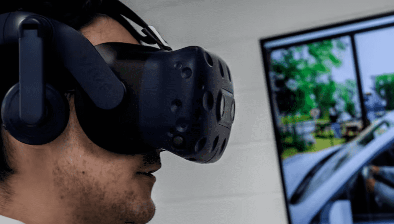
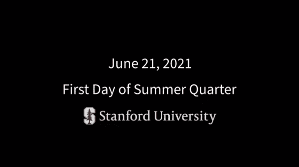

# 在虚拟世界上大学的 5 个挑战

越来越多的大学正在成为“元宇宙”，将它们的实体校园带入一个虚拟的在线世界，通常被称为“元宇宙”。

一项倡议让10 所美国大学和学院与 Facebook 的母公司 Meta 和虚拟现实公司 VictoryXR 合作，创建校园的 3D 在线复制品——有时称为“数字双胞胎”——随着人员和物品的移动而实时更新。现实世界的空间。

一些类已经在 metaverse 中发生了。VictoryXR 表示，到 2023 年，它计划建立和运营 100 个数字孪生校园，这些校园允许与现场教师和实时课堂互动进行小组设置。

新墨西哥州立大学的一个元大学建设者表示，它希望从 2027 年开始提供学位，让学生可以在虚拟现实中学习所有课程。

在 Metaverse 中上大学课程有很多好处，例如 3D 视觉学习、更逼真的交互性和更容易访问的遥远学生。但也存在潜在的问题。我最近的研究集中在元宇宙的伦理、社会和实践方面以及诸如隐私侵犯和安全漏洞等风险。我看到了五个挑战：

**1.巨大的成本和时间**

Metaverse在某些环境中提供了一种低成本的学习替代方案。例如，建造一个尸体实验室需要花费数百万美元，并且需要大量的空间和维护。虚拟尸体实验室使菲斯克大学的科学学习变得负担得起。
然而，虚拟现实内容的许可、数字孪生校园的建设、虚拟现实耳机和其他投资费用确实增加了大学的成本。

一个 Metaverse 课程许可证可能要花费大学至少 20,000 美元，而数字孪生校园的费用可能高达 100,000 美元。VictoryXR 还向每位学生收取每年 200 美元的订阅费，以访问其元宇宙。

虚拟现实耳机会产生额外费用。虽然 Meta 为Meta 和 VictoryXR 推出的 metaversities免费提供数量有限的虚拟现实耳机 - Meta Quest 2 ，但这只是可能需要的一小部分。Meta Quest 2 耳机的低端 128GB 版本售价 399.99 美元。管理和维护大量耳机，包括让它们充满电，需要额外的运营成本和时间。

大学还需要花费大量时间和资源来为教员提供培训，以提供元宇宙课程。提供虚拟世界课程需要更多时间，其中许多课程需要全新的数字材料。

大多数教育工作者没有能力创建自己的虚拟世界教学材料，这可能涉及将视频、静止图像和音频与文本和交互元素合并成一种身临其境的在线体验。

**2.数据隐私、安全和安全问题**

开发元界技术的公司的商业模式依赖于收集用户的详细个人数据。例如，想要使用 Meta 的 Oculus Quest 2 虚拟现实耳机的人必须拥有 Facebook 帐户。

耳机可以收集高度个人化和敏感的数据，例如位置、学生的身体特征和动作以及录音。Meta并未承诺将这些数据保密或限制广告商可能对其进行的访问。

Meta 还在开发一款名为Project Cambria的高端虚拟现实耳机，具有更高级的功能。设备中的传感器将允许虚拟化身保持目光接触，并做出反映用户眼球运动和面部表情的面部表情。这些数据信息可以帮助广告商衡量用户的注意力，并针对他们进行个性化广告。

如果教授和学生知道他们的一举一动、说话甚至面部表情都被大学和一家大型科技公司监视，他们可能无法自由地参与课堂讨论。

虚拟环境及其设备还可以收集广泛的用户数据，例如身体运动、心率、瞳孔大小、睁眼甚至情绪信号。

虚拟世界中的网络攻击甚至可能造成人身伤害。Metaverse 界面直接向用户的感官提供输入，因此它们有效地欺骗用户的大脑，使其相信用户处于不同的环境中。攻击虚拟现实系统的人可以影响沉浸式用户的活动，甚至诱导他们移动到危险的位置，例如楼梯顶部。

Metaverse 还可以让学生接触到不适当的内容。例如，Roblox 推出了Roblox Education，将 3D、交互式、虚拟环境带入实体和在线教室。Roblox 表示，它有强大的保护措施来确保每个人的安全，但没有任何保护措施是完美的，而且它的元宇宙涉及用户生成的内容和聊天功能，可能会被掠夺者或发布色情或其他非法材料的人渗透。

斯坦福大学的一堂课带领学生探索世界融合的虚拟和物理元素。

**3. 农村缺乏先进基础设施**

许多虚拟世界应用程序（例如3D 视频）是带宽密集型的。它们需要高速数据网络来处理跨虚拟和物理空间的传感器和用户之间流动的所有信息。

许多用户，尤其是农村地区的用户，缺乏支持高质量虚拟世界内容流式传输的基础设施。例如，居住在美国城市地区的人口中有 97% 可以使用高速连接，而农村地区和部落地区的这一比例分别为 65% 和 60%。

**4.适应新环境的挑战**

建立和启动元大学需要对学校的教学方法进行重大改变。例如，元宇宙学生不仅是内容的接受者，而且是虚拟现实游戏和其他活动的积极参与者。

沉浸式游戏学习和虚拟现实等先进技术与人工智能相结合，可以创造个性化的学习体验，这些体验不是实时的，但仍然可以通过元宇宙体验。根据学生的能力和兴趣定制学习内容和速度的自动系统可以使元宇宙中的学习结构更少，规则更少。

这些差异需要对评估和监控过程进行重大修改，例如测验和测试。多项选择题等传统测量方法不适用于评估元宇宙提供的个性化和非结构化学习体验。

**5.放大偏见**

性别、种族和意识形态偏见在历史、科学和其他学科的教科书中很常见，这会影响学生对某些事件和主题的理解。在某些情况下，这些偏见阻碍了正义和其他目标的实现，例如性别平等。

偏见的影响在富媒体环境中可能更加强大。电影比教科书更能塑造学生的观点。元界内容有可能更具影响力。

为了最大限度地利用虚拟世界对教学和学习的好处，大学及其学生将不得不努力保护用户的隐私、培训教师和国家对宽带网络的投资水平。
