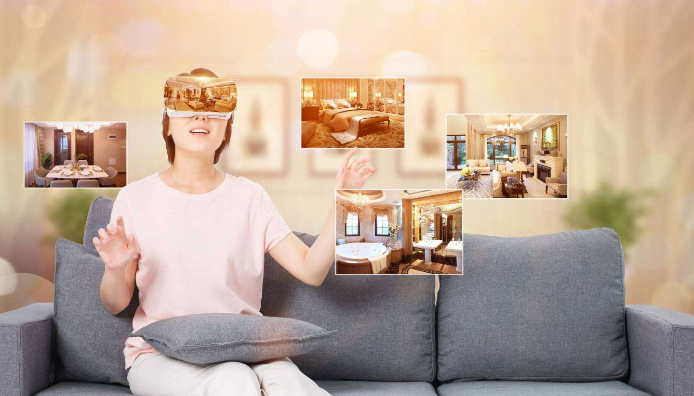
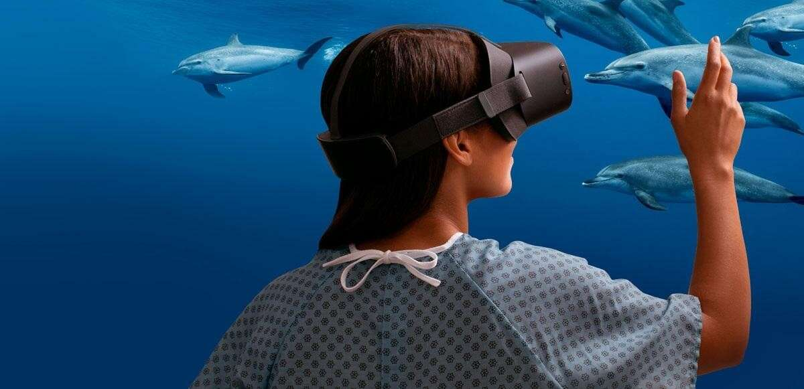

# 美国律师事务所将帮助公民对元宇宙伤害案件提起诉讼

总部位于美国佛罗里达州的摩根和摩根律师事务所提供服务，为虚拟世界中遭受的伤害进行赔偿诉讼。

虽然很难看出虚拟伤害如何成为诉讼的主题，但使用 VR 设备时遭受的现实生活伤害很可能是。该律师事务所声称，无论他们的客户在虚拟世界或现实生活中受到创伤，他们都会支持他。他们还声称是美国最大的人身伤害律师事务所。

摩根和摩根补充说，虽然虚拟世界很有趣，但“人体仍然存在于现实中，而思想在虚拟环境中游荡，有些人因使用虚拟世界的虚拟机而受伤。”

大多数 VR 头戴设备，例如 HTC Vive 和 Facebook 的 Oculus Quest，旨在通过降噪和限制视力的头戴设备将用户完全从现实中移除，从而导致用户骨折、脑震荡和受伤。此外，感官受限的 VR 用户可能无法避开其环境中的危险元素，这可能导致个人财物损坏或住院。

该律师事务所声称，这些设备是为娱乐而设计的。因此，当它们在工作环境中使用并造成人员受伤时，这是对公司采取法律行动的充分理由。

该律师事务所继续列举人们沉浸在虚拟世界中时所遭受的创伤的例子。

在某些情况下，用户试图爬上元世界中的一个高架表面并面朝下坠落，因为这样的表面实际上并不存在，从而导致这些人的医疗费用昂贵。

Morgan 和 Morgan 认为，VR 设备制造商尚未制定安全法规，这可以作为建立责任线的良好基础。

问题的部分原因是对 VR 伤害的责任不明确，因为有许多因素可以将责任转移到不同的各方。例如，如果用户滥用他们的 VR 耳机并受伤，他们很可能会因为他们的行为疏忽而对损害负责。另一方面，如果耳机存在导致伤害的缺陷，制造商将承担损害赔偿责任，但用户必须证明其使用并未造成伤害。

律师们承诺，“如果他们没有赢得虚拟案件，客户将不会支付一个比特币。”
