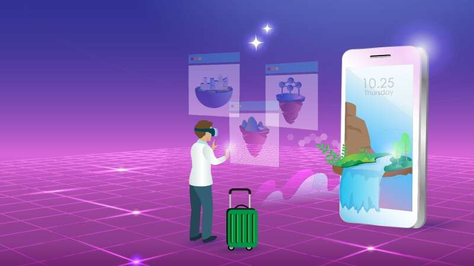

# 巴厘岛元旅游进入元界

Digital Agung Nusantara（巴厘岛双元宇宙）与 Blackstone Indonesia、Grahadi Bali Entertainment 和 Kicau Mania 合作，在元宇宙世界中开发巴厘岛元旅游。

根据印度尼西亚 Golkar 党副主席 Bamsoet Soesayto 在 Instagram 上的帖子，通过巴厘岛 Metatourism，任何人、任何地点、任何时间都可以享受巴厘岛的异国风情以及 PT Blackstone Indonesia、Black Lava Camp、Grahadi Bali Entertainment 和 Kicau Mania 拥有的资产。如果他们在现实世界中。

*MARKETING-INTERACTIVE*已联系 Bali Twin Metaverse 以获取更多信息，但尚未收到团队的回复。

“元界是一种增强现实（AR）技术，使个人能够与其他人进行虚拟互动。在元界的世界中，用户可以以虚拟形式做任何事情，例如聚会、开会、工作、玩耍、组织各种活动、参加音乐会、在线购物，直到购买数字资产，”Soesayto 补充道。

Soesayto 解释说，Bali Twin Metaverse 将把属于 Blackstone Indonesia 和 Grahadi Bali Entertainment 的土地、建筑物、艺术品重建为数字资产或不可替代代币（NFT）的形式。此外，Bali Twin Metaverse 将以 NFT 的形式重建 Kicau Mania 社区成员拥有的鸟声和动物。NFT 将通过 Bali Twin Metaverse 数字平台进行推广。

同样， WIR Group 是一家专注于东南亚增强现实、虚拟现实和人工智能的科技公司，并与 DCII 合作表明数据保护和安全是印度尼西亚元宇宙持续发展的优先事项之一。WIR 集团执行主席兼联合创始人 Daniel Surya 与 DCI 印度尼西亚首席执行官 Otto Toto Sugiri 在巴厘岛签署了两家公司之间的合作协议，标志着印度尼西亚已准备好进入虚拟世界。 

Sugiri 解释说，数据中心是用于存储许多服务器的建筑物，其功能之一是容纳网站或 Web 应用程序流量。为了使网站或 Web 应用程序流量顺利运行，网站所有者必须选择最佳的数据中心。
