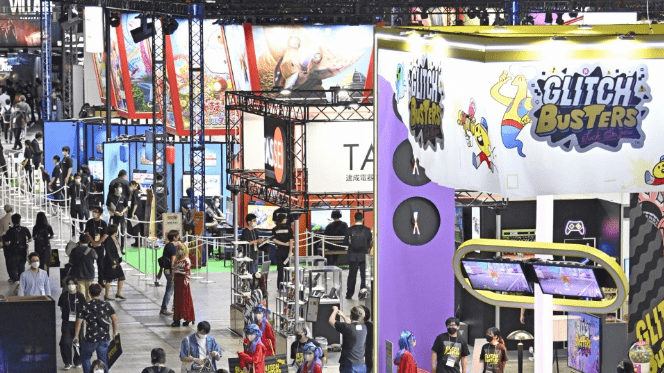

# 东京电玩展开幕之际，元界和虚拟现实成为焦点

东京电玩展于周四开始，自冠状病毒爆发以来首次恢复完全面对面的形式，元宇宙和虚拟现实游戏和技术成为人们关注的焦点。

一年一度的电子游戏爱好者盛会是世界上同类活动中规模最大的盛会之一，将于周日在东京附近的千叶幕张展览中心举行。前两天主要留给媒体记者和行业官员，从周五下午开始允许普通访客进入。

*东京电玩展将于 2022 年 9 月 15 日在千叶幕张展览中心开幕。（共同社）*

由于冠状病毒大流行，该节目在过去两年主要在网上举行，这是该节目第一次欢迎公众参加。主办方预计今年为期四天的活动将吸引 150,000 名游客。

包括日本巨头 Capcom Co. 和 Square Enix Co. 在内的来自 37 个国家的约 600 家公司和组织参加了此次活动。据主办方计算机娱乐供应商协会称，其部分内容也可以在线访问。

元界已成为游戏行业及其他领域的流行语，因为从游戏开发商到银行等越来越多的公司开始看到虚拟世界的商业潜力，让用户能够像在现实世界中一样体验购物、参加活动和相互交流.

Facebook Inc. 是其同名社交媒体的运营商，去年更名为 Meta Platforms Inc.，以专注于其元界业务，将公众的注意力带到了以前相对不为人知的领域。

随着国家日益放宽反病毒限制，参展机构数量恢复到2019年655家的90%左右。参展作品数量达到1864个，超过2019年的1522个。

东京电玩展是世界三大电玩盛会之一，与美国的 E3 和德国的 Gamescom 并列。
