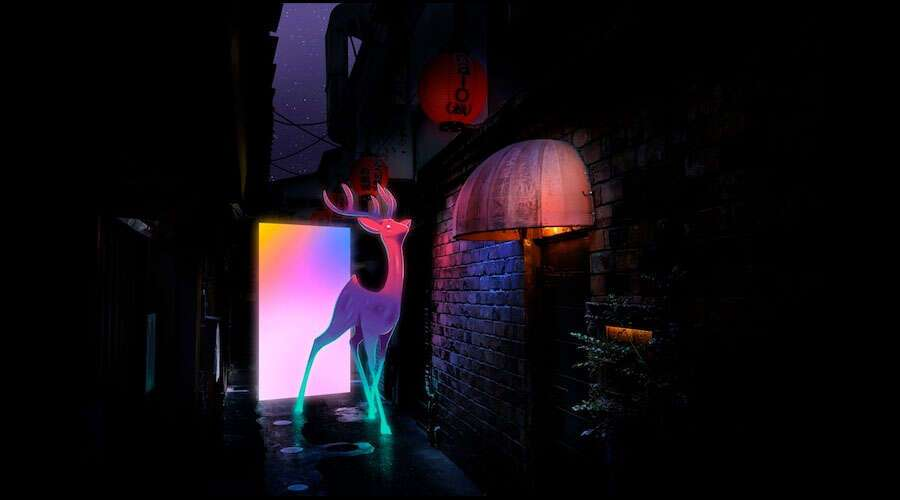

# 5个你还不知道的元宇宙爆炸区域

Metaverse 是一个基于区块链的虚拟世界，它正在彻底改变每个行业。从游戏和房地产到医疗保健和时尚，每个人都在谈论元宇宙的影响。数字资产是这个 3D 开放世界的中心。这些资产构成了元界生态系统的基础。以下是许多人尚未探索的元节的 5 个领域。

语义网：从“可读”机器网络到“可理解”智能网络的转变是语义网或 Web 3.0 将提供的。更重要的是，Web 3.0 将确保平台受托人控制和货币化公共数据将不再与此相关，而去中心化世界中的数据控制将取决于其真正的所有者——你和我。

它现在的 XR，VR 和 AR 的结合：扩展现实将通过 AR 智能眼镜、触觉、全息显示器和虚拟现实耳机等专注于虚拟世界的设备提升虚拟世界的用户体验。此类设备可以促进虚拟世界中的众多物理服务，并帮助用户顺利通过虚拟世界。

全新的社交网络空间：想象与一群同胞但完全陌生的人一起享受足球比赛，却不透露您的真实身份。多亏了 Metaworld，这些虚拟社交网络现在是确定无疑的。除了隐藏身份之外，用户生成和拥有的内容仅可共享给所选网络是很有可能的。

区块链即服务 (BaaS)：BaaS 基于软件即服务 (SaaS) 模型，并以类似的方式工作。它允许客户利用基于云的解决方案在区块链上构建、托管和运营自己的区块链应用程序和相关功能。同时，基于云的服务提供商保持了基础架构的敏捷性和可操作性。

边缘计算：5G 促进了数据的无处不在，这意味着可以通过任何设备从任何地方访问互联网，而不仅限于计算机/移动设备。物联网 (IOT) 技术使这成为可能，这是元界和 web3.0 蓬勃发展的基本要求。
