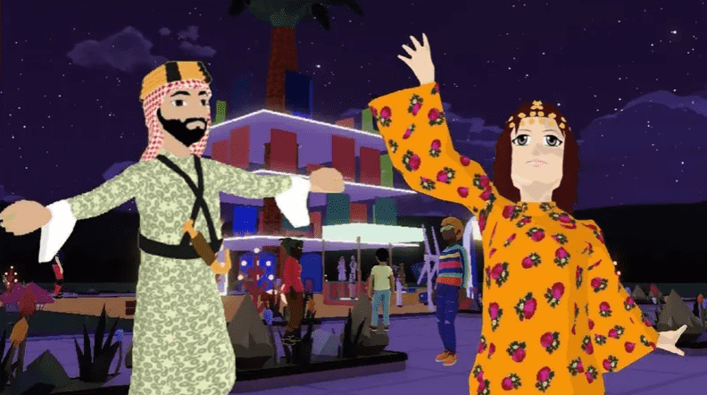

# 第一次虚拟沙特国庆庆祝活动将在元界举行

沙特阿拉伯国庆节的虚拟庆祝活动将首次在元界平台上举行。

在线庆祝活动将包括一个计算机生成的博物馆，展示来自王国不同地区的沙特遗产。

玩家可以为他们的虚拟化身购买不可替代的代币 (NFT) 服装，这些虚拟化身以来自不同地区的传统沙特服装为蓝本。

任何参与的人还可以收集“出席协议证明”（POAP），这是一种数字徽章，可以验证他们是否参加了活动。

将于 9 月 22 日至 24 日在 Decentraland 元界平台举行，国庆节为 9 月 23 日。

该活动由营销机构 The Bold Group 与阿卜杜勒阿齐兹国王研究与合作基金会 (Darah) 合作举办。

“像元宇宙这样的颠覆性技术是未来，我们 The Bold Group 的目标是成为这一演变的关键参与者，”Bold Experience Unit 的创意技术总监 Ziad AbuRjaily 在一份声明中说。

“将沙特国庆日这一历史悠久的传统庆祝活动引入技术新时代的想法受到了召集王国 13 个不同地区的人们在一个虚拟空间中庆祝沙特阿拉伯的挑战的启发。”

The Bold Group 的联合创始人兼首席执行官 Abeer Alessa 补充说：“我们正在通过向沙特国庆日致敬，以一种有影响力的方式激活元宇宙。”

“将我们的过去与我们的未来融为一体，我们正在纪念王国的传奇历史，保护我们的遗产并自豪地展示它，让人们参与到新的数字领域中。”

Decentraland 是一个基于以太坊区块链技术的元界平台。

它允许用户在玩游戏的同时购买虚拟土地并兑换虚拟货币。

在公共以太坊分类账上跟踪土地和其他 NFT 的所有权。
