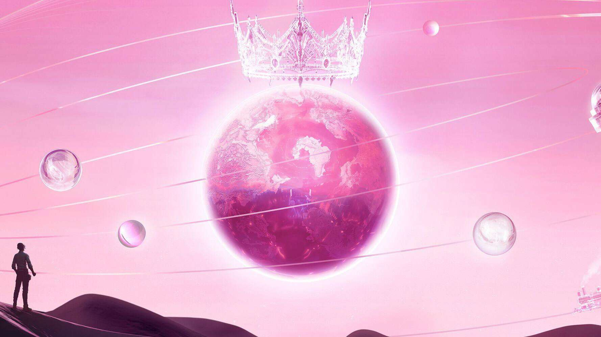

# 元宇宙中的声音：为什么这只是虚拟音乐会的开始

这就是现实的生活吗？这只是幻想吗？陷入了元宇宙。欢迎来到我们的新现实。

Metaverse 正在为音乐家和歌迷打开一个新的门户，让他们体验数字维度的音乐会。包括 Lil Nas X、Charli XCX 和 Foo Fighters 在内的几位艺术家已经举办了虚拟音乐会，还有更多人宣布了即将举行的演出。今年，第 64 届格莱美奖在 Roblox 举行，MTV 视频音乐奖 (VMA) 首次推出了最佳元宇宙表演的新类别，进一步巩固了元宇宙作为艺术家举办音乐会和巡回演出的场所。看起来像锁定的替代方案现在将继续存在，并且随着闪亮的奖品的争夺，数字艺术家将提升虚拟世界表演所能提供的水平。

MTV VMA 最佳元界表演奖不仅注意到了艺术家，还注意到了主办平台，这让视频游戏和虚拟场地有理由在比赛开始时加大力度。据 MTV 报道，该类别获得了超过 3.2 亿张选票。获胜者，K-pop 乐队 Blackpink 在 PUBG Mobile 中的虚拟表演，不仅仅是一场音乐会，与会者有机会展示他们的舞蹈动作，用天使般的翅膀装饰他们的化身并玩迷你游戏。互动虚拟世界的表演战胜了其他五个竞争者，包括 Minecraft 中的 K-pop 组合 BTS 和 Ariana Grande 在 Fortnite 的 Rift Tour 音乐会。

MTV 的一位发言人说：“我们看到了一个机会来突出和表彰其中一些最好、最有影响力的执行——并庆祝那些找到创造性方法来使用这些空间的艺术家——这导致今年增加了最佳元宇宙类别。”颁奖时说。

数字音乐会的概念越来越受欢迎；根据Wunderman Thompson于 2021 年 7 月进行的一项全球调查， 78% 听说过元宇宙的人表示他们有兴趣参加。早期的游戏现场音乐会已经吸引了数百万观众。根据 Epic Games 的数据，Marshmello 在 Fortnite 的 2019 年节目吸引了 1070 万粉丝，而 Travis Scott 在同一场比赛中的 2020 年天文表演吸引了 1230 万并发玩家。

“我认为粉丝想要新的体验，”音乐虚拟世界游戏平台公司 Pixelynx 的首席营销官 Kimberly Knoller 解释道。“流媒体音乐的被动体验不足以让粉丝保持参与，因为他们有很多地方可以消磨时间。”

现有的视频游戏已经成为艺术家的重要舞台，因为已经有数百万的玩家参与其中，但新的虚拟世界也正在成为音乐场所。Pixelynx 是一家提供虚拟世界平台的公司的例子，音乐家可以在这些平台上推出互动体验。

“在 Pixelynx，我们完全相信，音乐虚拟世界为艺术家提供了一个新的创意画布，并为粉丝提供了一种全新的形式来体验身临其境的音乐，”Knoller 说。该公司通过其虚拟生态系统为艺术家提供更多控制权，音乐家可以在其中发布和游戏化他们的体验。

在虚拟世界中托管也正在改变音乐制作。Weav Music 旨在通过允许其自适应并在视频游戏和扩展现实等互动体验中工作来为元宇宙中的音乐提供动力。Weav 的作品创作的音乐作品可以在非线性格式内实时变化，从而使体验变得个性化。

交互式 3D 虚拟世界已成为现场活动、团体聚会和创意的目的地。这些由游戏机制驱动的地方将为下一代铺平道路。“今天出生的每个人都是游戏玩家，”作者 Matthew Ball 在2021 年的一篇文章中说，“这意味着每年有 1.4 亿新游戏玩家。” 这一评论与活跃视频游戏玩家数量的增加有关。Statista的一项调查显示，2015 年，全球游戏玩家数量刚刚超过 20 亿，而到 2022 年，这一数字预计将达到 30 亿。到 2024 年，预计将有 33 亿游戏玩家。

融入社交和互动的游戏体验将成为虚拟世界的重要组成部分。随着技术的进步，未来的虚拟舞台也将如此。“我认为元宇宙中的音乐表演将继续发展，”诺勒说。“我相信音乐虚拟世界中粉丝的互动和参与体验将成为艺术家营销组合的一部分，就像 MTV 到来时音乐视频一样。”
