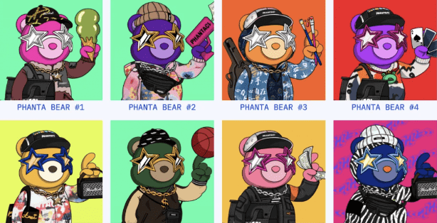
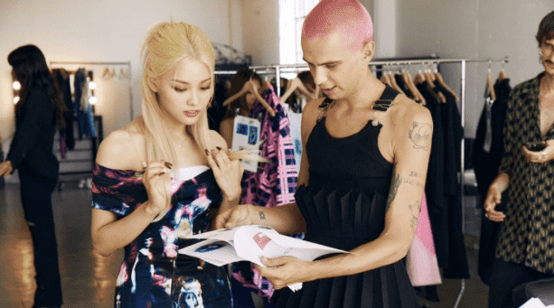
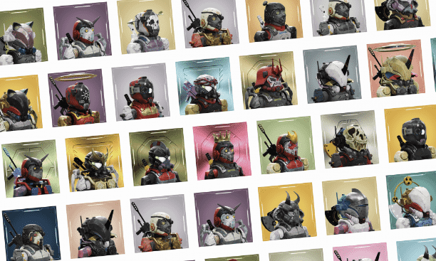

# 亚洲的偶像如何成为通往元宇宙的门户

亚洲的偶像经济长期以来一直是一个充满毒性和歇斯底里的市场，但其爆炸性的购买力仍然无与伦比。随着元宇宙迅速成为一个价值十亿美元的产业，这两者毫无疑问地成为了创收天堂中的一对。现在，非洲大陆最杰出的娱乐明星都想加入这个不断增长的领域。 

尽管声名狼藉，但大陆各地的名人开始认识到 Web3 如何成为支持其数字存在并利用偶像到粉丝动态的驱动力。这是一件新兴的事情，但它提供了很大的潜力，可以扩展到新的高度——直到最近，女子组合 Blackpink 在他们通过 PUBG Mobile与 BTS进行的“虚拟”音乐会之后，才在 MTV 音乐奖上获得了最佳 Metaverse 表演奖' Minecraft 的制作紧随其后。 

随着众多知名人士在他们自己的虚拟未来上大举投资，许多人正在转向数字收藏品和跨维度体验等营销活动，以进入不断增长的 Web3 市场，并通过邀请粉丝与他们一起参与来提升他们的在线社区。过程。

根据艾瑞咨询集团2020年发布的一份报告，2019年中国粉丝经济相关市值预计超过6192亿美元（4万亿元人民币），预计将超过8617亿美元（6万亿元人民币） 2023 年。与此同时，韩国的 K-pop 行业已经看到粉丝在音乐会、商品和与其音乐偶像相关的产品上花费更多。 

K-pop 女子组合 Blackpink 在今年的 VMA 颁奖典礼上获得了“最佳 Metaverse 表演”奖。照片：绝地求生移动

但去年国家网信办推出的娱乐圈政策收紧的“青浪行动” ，却对偶像市场造成了巨大打击。打击行动阻止了粉丝数量激增的数百万粉丝页面，并限制了名人或其相关产品出现在网页上的次数。虽然许多网友表示支持这一决定，但这也意味着全国许多 VIP 无法再同样程度地利用他们的在线粉丝群体。

这就是 Web3 的用武之地。虽然仍处于起步阶段，但新发现的数字空间可以帮助利用中国的偶像经济。尽管全国范围内有关虚拟世界的立法正在进行中，但向虚拟世界的过渡也可能会导致 Z 世代观众追随这些明星并加入该领域，从而使大陆的在线市场价值呈现有希望的上升轨迹。 

在整个亚洲，Web3 也开辟了一个充满前景的新世界。风景就像一个熔炉，偶像可以在其中担任名人大使、全球规模的音乐会、见面会等等。NFT-native 奢侈品牌 Luxeto的联合创始人 Cyrus Lu认为，元界是一种个性化的方式来切断娱乐业过度饱和的噪音：“它新颖而令人兴奋，并在当今的过度刺激的环境。”

华语明星周杰伦是偶像界的早期采用者之一。这位台湾音乐偶像在发布了他作为 NFT 出售的“ Phanta Bears”的数字渲染版本后，一举成为人们关注的焦点。此次发布为全球加密艺术市场开创了新的先河，在积累了超过 1000 万美元（6900 万人民币）并打破了全球 NFT 在数量和价格方面 销售最快的记录。

继这一成功之后，Chou 最近通过 Bohe 平台将他的五首歌曲的小样变成了数字收藏品，从而展示了他扩大他的 metaversal 影响力的雄心。收藏品可用作解锁访问专属虚拟空间的钥匙，粉丝可以在其中以头像导航并收听演示。虽然该版本在中国社交媒体上获得了很大的关注，但粉丝们似乎对投资犹豫不决，10,000 把钥匙未能售罄。 

卢推测，大陆对收藏品的反应摇摆不定可能是由于其不存在此类资产的转售部门。“ [中国]市场的反馈有些冷淡，部分原因是没有像 OpenSea 这样成熟的交易二级市场。” 北京对此类平台的严格禁令使这些产品难以增值或出售，导致它们最终从一开始就失去吸引力。

周杰伦的“Phantabear”NFT 空投在 40 分钟内售罄后创造了历史，带来了 5300 万美元（3.716 亿人民币）。照片：OpenSea

与此同时，韩国女子组合 Lightsum 在与法国设计师 Victor Weinsanto 和 Web3-first 机构 Brand New Vision 合作推出了数字服装系列 M3TALOVE 后，也进入了这一领域。NFT 系列由八款独家可穿戴设备组成，每一款都旨在代表该集团成员的个性。这些收藏品是否成功尚不确定，但该项目展示了亚洲的偶像如何通过这样的创造性努力争取在虚拟世界中获得更多曝光。 

Brand New Vision的首席执行官 Richard Hobbs认为，元界中的 K-culture 不仅正在加速发展，而且还会继续存在。“在时尚、音乐和运动的交汇处，总是有年轻人驱动的趋势，”他观察到。“在过去的 10 年里，社交媒体和其他 Web2 数字体验也加入了这些活动。现在我们已经准备好迎接 Web3、实时虚拟活动以及全新的着装和展示身份的方式。”

整个景观的发展表明这种情绪是真实的。在过去的一年里，越来越多的 K-pop 艺人使用元宇宙创建了一个虚拟中心，在那里他们可以与粉丝建立更牢固的联系。在乐队宣布将扩大其在虚拟空间的影响力后，女子组合 Billlie 转向 SK Telecom 的 Web3 服务 Ifland 与他们的粉丝举办见面会和问候活动，作为他们“K-Pop Guest House Land”的一部分。 

巴黎时装设计师 Victor Weinsanto 的最新项目涉及与女子组合 Lightsum 和 Brand New Vision 合作的一系列 NFT 可穿戴设备。照片：温桑托

“韩国，特别是在亚洲，非常支持元界，因此我们看到了很多人对如何以多种方式表现出来，从而导致现有粉丝更广泛地参与并将 K 文化带给更广泛的全球观众的兴趣， ”霍布斯指出。同样，韩国女子组合 NMIXX 本月早些时候也在 Zepeto 上创建了一个粉丝空间，游客可以在那里练习舞蹈动作，并使用自己的头像与成员自拍。在前六天，大约有 100 万用户访问了虚拟空间，并在平台上创建了超过 60 万条内容。

此外，今年早些时候，[Gusto Collective](https://www.google.com/search?client=safari&rls=en&q=gusto+collective&ie=UTF-8&oe=UTF-8)和[One Cool Group](https://www.onecool.com/)将亚洲第一部轰动一时的加密艺术作品带入生活，作为电影明星古天乐“未来战士”发行的延伸。通过 OneCoolGroup 的专用网站推出了一万个独特的头像 NFT，现已售罄。

“通过拥有电影项目的 NFT，粉丝们直接支持他们相信的艺术家或 IP。他们可以直接与演员古天乐和制作团队互动，当然也可以与社区的其他成员互动，” Aaron Lau， Gusto Collective 的创始人兼首席执行官解释说。“通过 NFT 区块链账本技术，创作者将继续从后续交易中获得特许权使用费。Web3 技术改变了游戏规则，通过内容和体验为所有利益相关者创造更大的价值。” 代币不仅可以为观众开辟新的沉浸式途径，而且对艺术家本身也有回报——这对每个参与的人来说都是双向的优势。

为庆祝大片《未来的勇士》上映，电影明星古天乐与 Gusto Collective 和 One Cool Group 合作发布了一系列 NFT。照片：趣味集体

简而言之，VIP 在网上以有意义的方式与他们的社区互动的空间很大，而且有证据表明粉丝的胃口已经存在。[KLKTN](https://klktn.com/)是一个精心策划的 NFT 平台，旨在通过 Web3 提升粉丝体验，它正在实时见证粉丝文化的这种重塑。该平台的受欢迎程度归结为它为粉丝群提供的附加值水平，这是线下空间无法复制的。虽然音乐家和艺术家能够分享他们的幕后内容和创作过程，但他们还能够通过允许他们选择、购买和拥有真实的虚拟“特别版”收藏品和数字化标记来丰富与粉丝的互动“时刻。” 

但元宇宙仍然是一个极具挑战性的领域。在线领域的大规模扩散开辟了尚未受到监管的互联网新角落。这种增加诈骗和欺诈的可能性给观众和名人都带来了风险。此外，整个空间中虚拟偶像的兴起意味着个性可能会失去与这些新竞争对手的文化相关性，这些新竞争对手由于其广受欢迎，被亚洲各地的品牌席卷，用于品牌交易、大使职位和促销活动。 

“这些天对中国名人社区的严密控制在一定程度上促成了虚拟偶像的兴起，[比如阿雅依](https://jingdaily.com/virtual-idols-china-celebrities-crackdown-ayayi-luo-tianyi/)或玲，”卢说。“虚拟偶像本质上不会带来 IRL 名人强加的个人风险。这可能会减轻品牌在签约名人或品牌大使时可能面临的风险。” 对于公司来说，这些的延展性使他们更容易塑造自己的形象，而且他们不会因丑闻等而失去吸引力。 

挑战可能仍然存在，但就目前而言，亚洲各地的明星似乎愿意冒险。对于粉丝和名人来说，元宇宙不仅仅是另一个赚钱的途径。在这里，粉丝们可以见到他们的英雄，与他们交谈，感受个人联系——这在现实世界中是不容易实现的。
