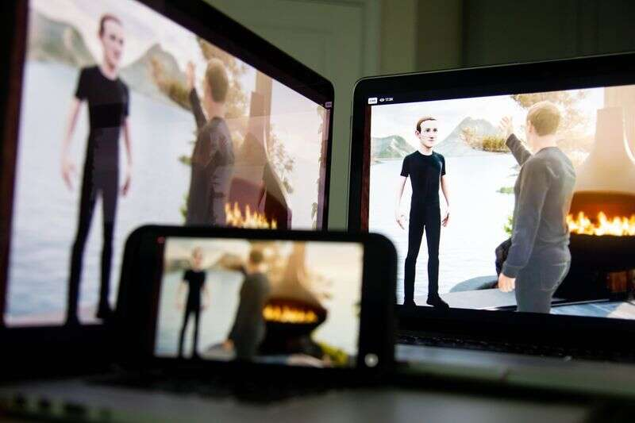

# Facebook，当心：元宇宙是平的

Facebook 的马克·扎克伯格在 2021 年 10 月的虚拟 Facebook Connect 活动中调整了自己的头像。

几周后，马克·扎克伯格将宣布 Meta Platforms Inc. 推出一款新的虚拟现实耳机。令人尴尬的是，我们已经知道它会是什么样子。有人在酒店房间里发现了一个据称设备的视频，该视频在网上流传。然而，这些都不重要，因为时髦的 VR 头戴设备正在变得过于分散注意力，而且对于所谓的元宇宙（许多人认为是其下一章的 3D 版本的互联网）的早期发展来说并不是不可或缺的。事实证明，平板屏幕做得很好。 

虽然 Facebook 迄今已售出约 1400 万台]VR 耳机，但仍有数百万人通过 Roblox 和 Epic Games Inc. 的 Fortnite 等应用程序通过常规 2D 屏幕访问虚拟世界。这一趋势可能会持续数年，因为 VR 头显需要时间来缩小尺寸和降低价格。

这让扎克伯格陷入了尴尬的境地。他希望你购买 Meta 的耳机，称为 Quest，因为这让他能够更好地控制他建立的任何 Metaverse 市场。原因很清楚：多年来，他一直受制于应用程序守门人 Alphabet Inc. 的 Google 和 Apple Inc. 的规则，支付他们的费用并遵守诸如 App Tracking Transparency 提示等法令，这将使Facebook 的广告减少约 1400 万美元今年的销量。

对于 Facebook 来说，在应用商店推出其元宇宙平台 Horizon Worlds 将是一个痛苦的、几乎不可想象的步骤。但也许还有另一种方式。Facebook 可以让人们通过一个简单的浏览器访问该 平台。

谷歌的 Stadia使用一项称为云流媒体的服务，让人们可以通过 Chrome 玩大型视频游戏。这是一个昂贵的过程，需要强大的服务器，但它可以帮助 Facebook 绕过苹果和谷歌，同时吸引大量好奇的新用户。 Meta 的技术主管 Andrew Bosworth 今年早些时候在 Twitter 上暗示，可能会推出基于网络的版本，但公司发言人拒绝提供更多细节。

“这将是一个看起来像游戏的 3D 版本的 Facebook，但你可以从桌面浏览它，”元界房地产初创公司 LandVault 的首席执行官 Sam Huber 说。“它可能成为世界上最受欢迎的游戏。”

即使是适度的受欢迎程度也会让投资者放心，他们可能会对公司的耳机客户增长速度感到犹豫：自去年 10 月推出以来，仅有 300,000 人访问了 Horizon Worlds。您只能通过 Quest 2 耳机访问该平台。

“Facebook 似乎是在沉没成本的谬误中运作的，”十多年来一直报道元宇宙的作家兼博主 Wagner James Au 说。“没有数据支持 VR 头戴设备成为大众市场设备。”  

事实上，虚拟世界的平面版本比 3D 版本更受欢迎。Roblox 的 5200 万每日访问者中约有四分之三使用手机，而使用 Microsoft Corp. 的 Minecraft 或 Fortnite 的绝大多数人使用台式电脑或移动设备。

几家元界公司也已转向平仓。例如，用于交易加密资产的虚拟世界 Decentraland 在 2017 年推出其初始代币产品时被宣传为“虚拟现实平台”  。然而，该公司表示，此后所有用户都通过桌面或浏览器访问。

VRChat 是一个与其他头像进行社交的平台，于 2014 年首次作为 Oculus 头戴设备的应用程序发布。三年后，它推出了桌面版本，并吸引了数百万用户。

“问题在于价格，”Metaverse 初创公司 Somnium Space 的创始人 Artur Sychov 说，他的用户主要通过浏览器访问。Meta 的 Quest 2 售价约 400 美元，而其他竞争对手的耳机可能超过 800 美元。

在屏幕上进入虚拟世界实际上是“真实”VR 的一个不错的代理，而且肯定比普通的视频通话更吸引人，正如我在 Zoom 会议期间 Sychov 带我参观 Somnium 宇宙时发现的那样。由于技术上我并没有把他当成虚拟形象，Sychov 在他面前拿着一个虚拟平板电脑，上面有一个“相机”，让我可以跟踪他在空间中的动作。

看着他在虚拟画廊里指着艺术，穿过五颜六色的森林，甚至在我的笔记本电脑屏幕上，足以帮助我想象自己在那里。

到目前为止，Meta 的营销一直专注于 VR 耳机的身临其境的好处，创造一种你真的和同事在一起 或在健身课上的感觉。但这错过了元宇宙的真正卖点 —— 创造新体验的激励 —— 而且你不需要虚拟现实耳机。

