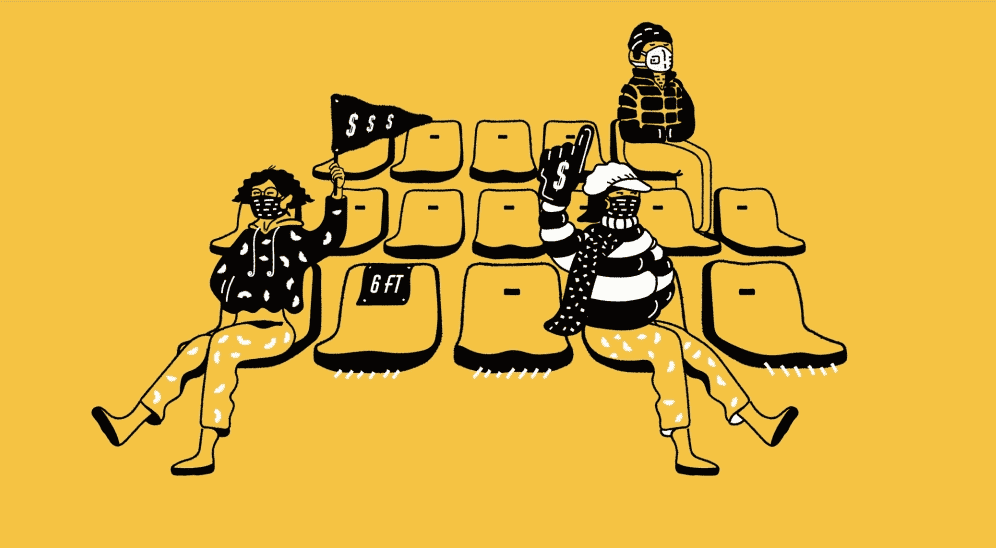

# 为什么 Grey Goose 将更多的营销资金投入元界

伏特加品牌 Grey Goose 通过虚拟体验将其体验营销提升了一个档次。具体来说，百加得旗下的品牌正在向元界倾斜，最近一次是为了激活美国网球公开赛。

本月早些时候，Grey Goose 在 Metaverse 平台 Decentraland 上为美国公开赛创造了一种身临其境的体验，参观者在其中了解了美国公开赛的标志性鸡尾酒 Honey Deuce。活动还设有互动展示，让参观者为球员敬酒。

“我们渴望在这个领域与我们的消费者会面，”Grey Goose 副总裁 Aleco Azqueta 谈到将品牌带入虚拟世界时说。“鉴于它与体育和游戏的联系，美国公开赛是我们品牌最自然的搭配。”

利用美国公开赛等赛事来构建其元宇宙营销策略，Grey Goose 可以创建新的节目来吸引目标人群，并在体育迷和饮酒者中脱颖而出。为了开发其虚拟激活，Grey Goose 聘请了 Razorfish，这是一家专门从事网络开发、媒体规划和购买、技术和创新的互动机构。

对于美国公开赛的激活，Grey Goose 希望其虚拟体验能够与消费者在现实生活中与其品牌的互动方式建立紧密的联系。为实现这一目标，Grey Goose 设置了互动游戏和挑战赛，让参观者有机会赢取各种奖品，包括限量版可穿戴设备、商品和明年美国公开赛的 Grey Goose 套房门票。

Grey Goose 此前曾在格莱美颁奖典礼上与 Peter Dundas 合作，尝试过元界营销，其中包括限量版 NFT 和 Grey Goose 和 Peter Dundas 为帕丽斯·希尔顿设计的马提尼形包。随着美国公开赛的启动，“这是我们建立的第一个完全互动的数字世界”，Grey Goose 正在寻求“在未来几个月和几年内继续探索 Web3 功能，”Azqueta 说**。**

目前尚不清楚 Grey Goose 的广告预算中有多少分配给了元宇宙中的这个活动，因为 Azqueta 不会分享总体预算细节。然而，他确实分享了他们的绝大多数广告支出（70%）都在数字渠道上，Facebook、Instagram 和 Twitter 等社交媒体占该品牌总支出的 26%。根据 Pathmatics 的数据，Grey Goose 今年迄今在广告方面的花费略高于 410 万美元。

Gray Goose 的美国公开赛营销策略取决于巩固锦标赛和品牌之间的联系。Grey Goose 和美国公开赛从 2007 年开始建立长期合作伙伴关系，Grey Goose 希望通过这种合作关系增加其文化影响力并提升品牌知名度。

Azqueta 表示，作为其元节营销策略的一部分，Grey Goose 一直在 MetaVIP 休息室提供限量版可穿戴设备，这些设备一直销售一空，美国公开赛仅一周就下载了 26,000 台。“这就是为什么我们正在探索纽约市和元宇宙的活动，”Azqueta 说。

除了激活美国公开赛之外，Grey Goose 还继续推进送货服务和家庭鸡尾酒。例如，在纽约、布鲁克林和曼哈顿，居民可以享用由 Cocktail Courier 配送的预制冰镇 Honey Deuce 鸡尾酒。

“Grey Goose 凭借 Honey Deuce 打出了本垒打，因为他们不断改进它，”综合媒体、数字和传播机构 Team One 的生活方式营销和合作伙伴关系副总裁兼集团总监 Damian Areyan 说。“送货上门鸡尾酒、冷冻版本、鸡尾酒套件、社交媒体上的鸡尾酒食谱，他们利用美国公开赛来提高他们整个产品组合的知名度。他们还利用这段时间让 Honey Deuce 成为美国公开赛的在线文化时刻。”

在未来几年，随着空间采用率的增长，元界的营销]可能会从主要品牌的实验性转变为标准。赞助情报平台 SponsorUnited 的创始人兼首席执行官鲍勃·林奇 (Bob Lynch) 表示：“灰鹅和美国公开赛受益匪浅，因为这种合作伙伴关系不仅增强了球迷的体验，而且本身就成为了标志性的。” “这种合作伙伴关系的扩大使美国网球公开赛和 Grey Goose 能够接触到数字连接的音乐、时尚和体育领域的文化影响者。”
