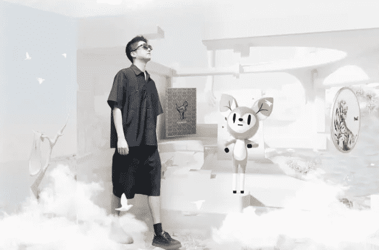

# 阿里巴巴在元界推出奢华体验

阿里巴巴集团表示，通过周四发布的一系列数字升级和增强现实时装秀，它正在“扩大奢侈品牌与虚拟世界中中国富裕购物者联系的方式”。

此次发布是该公司天猫奢侈品馆成立五周年的一部分，阿里巴巴将其描述为“中国最大的在线目的地，拥有来自五大奢侈品集团的 200 多个奢侈品牌。”

阿里巴巴奢侈品部门负责人珍妮特·王（Janet Wang）承认，这种流行病对零售商来说是一个挑战，但表示中国奢侈品消费者的在线消费一直保持弹性。“虽然大部分奢侈品购物仍发生在实体零售店，但在线和全渠道扩张稳步增长——中国的奢侈品在线渗透率从前一年的 12% 飙升至 2020 年的 23%，”阿里巴巴在一份声明中表示。“天猫奢侈品馆拥有超过 [200] 个奢侈品牌，而冠状病毒爆发前只有 150 个。尽管中国的许多城市偶尔会进入封锁状态，但今年和去年在平台上以数字方式举办了超过 1,000 场购物活动和新产品发布会。”

该公司表示，奢侈品牌今年继续在天猫奢侈品馆推出，“即使在经济低迷时期，包括宝格丽、盟可睐和布鲁内洛·库奇内利。”

王说：“我们看到品牌接受数字化转型的速度有多快，消费者增加了在线消费。”他补充说，大流行期间的消费趋势包括增加送给亲人的礼物、购买家居用品以及购买保值物品，例如手表和珠宝。

该公司表示，在 2019 年至 2021 年期间，天猫奢侈品馆的客户群飙升 150%，销售额增长 300%，并称该平台的创新数字体验是其增长的原因。

对于这个最新的数字体验，王说在元界成为流行语之前，“我们已经把这个流行语变成了商业现实。现在，作为其五周年庆典的一部分，Luxury Pavilion 将于 9 月 22 日与 Vogue 中国和多位艺术家合作举办一场增强现实时装秀。”

“想象一下顶级奢侈品牌的‘超级吉祥物’将在虚拟跑道上大放异彩，而不是超级名模，”王说。“天猫奢侈品馆平台上的观众可以通过多种方式与这些超级吉祥物互动，包括与它们自拍。”

王说，天猫奢侈品馆还推出了“一种新的 Meta Pass，它可以优先访问 Burberry 和 Max Mara 等品牌的产品。”

Meta Pass 包包括在区块链上认证的数字权证。“步履蹒跚的消费者将能够将这些认股权证换成限量版，包括 Bogner 的 90 周年滑雪板、Max Mara 的 2022 秋季系列超大号毛衣、Burberry 的标志性 Lola 包和 Marni 的羊毛衬里 Pablo 运动鞋，”王说，并补充说数字环境“可以为消费者提供与现实世界相同甚至更好的购物体验和奢侈品牌身份。”

阿里巴巴在一份声明中表示，过去几年，天猫奢侈品馆“为产品、数字化身和数字收藏品部署了 3D 购物、增强现实和虚拟现实试穿”，并指出已有 20 多个奢侈品牌发布了数字平台上的艺术收藏品以及举办的虚拟时装秀。

“今年，卡地亚、江诗丹顿、巴宝莉和其他公司使用视频顾问与 VIP 客户进行一对一的直播，”该公司表示。“20多个品牌已经在天猫奢侈品馆推出了手表测试，以及其他数字服务，如手镯调整、包包保养，甚至包括擦鞋。”
