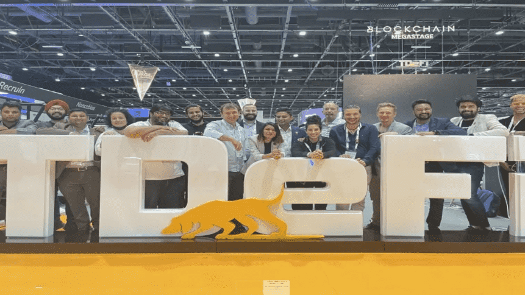

# TDeFi 带来了板载 Megaverse，此举将颠覆 Metaverse 的格局

TDeFi是 DeFi 行业的下一级孵化器，也是为 DeFi 领域的初创公司提供指导、营销和增长黑客的世界级提供商，现在正在加入 Megaverse，这是一个基于虚幻引擎 5 构建的超现实元宇宙。

TDeFi 的团队很高兴能与Megaverse及其行业资深团队合作，帮助将 Metaverse 变为现实。毫无疑问，元宇宙是下一件大事，而 Megaverse 有机会成为该领域的主要参与者。

Megaverse 的团队已经表现出对帮助发展和扩展业务的承诺。他们与 TDeFi 的合作将改变 TDeFi 和 Megaverse 的游戏规则。 

**走进元界**

元宇宙的概念在过去几年中获得了很大的关注，尤其是随着虚拟现实和增强现实的兴起。 

对于外行来说，元宇宙是一个术语，用于描述一个共享的虚拟空间，人们可以在其中以类似于现实世界的方式相互交互以及与数字对象交互。 

然而，元宇宙不仅仅是一个虚拟世界；它也是人们可以买卖虚拟商品和服务的地方，企业可以在这里以一种全新的、身临其境的方式与客户互动。 

简而言之，您可以将元宇宙视为尚未创建的物理、互联网和虚拟世界的最佳方面的组合。 

虽然元宇宙仍处于早期阶段，但有几家初创公司正在努力构建使其成为现实所需的基础设施。 
