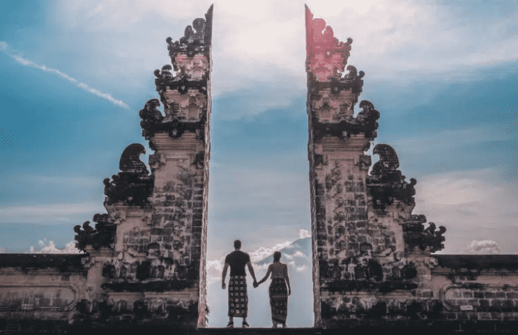

# 初创公司正在为旅游体验打造“双胞胎”巴厘岛元界

一家名为 Bali Twin Metaverse 的创意创业公司正在尝试创建目的地的数字孪生。该项目旨在改变游客参与当地生活方式的方式。

**作为元界体验的一部分，游戏玩家和区块链爱好者可以探索一个有趣的、完整的巴厘岛复制品，该体验正在被宣传为元旅游。**

印度尼西亚政府已经批准了巴厘岛双元宇宙。PT Blackstone Indonesia、Black Lava Camp、Grahadi Bali Entertainment 和 Kicau Mania 是这些数字资产的所有者。不过，**自从巴厘岛双元宇宙开放以来，世界上任何人都可以随时参观热带天堂的虚拟复制品。**

Blackstone Indonesia 的创建者 Bambang Soesayto 在 Instagram 帖子中概述了该项目的运作方式。“ **Metaverse 是一种增强现实 (AR) 技术，使个人能够与其他人进行虚拟互动。在这个元宇宙世界中，用户可以以虚拟形式做任何事情，例如聚会、开会、工作、玩耍、组织各种活动、参加音乐会、在线购物或购买数字资产。**”

Bali Twin Metaverse 本质上将把巴厘岛的艺术、景观和建筑变成可以在 Metaverse 市场上作为 NFT 交易的数字副本。根据该公司的 litepaper，该项目的目标是“融合区块链和传统游戏之间的边界，为巴厘岛文化保护做出贡献。”

**在印尼政府、Blackstone Indonesia（不要与 Blackstone Group 混淆）、AWS 和 Epic Games 等知名合作伙伴的支持下，他们无疑会产生影响。**为品牌和业主建立广告平台是巴厘岛双元界的目标之一。他们想要创建“世界上最详细的数字双胞胎”。他们密切关注每一个方面。

Bali Twin Metaverse 刚刚宣布与 Kicau Mania 合作，后者拥有世界上最广泛的巴厘岛鸟类声音收藏之一。这些声音将被整合到 Metaverse 体验中，为数字遭遇增添额外的真实感元素。

Metaverse 是一个**“具有真实世界模拟的沙盒，在未来的环境中揭示古代巴厘岛文明的奥秘”。**根据游戏描述。用户将能够通过元界创建自己的企业、赚取真金白银、创造物品并从中获利，甚至可以在数字巴厘岛购买、出租或出售土地。

游戏的图形令人印象深刻，NFT 的数字艺术作品也是如此。8 月下旬，该公司在其互联网市场上提供了第一个 NFT Hanuman 和 Barong 面具。希望通过数字化和现代化巴厘岛传统艺术，该计划将有助于促进岛上独特的文化。
