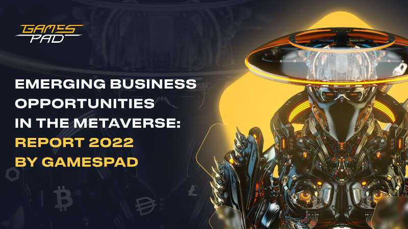
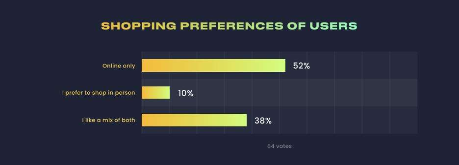

# Metaverse 中的新兴商机：GamesPad 2022 年报告

英属维尔京群岛罗德城，2022 年 9 月 22 日 (GLOBE NEWSWIRE) -- 元界是一个共享且持久的虚拟空间，它实时存在，并从虚拟现实和虚拟增强的物理现实的融合中出现。

这种世界的融合正在导致由技术发展推动的范式转变，并开辟了新的可能性——为消费者和企业带来了令人兴奋的机会。因此，无论是为全球观众举办虚拟音乐会，还是在家中舒适地在逼真的数字会议室中与您的公司举行高管会议，元宇宙都对企业的未来意义重大。

Meta、Apple 和 Microsoft 等行业领导者和科技巨头都在大力投资元宇宙，这表明这个概念不是另一个实验，而是未来。为了在现代世界中保持竞争力，企业需要制定强有力的战略来进入这个新的虚拟世界。

这就是为什么游戏、NFT 和 metaverse 生态系统 GamesPad 创建了 Metaverse：Emerging Business Opportunities，这是一份包容性研究论文，探讨了 metaverse 市场、这一新概念带来的商机，以及进入新兴市场的策略。

该研究论文由 GamesPad和 BullPerks 联合创始人 Constantin Kogan 和 Eran Elhanani 撰写. 它概述了 20 多种元宇宙趋势、从大约 1,000 名受访者收集的独特统计数据，以及顶级行业专家和思想领袖的见解，包括：

- 萧逸 (Animoca Brands 联合创办人)
- Wahid Chammas（Faith Tribe 董事长兼联合创始人、Faith Connexion 共同所有人、TyreGate Capital 创始人兼首席信息官）
- Travis Wu (Highstreet 创始人)
- Brian Hazan（THE HUSL 联合创始人）
- Philip Devine（CryptoBlades Kingdoms 的联合创始人）
- A. Bahadir Yener（Metawear 创始人）
- Gal Yosef（3D 艺术家，Reflection Studios 首席执行官）
- Anastasia Drinevskaya（Cointelegraph Communications 首席执行官兼创意总监）
- Shawn Mims（美国说唱歌手，Cre8tor 和 RecordGram Inc. 的联合创始人）
- Warren Parker-Mill（时尚元界俱乐部首席执行官）
- Eathan Janney、Jeff Kelley 和 Josh Kriger（Edge of NFT 播客、Edge of Company、NFT | LA 的联合创始人）
- Gary Ongko Putera（BOOM Esports 首席执行官兼创始人）
- Dana Kachan（GamesPad 和 BullPerks 的首席营销官）
- Petrix Barbosa（MoonBoots Capital 联合创始人）

**元界中的业务**

Metaverse 将为几乎所有企业带来新的机遇。首先，元界体验可以帮助企业在全新的个性化水平上与现有客户建立联系，并进入新市场。此外，元宇宙可以改变产品和服务、生产和分销流程、组织运营等等。GamesPad 已经确定了一些将从元宇宙中受益的主要经济部门。

**赌博**

全球范围内的玩家都表现出对通过 3D 图形、支持 VR 的游戏和用户创意平台提供身临其境体验的游戏的偏好。预计全球将有近 30 亿游戏玩家 进入元界体验下一级游戏，这使游戏行业处于受益于元界的独特地位。

此外，根据 GamesPad的数据，44% 的受访者认为 Play-to-Earn 游戏是虚拟世界中最令人兴奋的方面。颠覆传统模式和推进元宇宙概念的能力显示了 Play-to-Earn 游戏在未来的力量和重要性。Play-to-Earn NFT 游戏CryptoBlades Kingdoms的数据证明了这 一点：自 8 月以来，他们的用户完成了 23,709 场战斗，训练了 4,472,925 个单位，掠夺了超过 313,146,492 个，并收集了超过 1,712,753,259 个木材、石头和粘土，这证明了用户的对 GameFi 领域的兴趣日益浓厚。

**时尚**

头像是虚拟世界中玩家虚拟身份的核心装置，这说明了为什么数字自我表达对在线用户变得越来越重要。时尚品牌在塑造元宇宙方面发挥着至关重要的作用。一个很好的例子是 Faith Tribe，这是一个开源设计平台，旨在授权和奖励虚拟世界和物理领域的数字创作者。该品牌旨在开发一个全球创作者生态系统，为用户生成的时尚产品设计的成功创作、交易、分销和货币化营造一个包容和开放的环境。

另一个有趣的例子是 Metawear， 它通过创建 Metaverse Fashion DOME 来改变时尚界创造、赚取和营销他们的设计和产品的地方。 

**虚拟房地产**

根据 GamesPad 的一项调查， 45% 的受访者 表示他们会考虑购买虚拟房地产，而 14% 的用户表示他们已经购买了一些。随着雄心勃勃的房地产企业家在虚拟世界中积极积累土地，虚拟房地产正在成为一项有利可图的投资。GamesPad 认为，与大多数实体位置相比，在虚拟世界中投资房地产可以让企业接触到更大份额的客户。 

**市场营销和广告**

公司可以使用虚拟现实中的虚拟现实以更具创造性的方式与客户互动，在新的虚拟世界中为他们提供独家品牌体验。它必将催生一个全新的数字营销和广告方向，包括虚拟世界广告、虚拟影响者、虚拟世界事件和虚拟世界商业。

**创造者经济**

目前，创作者经济在很大程度上依赖于中心化的公司，即 YouTube 和 Facebook 等社交媒体平台，它们不仅可以从创作者的收入中分得一杯羹，还可以对他们进行封禁和审查。然而，元宇宙使创作者能够避开这些平台，直接与他们的观众联系，让创作者经济蓬勃发展。

**身临其境的购物体验**

根据 GamesPad 的调查， 43% 的受访者 更喜欢在线购物。3D 沉浸式虚拟世界将提供增强的购物体验，并改变我们购物和与品牌互动的方式。虚拟商场和策划、可定制的购物平台是虚拟世界改善购物体验的一些可能方式。例如， Highstreet正在 通过将世界各地的百货公司（如 Saks、Selfridges 和连卡佛）转变为进入 Highstreet World 的入口点，从而 改变 Metaverse 中的零售业。

资料来源： GamesPad 元界报告 2022

**音乐和娱乐**

元宇宙将使音乐会和其他虚拟活动变得无限和无国界，让全球观众参与和欣赏展览。名人和音乐家可以使用元宇宙与他们的粉丝进行高水平的联系，同时也可以通过他们的表演获利。 

**虚拟旅行**

与物理世界不同，元宇宙没有边界。通过将虚拟世界的无限旅游机会与有利可图的旅游业相结合，元界为旅游行业的人们提供了一系列有利可图的潜力。

**员工敬业度**

在元宇宙中，组织可以使用新兴技术来启用增强的虚拟工作空间，这可以显着提高员工敬业度和生产力。这尤其有助于远程工作环境，激发工作场所的创造性协作。 

**沉浸式学习体验**

利用 VR 和 AR 技术，元界可以加强教育，使在线课程提供商能够在广泛的领域提供身临其境的学习体验。这不仅会改善学生与信息的互动，还会使学习过程更具吸引力。

**社会化**

元宇宙将彻底改变我们的数字社交方式，促进创建独立的虚拟社区，用户可以在其中享受身临其境和丰富的社交体验。例如，使用数字化身，朋友们可以在同一个虚拟房间里“面对面”进行社交，而实际上他们相距数英里。 

**可访问性和授权**

本质上，元宇宙是无国界的，为来自世界各地的人们提供了可访问性，无论他们身在何处。这种普遍性将特别改善残疾人或发展中社区的人的访问。

**Metaverse 是否适合您的业务？**

GamesPad 相信元界为所有企业提供了新的机会。元宇宙呈现出丰富和可能性的未来。行业领导者和企业家应在早期阶段投资于元界战略，以在这个令人兴奋的新领域巩固利润丰厚的渠道。
