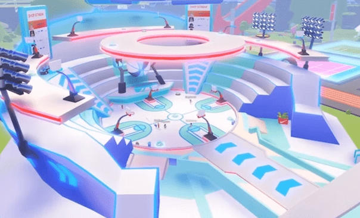

# 现在有 2100 万人访问了耐克的 Roblox 商店，这是正确进行元界商务的方法。

Nikeland 是主流元界商业概念的第一个证明之一。在 Roblox 上创建的虚拟世界在头两个月内吸引了 700 万访问者。它建立在耐克新收购的元界代理商 RTKFT 的专业知识之上，以促进耐克品牌的游戏体验，最重要的是，允许用户从耐克本身购买虚拟商品。

耐克的数字化成果——在很大程度上归功于这些元宇宙体验——现在占其耐克品牌总收入的 26%。据 Roblox 称，作为这项努力的一部分，Nikeland 迄今已接待了超过 2100 万游客，并受到近 118,000 名游戏玩家的喜爱。

然而，考虑到元节作为一种营销工具还处于萌芽阶段，像 Nikeland 这样的元节执行还能维持多久还存在疑问。游戏玩家不断寻求新体验，而 Roblox 的性质意味着这些景点很容易找到。

Winnie Burke 是 Roblox 时尚和美容合作伙伴的负责人。她解释说，元界体验的可行性（与现实世界的零售一样）依赖于新产品的引入：通过持续的内容更新吸引社交空间，粉丝可以在其中以真实和互动的方式发现新产品。

“Tommy Hilfiger 是最新加入虚拟世界的时尚品牌，其 Tommy Play 持久体验经常更新，这意味着即使是常客也总能找到新的探索或尝试。这是我们所见过的时尚界挑战虚拟世界的非常令人兴奋的例子之一。”

引入新产品和新体验的需求融合了零售和游戏的核心原则。零售——尤其是时尚和奢侈品——以服装系列的季节性更新为理念，而《最终幻想 XIV》和《火箭联盟》等持久游戏世界则定期引入新的环境和游戏模式。

Together Labs 的首席执行官 Daren Tsui认为，成功的元节执行需要三个关键属性：“它需要存在（社交存在），它需要持久（当用户回来时，存在某种连续性，而不是重启），最后也是最重要的是它需要共享（需要多人在元节中进行交互）。”

除了推出新的服装项目，耐克兰一直在效仿游戏的发布和刷新方法。例如，在 NBA 全明星周期间，耐克委托勒布朗·詹姆斯访问 Nikeland，在此期间参与者获得了能够解锁虚拟产品的物理游戏奖励。

因此，元界商务是这两个学科之间维恩图的中心，而最好的元界体验将是那些满足观众对两者的期望的体验。

例如，Gucci 最近重新设计了 Gucci Town 体验的视觉和体验，以服务于其最新的 Gucci Flora 香水活动，引入了新的挑战，并允许粉丝与品牌大使 Miley Cyrus 的化身互动。

Burke 说：“这些品牌世界是现有社交渠道的延伸，让粉丝能够以一种令人兴奋、充满活力和不断变化的方式与品牌、创作者和社区成员建立联系，让人们回归更多，并与他们一起享受这些体验他们的朋友们。”

**持久世界**

可以理解的是，Gucci Town 和 Nikeland 等体验的电子商务方面一直是元界大量报道的焦点。观众会选择用付费产品来装饰他们的虚拟形象是一个新概念——至少对于游戏观众之外的人来说是这样。然而，正如 Burke 解释的那样，许多品牌转而利用他们在 Metaverse 平台上的品牌体验来与他们原本不会接触到的受众建立关系。

她说：“对于许多品牌来说，主要目标是与 Z 世代建立亲密关系，这反过来会影响他们在现实世界中的购买决定。从我们的研究中，我们看到了平台上品牌的生活方式体验如何扩展到未来与实体世界中的品牌互动的早期迹象。

“例如，我们与参观过 Alo Sanctuary 体验的人进行了一次虚拟焦点小组讨论，近一半的人表示他们下次想要运动服时‘可能’会从 Alo 购买。”

Metaverse 借鉴了零售和游戏的历史，为电子商务创造了一条可行的新途径。然而，它未来的成功需要品牌长期投资于他们的元宇宙体验，以便让用户像回到现实世界的商店一样定期回来。
