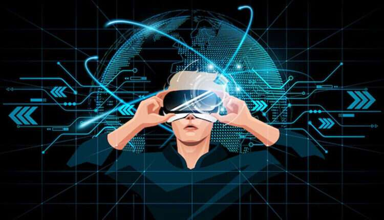

# Auxuman 宣布通过世界上第一个无代码 Metaverse 平台进入 Metaverse

#### ***Mark Cuban 支持的元节公司扩张，从虚拟生物转向完全可定制的元节创建***

领先的无代码 Metaverse 平台 Auxuman 宣布了其业务发展的下一阶段，并引入了 auxWorld。这家成长中的 Metaverse 公司通过平衡虚拟竞争环境并为品牌提供他们需要的工具，以通过世界上第一个无代码 Metaverse 解决方案更好地接触和服务客户，从而为各种创作者提供支持。

今天的元宇宙体验被构建在线游戏的大公司所控制，扼杀了用户的创造力并限制了他们的体验。通过 auxWorld，品牌和创作者有机会通过卓越的图形、周到的游戏玩法和对每个客户群有意义的实用程序参与创建虚拟世界体验。

“我们的第一个软件产品 auxWorld 可以彻底改变虚拟世界的创建方式，它为任何人提供了一种简单而精简的方式来构建高度身临其境和引人入胜的体验，”首席执行官兼联合创始人 Negar Shaghaghi 说。“auxWorld是一个创造和文化的平台：创作者每天都在创造，用户享受无尽的游戏，品牌每天都在靠近消费者。”

**Auxuman 赋予创作者以几乎无限可能构建元界体验的能力**

设计和游戏由平台决定的停滞模型一直是创作者在元宇宙中开发自己的空间的持续障碍。相反，Auxuman 让消费者参与到元宇宙创建的每个阶段，提供无穷无尽的创造机会。反过来，这也为品牌和创作者提供了一个难得的机会，可以在虚拟世界中建立长期和可持续的存在。

“auxWorld 让每个用户都能从元界生态系统中受益，”Shaghaghi 说。“使用 auxWorld 标准框架，创作者可以在很短的时间内开发出真正原创的内容。品牌与我们合作提供资产和奖励，包括 NFT，它们成为创建元宇宙的基石，用户因此可以享受无穷无尽的体验。”

作为元界领域的创新者，Auxuman 引起了当今最知名的投资者之一的注意——马克·库班
“auxWorld 处于深思熟虑的元界创造的最前沿，”企业家和投资者马克·库班说。“该团队有一个雄心勃勃的创新愿景，我很高兴看到 Auxuman 在描绘元宇宙的未来方面发挥的作用。”
