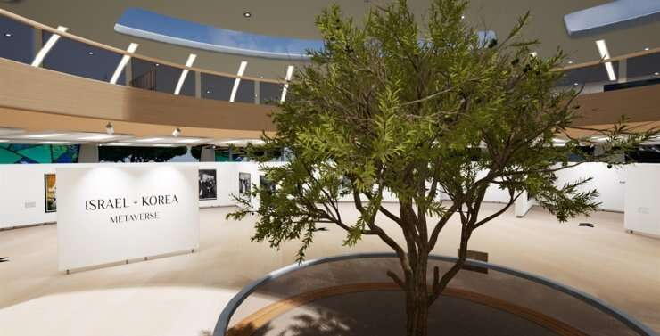
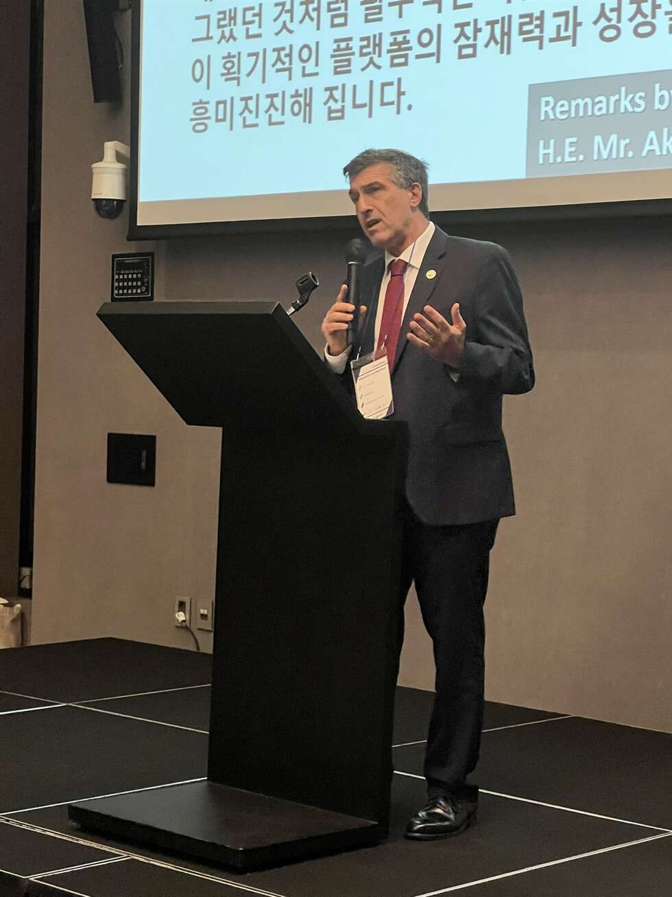

# 以色列大使馆在虚拟世界中开幕

以色列-韩国元界是以色列驻韩国大使馆的虚拟版本，其一楼有一棵橄榄树。由以色列驻韩国大使馆提供

以色列驻韩国大使馆在虚拟世界中开幕，成为该国第一个在虚拟世界中出现的外交使团。值此韩以建交60周年之际，以色列大使馆在虚拟世界开设了展馆，提供有关以色列的信息，促进两国交流。

“以色列-韩国元界是一个真正独特的平台，可以分享虚拟现实沉浸式体验、以色列-韩国关系的历史，还可以进行以色列人和韩国人之间各种有趣的互动。尽管他们相距 8000 公里，但9 月 20 日，以色列驻韩国大使 Akiva Tor 在首尔一家酒店的发布会上说。
据大使馆称，没有其他大使馆具有这种功能目前存在于世界任何地方。大使馆与一家名为 Vrillar 的韩国公司共同开发了这项技术。

“我很确定这是前进的方向。它不会是公共外交的唯一工具，当然，我们将始终希望将真实的人带到韩国并举行面对面的会议和面对面的会议文化表演。但我认为大使馆虚拟世界将成为基本标准，就像大约 20 年前网站成为基本标准，现在 SNS 频道一样，“大使说。

“我对这个突破性平台的潜力及其发展方式的思考越多，它似乎就越令人兴奋……我们将为远距离的人们创造新的互动途径，例如在亚洲两端的以色列人和韩国人。”

以色列驻韩国大使 Akiva Tor 于 9 月 20 日在首尔 RYSE, Autograph Collection 举行的以色列-韩国元宇宙启动活动上发表讲话 图片由以色列驻韩国大使馆提供

展馆的外观灵感来自耶路撒冷以色列博物馆的圣书殿。进入展馆后，出生于德国的犹太理论物理学家阿尔伯特·爱因斯坦（Albert Einstein）欢迎参观者并简要介绍了展馆。爱因斯坦由德国驻韩国大使迈克尔·雷芬斯图尔（Michael Reiffenstuel）配音。

一楼以橄榄树为中心介绍韩以关系60年历史的画廊，将以色列的国树带入虚拟世界。虚拟空间对各种活动开放，包括二楼的MC2休息室，大使希望更多的人参观和使用展馆。

“作为大使馆，我们面临的挑战将是让这种创新功能在韩国和以色列流行，让那些内心年轻并愿意接受新的参与体验的人，”Tor 说。

“我正在考虑一个有希伯来语和韩语俱乐部的虚拟世界，一个以色列电影节，以色列和韩国学生俱乐部的虚拟会议，一个 K-pop 和希伯来圣经爱好者的聚会场所，一个谈话和辩论的地方关于考古学和自动驾驶汽车的未来。” 大使馆计划不断更新以色列-韩国元宇宙。以色列-韩国元宇宙可以在 Google Play Store 和 Apple App Store 下载。
